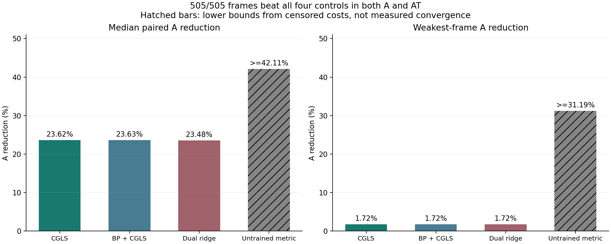

# 完整轨迹四项对照 / Four Controls Across Complete Trajectories

2026-09-08

**四项新增对照均为505/505帧、5/5完整轨迹通过调用优势门。** 同一个冻结学习残差度量，从零初值出发并使用不读取待测真值的停止认证，在四指标1%精度下，每帧A和AT调用均少于普通CGLS、归一化BP加CGLS、历史dual-ridge加CGLS，以及未训练的同结构度量。继承的Jacobi比较也通过。这里的“通过”指候选逐帧严格省调用，不代表每个对照在预算内收敛。

**All four additional comparisons pass on 505/505 frames and 5/5 complete trajectories.** The same frozen learned residual metric starts from zero and uses a query-truth-free stopping certificate. At four-metric 1% accuracy it uses fewer A and AT actions on every frame than ordinary CGLS, normalized BP plus CGLS, historical dual ridge plus CGLS, and the untrained same-architecture metric. The inherited Jacobi comparison also passes. Passing means strictly lower candidate action counts, not that every control converges within budget.

## 数字与含义 / Numbers and Meaning

| 对照 / Control | 候选省调用帧 / Frames with lower candidate cost | A减少中位数 / Median A reduction | 最弱帧A减少 / Weakest A reduction | 未找到首次达标的实现路径 / Censored paths |
|---|---:|---:|---:|---:|
| 普通CGLS / Ordinary CGLS |505/505|23.62%|1.72%|0/1010|
| BP + CGLS |505/505|23.63%|1.72%|0/1010|
| 历史dual-ridge + CGLS / Historical dual ridge |505/505|23.48%|1.72%|0/1010|
| 未训练同结构度量 / Untrained same-architecture metric |505/505|>=42.11%|>=31.19%|1008/1010|
| Jacobi，继承前一结果 / Jacobi, inherited |505/505|22.64%|0.87%|0/1010|

前三种新增经典对照在全部帧、两套实现中都找到了首次四指标达标位置。候选相对每一种的最小余量均为6A和7AT。候选A成本的全体中位数为297，三种经典对照的有利跨实现成本中位数均为389；配对减少百分比不能直接用这两个总体中位数相除代替。

All three additional classical controls have finite first four-metric crossings on every frame in both implementations. The smallest candidate margin against each is 6A and 7AT. The candidate's overall median A cost is 297; each classical control has a favorable cross-implementation median cost of 389. Ratios of these separate medians must not replace the paired savings percentages.

未训练度量的1010条实现路径中，1008条在512步内仍未达标；仅一帧的两套路径找到首次达标。对于未达标路径，只能说其理想首次达标成本至少为513A/513AT，不能把513写成实际收敛成本，也不能说永远无法重建。表中的`>=`因此是减少比例下界。这个对照支持“训练后的度量有作用”，而非仅靠同结构的固定几何变换就能解释当前收益。

For the untrained metric, 1008 of 1010 implementation paths do not meet the required accuracy within 512 iterations; only one frame's two paths have finite first crossings. Censored paths imply an ideal first-hit cost of at least 513A/513AT, not an observed convergence cost of 513 and not permanent reconstruction failure. The table therefore marks reduction lower bounds with `>=`. This control supports a contribution from the learned metric, beyond what the same fixed untrained geometry transform explains here.

## 公平性与复算 / Fairness and Independent Checks

数据仍是此前已打开的五条PoolFire轨迹，各101帧、固定九相机clean观测。每个模型训练时排除其整条待测轨迹，使用其余404帧；但历史开发参考过打开的数据，所以这不是新的前瞻性外部验证。本轮复用已封存候选，不新增模型或训练，也不调整精度门、停止认证和512步对照上限。

The data are the same five previously opened PoolFire trajectories, 101 frames each, with fixed nine-camera clean observations. Each model excludes its entire query trajectory and trains on the other 404 frames. Historical development used opened-data evidence, so this is not fresh prospective external validation. This comparison reuses sealed candidate endpoints, with no new model or training and no change to accuracy limits, the candidate certificate or the 512-iteration control cap.

对照获得更有利的真值可见停止：四指标首次同时不超过1%就停，比较时不收取评分或停止开销；BP和ridge的精确初始化仍计入1A+1AT。候选计入自身物理停止确认。逐帧以两套实现中候选较高的A、AT成本，分别比较对照较低的理想成本或严格下界，要求两项均严格减少，不允许平均数隐藏个别伤害。

Controls receive favorable truth-aware stopping at the first simultaneous four-metric 1% crossing, with zero scoring or stopping overhead in the comparison. Exact BP/ridge initialization still costs 1A+1AT. The candidate pays for its own physical stopping confirmation. Every frame compares the higher candidate A and AT costs across implementations with the lower ideal control cost or rigorous censoring bound; both must decrease strictly, with no average hiding a harmed frame.

4040条对照路径、2020个配对比较和20份对照-轨迹统计已独立审计。修正后的新对照同场评分最大相对差2.01e-15、原生物理投影差7.87e-16，独立汇总差为0。一次历史ridge批量/逐样本输入的数值一致性失败被保留；恢复已独立复核的完整对照，使用原逐样本公式，未放宽容差。原失败工作不算免费，部分未持久化成本仍需如实披露。

All 4040 control paths, 2020 paired comparisons and 20 control-trajectory summaries are independently audited. Corrected new-control same-field metric disagreement is at most 2.01e-15 and native projection disagreement 7.87e-16; independent summary discrepancy is zero. A failed historical batch-versus-single-query ridge identity check is retained. Completed controls were independently recovered and the original single-query formula restored without loosening tolerances. Failed work is not free, and incomplete persisted cost accounting remains disclosed.

## 边界与下一步 / Limits and Next Step

**这是学习度量的证据，不是暖启动贡献或实测提速。** 候选仍从零开始，旧暖启动负结果不被改写。F/FT/T变换、回归推断、训练、几何与认证准备均非免费；全缓存直接解尚未被击败。没有新相机数、位姿/噪声泛化、独立公开外门或真实BOST结果。

**This is learned-metric evidence, not warm-start attribution or measured speedup.** The candidate still starts from zero and previous warm-start failures remain unchanged. F/FT/T transforms, regression inference, training, geometry and certificate setup are nonfree; fully cached direct remains unbeaten. New camera counts, pose/noise generalization, an independent public gate and real BOST are not established.

下一步固定这个冷启动求解器与停止认证，检验一个真正额外的暖初始化贡献，并与其冷启动版本及便宜初始化公平比较。只有证明完整目标下的额外价值，才推进端到端时间、内存和新的外部条件；不把度量结果直接改名为暖启动成功。

Next keep this cold-start solver and its certificate fixed and test genuinely additional warm-initializer value against the cold solver and cheaper initialization. Only after demonstrating added value toward the full objective should end-to-end time, memory and new external conditions advance. Metric gains cannot simply be renamed warm-start success.

[脱敏汇总 / Redacted summary](poolfire_full_control_cost_20260908.json) | [完整Jacobi比较 / Complete Jacobi comparison](poolfire_full_metric_cost_20260908.md)
