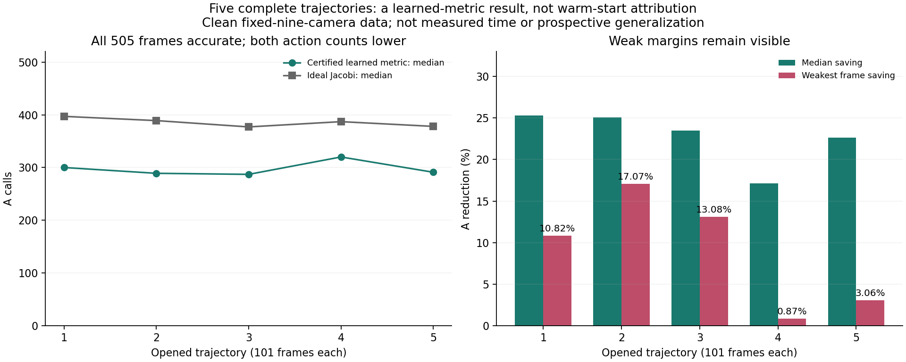

# 完整轨迹：学习度量减少调用 / Complete Trajectories: Learned-Metric Call Savings

2026-09-08

**505/505帧、5/5完整轨迹通过。** 同一冻结学习残差度量、零初值和不读取待测真值的停止认证，在四项相对误差均不超过1%时，每帧的A和AT调用均严格少于理想停止的Jacobi对照。A减少的全体中位数为22.64%，范围0.87%-39.41%。最弱一帧仅省3次A，不能把五点试验中较大的优势推广到所有帧。

**505/505 frames and 5/5 complete trajectories pass.** The same frozen learned residual metric, zero initialization and query-truth-free stopping certificate use strictly fewer A and AT actions on every frame than ideal-stopped Jacobi while meeting all four relative-error limits of 1%. The median A reduction is22.64%, ranging from0.87% to39.41%. The weakest frame saves only three A actions: larger five-point pilot margins do not extend to every frame.

## 比较方法 / Comparison

五条此前已打开的PoolFire轨迹，每条101帧、固定九相机、clean观测。每个已有模型的训练数据为其他四条轨迹404帧，不含自己留出的101帧。本轮不重新训练，不调整参数或停止规则；两套实现的全部预测先封存，再读取对应真值评分。早期模型开发已经参考过打开的数据，因此这不是新的前瞻性外部验证。

Five previously opened PoolFire trajectories,101 frames each, with fixed nine-camera clean observations. Each existing model was trained on the other404 frames, excluding its entire101-frame query trajectory. This run changes no training, parameters or stopping rule. All predictions from both implementations are sealed before query-truth scoring. Earlier development used opened-data evidence, so this is not a new prospective external validation.

候选为零初值加学习残差度量，在FA上运行标准CGLS，其中F^T F=T；独立版使用另一种加权法方程递推。停止依据原始物理残差及几何误差界，额外物理确认计入A。Jacobi则获得更有利的条件：允许读取真值，四指标首次达到1%就停，比较时不收取停止或评分开销。其全部首次达标步数均已找到，没有截断下界。每帧以两套实现中候选的较高成本，比较Jacobi的较低成本。

The candidate starts from zero and runs standard CGLS onFA, whereF^T F=T is the learned residual metric; a separate implementation uses a weighted-normal recurrence. The original physical residual and geometry error bound determine stopping, with a fresh physical check charged toA. Jacobi receives favorable oracle treatment: truth is available for its earliest four-metric1% stop, with no stopping or scoring overhead in the comparison. All first crossings are finite, not censored lower bounds. Each frame compares the higher candidate cost across implementations with the lower Jacobi cost.

| 轨迹 / Trajectory | 通过 / Pass | A减少中位数 / Median A reduction | 最弱帧A减少 / Weakest-frame A reduction |
|---|---:|---:|---:|
|1|101/101|25.31%|10.82%|
|2|101/101|25.06%|17.07%|
|3|101/101|23.47%|13.08%|
|4|101/101|17.14%|0.87%|
|5|101/101|22.64%|3.06%|

候选较高A成本为261-353，Jacobi较低A成本为294-505；这些范围不能当作彼此配对的端点。最弱帧候选342A/341AT，对照345A/345AT。同场四指标独立评分最大相对差5.20e-15，原生物理投影差7.92e-16；独立重建全部首次达标索引、逐帧判决和轨迹统计，统计差为0。

Candidate upper A costs range261-353 and Jacobi lower costs294-505; range endpoints are not paired observations. On the weakest frame the candidate uses342A/341AT versus345A/345AT. Independent same-field metric disagreement is at most5.20e-15 and native projection disagreement7.92e-16. All first-hit indices, frame decisions and trajectory summaries are independently reconstructed, with zero summary discrepancy.

## 边界与下一步 / Limits and Next Step

这是学习残差度量的完整已打开轨迹证据，**不是暖初始化贡献证明**。它也不是端到端提速：F、FT、T的应用、模型训练以及密集几何认证准备均非免费，全缓存直接解尚未被击败。更改残差度量只在当前一致clean系统中保留相同唯一解，对噪声或模型失配一般不等价。还未验证新几何、其他相机数、实验噪声、独立公开外门或真实BOST。

This is complete opened-trajectory evidence for the learned residual metric, **not proof of warm-initializer contribution**. Nor is it end-to-end speedup: F/FT/T applications, training and dense geometry-certificate setup are nonfree, and fully cached direct remains unbeaten. Changing the residual metric preserves the same unique solution in the current consistent clean system, not generally under noise or model mismatch. New geometry, other camera counts, experimental noise, independent public conditions and realBOST remain unvalidated.

下一步保持模型不变，补齐普通CGLS、BP、历史dual-ridge与同架构未训练度量的完整轨迹公平比较，再研究暖初始化是否在此基础上有额外价值。只用训练折标定的经验停止规则此前仅4/5点通过，已关闭；本轮正结果不依赖它，也不推翻旧暖启动负结果。算法突破、论文成功、资源加速、外部泛化和真实BOST结论均仍未成立。

Next keep the model fixed and complete full-trajectory comparisons against ordinary CGLS, BP, historical dual ridge and the same-architecture untrained metric, then test additional warm-initializer value. The empirical train-fold-only stopping rule previously passed only4/5 points and is closed. This positive result does not depend on that rule or overturn earlier warm-start failures. Algorithmic breakthrough, paper success, resource speedup, external generalization and realBOST remain unestablished.

[脱敏汇总 / Redacted summary](poolfire_full_metric_cost_20260908.json) · [此前五点归因 / Earlier five-point attribution](poolfire_left_metric_20260907.md)
