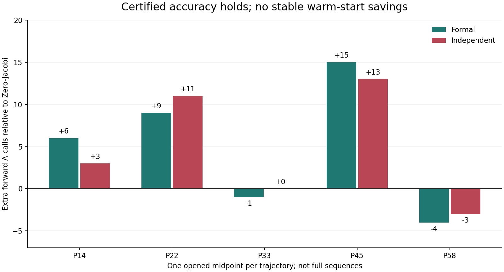

# 精度认证与暖启动成本 / Certified Accuracy and Warm-Start Cost

2026-09-07

几何误差界使六种方法在五个已开封代表帧上均通过停止认证和四指标1%门；但冻结学习暖启动没有稳定少算。例如一帧需947次前向调用，Jacobi为932次，独立实现也确认劣势。关闭这套固定配置，不扩跑505帧。误差界需要几何准备，不是免费加速，也不是完整轨迹、外部泛化或真实BOST成果。

Geometry error bounds let all six methods certify stopping and four-metric 1% accuracy on five opened representative frames. The frozen learned warm start still does not consistently save calls: one frame needs 947 forward actions versus 932 for Jacobi, with the disadvantage independently confirmed. Close this fixed configuration without expanding to 505 frames. The bounds require geometry setup; this is neither free acceleration nor a complete-trajectory, external or real-BOST result.

## 做了什么 / What Was Tested

五条已开封PoolFire轨迹各取一个既定中点，共五帧，不是完整505帧结果。沿用冻结的1840参数L-BFGS暖启动及其外折参数，另比较Adam、Zero-CGLS、Zero-Jacobi、归一化BP和历史dual-ridge。没有重新训练。所有输入仍只有观测与已报告几何，轨迹编号仅选择此前训练折模型。

One previously fixed midpoint from each of five opened PoolFire trajectories is tested, not all 505 frames. The primary reuses the frozen 1840-parameter L-BFGS warm start and its outer-fold parameters. Controls are Adam, Zero-CGLS, Zero-Jacobi, normalized BP and historical dual-ridge. No training is repeated. Inputs remain observations and reported geometry; trajectory IDs only select the existing outer-fold model.

上一轮固定观测残差1e-8的成本实验因部分对照跑满预算，保持未定。本轮先推导、冻结并独立构造几何到场及两类梯度的误差上界，再由当前残差和当前场范数认证相对误差是否小于1%。没有看新结果后换阈值，也不修改旧判决。误差界使用活跃区域满秩、外边界零值、干净观测一致性的既有代理假设；真实噪声与模型失配不在本次保证范围。

The previous fixed observation-residual 1e-8 experiment remains inconclusive because some controls exhausted its cap. This new contract first derives, freezes and independently constructs geometry-based error bounds for the field and two gradient functionals. Current residuals and field norms certify relative errors below 1%. No threshold is substituted after the new result and no old decision is changed. The bounds assume the existing active-support full-rank operator, zero exterior boundary and clean consistent observations; real noise and model mismatch are outside this guarantee.

## 成本与判决 / Costs and Decision

表格是精确前向A调用数，格式为正式/独立实现。所有端点有一次精确残差认证，因此对应AT均为A减1。包含暖启动lift、初始投影与认证成本；未隐藏在免费预算里。六种方法在两套实现中全部5/5满足停止认证与四指标1%门。

Entries are exact forward A counts, formal/independent. Each endpoint uses one exact residual certificate, so its AT count is A minus one. Warm-start lift, initial projection and certification are included. Every method in both implementations passes stopping certification and all four 1% accuracy criteria on 5/5 samples.

| 方法 / Method | P14 | P22 | P33 | P45 | P58 |
|---|---:|---:|---:|---:|---:|
| lbfgs1840 | 877/874 | 891/891 | 866/866 | 947/945 | 783/783 |
| adam1840 | 878/878 | 892/891 | 870/869 | 944/946 | 780/781 |
| zero_cgls | 879/878 | 890/888 | 876/876 | 945/944 | 784/784 |
| zero_jacobi | 871/871 | 882/880 | 867/866 | 932/932 | 787/786 |
| normalized_bp | 880/880 | 891/891 | 877/877 | 946/944 | 783/784 |
| dual_ridge | 879/879 | 889/888 | 876/875 | 945/944 | 783/782 |

学习暖启动相对Jacobi在P14、P22、P45三个中点上，两套实现均需要更多前向与伴随调用。这足以拒绝“每个中点稳定严格省算”的预注册必要门。另有10个调用差符号因浮点迭代近似平局而不同，完整披露；不把所有细小差异当成稳定排序，也不让无关平局抹去共同反例。局部省算存在，但不是所要求的稳定优势。

Both implementations need more forward and adjoint actions for the learned warm start than Jacobi at P14, P22 and P45. These common counterexamples reject the preregistered necessary requirement of strict savings at every midpoint. Ten other action-difference signs disagree near floating-point ties and are disclosed. Small differences are not uniformly stable rankings, and unrelated ties do not erase common counterexamples. Local savings exist, but not the required stable advantage.

所有端点最坏field/full-gradient/interior-gradient/observation相对误差分别约0.0006402/0.0004699/0.0008002/0.00000714。误差界仍保守，不等于找到最少迭代数。经典对照也全部通过，不能把最终精度归功于学习。

Worst field/full-gradient/interior-gradient/observation relative errors over all endpoints are approximately 0.0006402/0.0004699/0.0008002/0.00000714. The bounds remain conservative; they do not find the minimum iteration count. Classical controls also pass, so final accuracy cannot be attributed to learning.

## 独立验证和边界 / Verification and Scope

两版分别从Cholesky和独立pivoted-QR分解构造误差界，常数最大相对差6.39e-12。采用场空间与右白化空间两套CGLS实现，全部60端点封存后才读真值评分；每个端点通过另一套几何误差界和原生射线重放。同场评分最大相对差4.40e-15。这里认证的是满足精度的两个合法浮点解，不声称两条迭代轨迹逐位相同。有限精度保守界经过审计，不是区间算术机器证明。

The bounds are constructed separately from Cholesky and independently factored pivoted QR, agreeing to relative 6.39e-12. Field-space and right-whitened CGLS implementations seal all 60 endpoints before truth scoring. Every field passes the other geometry certificate and native ray replay. Same-field scores differ by at most relative 4.40e-15. These are two legitimate floating-point solutions meeting the accuracy goal, not bitwise-identical iteration trajectories. The conservative finite-precision bounds are audited, not interval-arithmetic machine proofs.

本轮两版及所有方法合计执行52363A+52303AT在线动作，另有240次离线重放/评分A。几何常数构造还各含5880列forward-equivalent矩阵动作及大规模Gram乘积；旧几何组装与分解成本仍保留。完整直接解仍是505/505合格且在线更便宜的对照。这不是零准备成本、矩阵自由部署、fresh wall/RSS或资源加速结果。

Across both implementations and all methods, this audit executes 52363 A plus 52303 AT online actions, with 240 further offline replay/scoring A actions. Each geometry-bound construction additionally applies 5880 forward-equivalent matrix columns and large Gram products; previous geometry assembly and factorization costs remain. Full direct is still a qualified 505/505 control with cheaper online queries. This is not zero-setup, matrix-free deployment, fresh wall/RSS or a resource-speedup result.

残差与前向误差不同、需借助条件性联系，是标准数值分析，不是本项目首创。[Netlib stopping criteria](https://www.netlib.org/linalg/html_templates/node83.html), [LAPACK error analysis](https://www.netlib.org/lapack/lug/node78.html).

Residual and forward error are distinct and connected through conditioning, a standard numerical-analysis principle, not a novelty claim. [Netlib stopping criteria](https://www.netlib.org/linalg/html_templates/node83.html), [LAPACK error analysis](https://www.netlib.org/lapack/lug/node78.html).

关闭当前固定暖启动与停止配置，不扩跑505帧，不放宽门、不追加训练或租GPU挽救。不关闭整个C路线。下一次拟合前先解释慢误差成分为何仍在；不是论文成功、外部泛化、弯曲射线或真实BOST成果。

Close this fixed warm-start/stopping configuration without a 505-frame expansion, looser gate, extra training or GPU rescue. This does not close the entire C route. Explain the persistent slow error components before another fit. No paper success, external generalization, curved-ray or real-BOST result is claimed.

[脱敏完整汇总 / Redacted summary](poolfire_functional_stop_20260907.json)

[此前完整505帧精度负结果 / Prior full505 accuracy rejection](poolfire_butterfly_accuracy_20260907.md)
