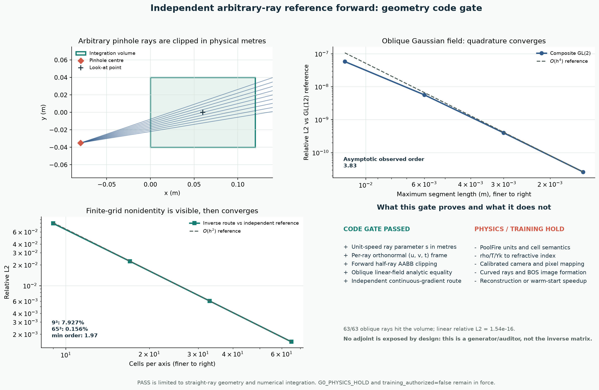

# C 路线证据：任意视角参考正演的几何代码门

> 机器判定：`PASS_ARBITRARY_RAY_REFERENCE_CODE_GATE_ONLY`
>
> 物理判定：`G0_PHYSICS_HOLD`
>
> 训练许可：`training_authorized=false`
>
> 突破判定：没有算法突破；只通过 straight-ray 几何与数值积分代码门。

## 先讲人话

我们最终想比较：

1. 从零开始做三维 BOST 物理反演；
2. 由神经算子先猜一个初值，再让同一个物理 solver 收敛。

如果生成测试观测和反演都使用同一个离散矩阵，warm start 很容易只学会这个矩阵的数值习惯，而不是学到可迁移的流场结构。这叫 **inverse crime**。

本轮新增了一条故意不提供 `adjoint()` 的参考正演路线。它不调用现有 inverse 的中心差分、cell-to-node、LOS 矩阵或 detector crop，而是：

1. 从任意方向的 orthographic/pinhole 相机生成单位射线；
2. 为每条射线构造局部正交的 `u/v` 横向基；
3. 在真实长度单位下把射线裁剪到三维盒子；
4. 直接调用连续的 `∇Δn(x)`；
5. 用复合 Gauss-Legendre 求积得到两分量小角度偏折。

这仍然只是 **straight-ray 数值参考器**。它不是曲线光线、像素位移、BOS 图像，也不是已经确认过单位和组分的 PoolFire optical truth。

## 1. 冻结的数学合同

每条射线写成

\[
\mathbf r(s)=\mathbf o+s\mathbf t,
\qquad \|\mathbf t\|_2=1,
\qquad s\in[s_{\rm in},s_{\rm out}],
\]

所以 `s` 的单位与三维坐标相同，当前明确为 metre。

每条射线携带右手正交基

\[
\|\mathbf e_u\|=\|\mathbf e_v\|=1,\quad
\mathbf e_u^\mathsf T\mathbf t
=\mathbf e_v^\mathsf T\mathbf t
=\mathbf e_u^\mathsf T\mathbf e_v=0,\quad
\mathbf e_u\times\mathbf e_v=\mathbf t.
\]

输出仅为

\[
\varepsilon_a=
\frac{1}{n_{\rm ref}}
\int_{s_{\rm in}}^{s_{\rm out}}
\mathbf e_a^\mathsf T\nabla\Delta n(\mathbf r(s))\,ds,
\qquad a\in\{u,v\}.
\]

由于 `eu/ev` 已垂直于射线，显式写投影矩阵
`I-ttᵀ` 与否在这两个分量上等价。

## 2. 代码结构为什么与 inverse 分开

参考模块：

- `learning_labs/poolfire_g0_reference_forward.py`
- 输入连续 `gradient_delta_n(points)` callable；
- 使用 forward half-ray AABB slab clipping；
- 使用每条射线自己的 `u/v/t` 基；
- 使用分段 Gauss-Legendre；
- 输出 `epsilon_u/epsilon_v`、hit mask、`s_in/s_out`、路径长度和积分调用账；
- 不暴露 `adjoint()`。

当前 inverse 候选：

- `ProjectionFirstInteriorStraightRayOperator`
- 输入粗网格 cell-centred `Δn`；
- 先做等宽 midpoint LOS 投影；
- 再做 detector 中心差分；
- 四周各裁掉一格；
- 暴露精确离散转置。

AST 依赖审计显示，参考模块对以下 inverse primitive 的 import 数为 **0**：

- `poolfire_g0_straight_operator`
- `poolfire_g0_cell_center_operator`
- `_second_order_derivative_matrix`
- `_interior_derivative_matrix`

这证明实现没有共享 inverse primitive，但还不能单独证明真实 CFD 标签不存在 inverse crime；真实标签还需要独立参考网格、插值和物理合同。

## 3. 解析 oracle

### 3.1 斜视角线性场

对常梯度 `g`，解析答案为

\[
\boldsymbol\varepsilon
=\frac{L}{n_{\rm ref}}
\begin{bmatrix}
\mathbf e_u^\mathsf T\mathbf g\\
\mathbf e_v^\mathsf T\mathbf g
\end{bmatrix}.
\]

63/63 条 pinhole 斜射线穿过体积：

- relative L2：`1.54e-16`
- max absolute error：`6.78e-21`

### 3.2 二次场

对

\[
\Delta n(\mathbf x)
=\frac12\mathbf x^\mathsf T H\mathbf x
+\mathbf g^\mathsf T\mathbf x+c,
\]

从入射点 `p0` 积分长度 `L` 的解析梯度积分为

\[
L(H\mathbf p_0+\mathbf g)+\frac12L^2H\mathbf t.
\]

289/289 条斜射线：

- relative L2：`2.08e-16`
- max absolute error：`5.42e-20`

### 3.3 余弦场

对

\[
\Delta n=A\cos(\mathbf k^\mathsf T\mathbf x+\phi),
\]

使用闭式正弦积分检查方向、抵消和相位：

- 289/289 条斜射线有效；
- relative L2：`1.64e-15`
- max absolute error：`4.34e-19`

这些接近机器精度的结果只能证明几何、基和求积公式的一致性。

## 4. 求积收敛

使用斜视角三维 Gaussian `Δn`：

| 最大分段长度 | GL 阶数 | 相对 GL(12) 参考误差 | 观测阶 |
|---:|---:|---:|---:|
| 0.012 m | 2 | `5.79e-8` | - |
| 0.006 m | 2 | `5.69e-9` | 3.35 |
| 0.003 m | 2 | `4.00e-10` | 3.83 |
| 0.0015 m | 2 | `2.60e-11` | 3.94 |

第一段不是严格嵌套网格，因为不同斜射线的分段数由
`ceil(path_length/max_step)` 决定。因此门禁使用最后两个渐近区间：

- asymptotic minimum observed order：`3.83`
- 预期：复合二点 Gauss-Legendre 约四阶
- `Δn` 幅值乘 3.7 后的线性误差：`1.45e-16`

## 5. 坐标尺度不变性

把相机、体积和积分步长全部放大 `7.3` 倍，同时令

\[
\Delta n_\lambda(\mathbf x)=\Delta n(\mathbf x/\lambda),
\qquad
\nabla\Delta n_\lambda
=\lambda^{-1}\nabla\Delta n(\mathbf x/\lambda),
\]

理论偏折不变。

实测：

- 偏折 relative L2：`5.47e-16`
- 路径长度缩放 relative L2：`1.78e-16`

这排除了把未归一化方向参数误当物理弧长的常见错误。

## 6. 与 inverse 的有限网格非同构证据

同一个连续解析场分别走：

- reference：连续解析梯度 + ray clipping + GL；
- inverse：cell-centre 采样 + midpoint LOS + detector 中心差分。

| 每轴 cells | inverse vs reference relative L2 | 观测阶 |
|---:|---:|---:|
| 9 | `7.927%` | - |
| 17 | `2.261%` | 1.97 |
| 33 | `0.603%` | 1.99 |
| 65 | `0.156%` | 2.00 |

解释：

- 粗网格上两条路线明确不是同一个数值映射；
- 网格加密后约二阶收敛到同一个连续问题；
- 所以它适合做后续 synthetic observation 与 inverse baseline 的离散分离。

这不是“误差越大越好”。真正要求是：有限分辨率上实现独立，同时都能收敛到同一个连续 oracle。



## 7. 当前能做什么

允许：

1. 接入师兄确认后的相机 pose 和明确单位的三维 domain；
2. 用解析场继续审计视角、裁剪、符号和求积；
3. 在独立高分辨率 `Δn` 表示到位后生成 straight-ray 参考偏折；
4. 将参考观测与 coarse inverse forward 分开；
5. 开始搭建 Zero/BP/CGLS/PCGLS/Direct Operator 的接口与成本账。

仍然禁止：

1. 把固定 `n_ref` smoke 值写成 PoolFire 燃烧组分光学模型；
2. 把 straight-ray 偏折写成曲线光线、背景位移或像素位移；
3. 把连续解析场写成 CFD 或实验数据；
4. 宣称 G0 physics 已通过；
5. 直接用当前输出训练 C0；
6. 宣称重建、提速、泛化、算法突破或论文成功。

## 8. 下一道真实门

还需要师兄或数据作者确认：

1. PoolFire 数组是 point sample 还是 finite-volume cell average；
2. 坐标单位和 exact domain edges；
3. `rho/T/Yk → Δn` 的公式、常数、波长和 reference；
4. 每视角内参、外参、畸变、ROI、轴约定和像素映射；
5. 现有 solver 的观测变量、A/Aᵀ 或 JVP/VJP；
6. matched-accuracy 停止条件。

在这些输入到位前，下一步可以写强基线的 **接口与合成解析测试**，但不能开始把 PoolFire 当作真实 BOST 标签训练。

## 9. 复现

```bash
.venv/bin/python site_tools/run_poolfire_g0_reference_forward_gate.py
.venv/bin/pytest -q \
  learning_labs/test_poolfire_g0_reference_forward.py \
  site_tools/test_run_poolfire_g0_reference_forward_gate.py
.venv/bin/python \
  site_tools/render_poolfire_g0_reference_forward_figure.py \
  learning_labs/results/poolfire_g0_reference_forward_gate_v0/result.json \
  assets/poolfire_g0_reference_forward_gate_v0.png
```

机器可读结果：

- `learning_labs/results/poolfire_g0_reference_forward_gate_v0/result.json`

证据等级总结：

| 问题 | 当前状态 |
|---|---|
| 任意 straight-ray camera frame | 代码门通过 |
| AABB clipping 与物理弧长 | 代码门通过 |
| 解析场与求积收敛 | 代码门通过 |
| 与 inverse primitive 分离 | 代码门通过 |
| PoolFire 单位/field semantics | 未确认 |
| 反应流折射率模型 | 未确认 |
| 真实相机和像素映射 | 未确认 |
| curved-ray / BOS 图像 / 光流 | 未实现 |
| C0 warm start 的同精度成本收益 | 未测试 |
