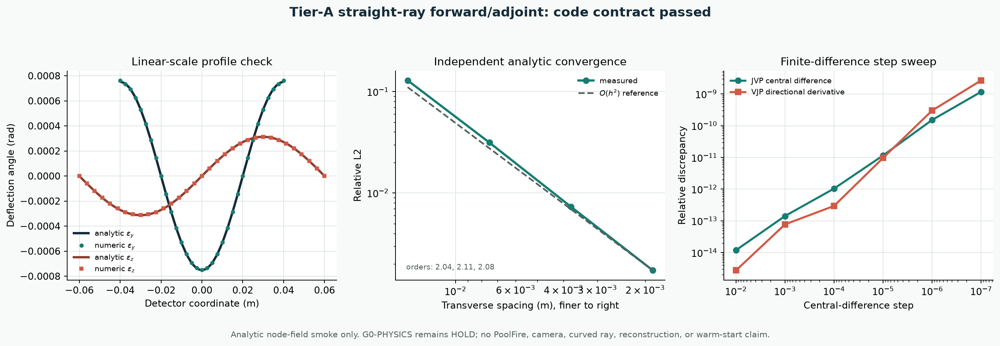

# PoolFire G0 Tier-A 直线 forward/adjoint 证据

| 门 | 当前状态 |
|---|---|
| 数值判定 | `PASS_TIER_A_STRAIGHT_CODE_SMOKE_ONLY` |
| 物理判定 | `G0_PHYSICS_HOLD` |
| C0 训练 | `training_authorized = false` |

这一步只回答一个窄问题：在明确的节点网格、单位和离散约定下，最小直线 LOS `Δn → 偏折角` forward 及其精确离散 adjoint 是否把符号、尺度、边界与转置写对。

它不使用 PoolFire 场，也不证明物理可信 BOST、三维重建、warm start、加速或泛化。

## 1. 冻结的代码合同

对正坐标轴方向的一条 LOS，程序计算

\[
\boldsymbol\epsilon_\perp
=
\frac{1}{n_{\rm ref}}
\sum_q w_q\,\nabla_{\perp,h}\Delta n_q .
\]

当前合同是：

| 项目 | 冻结语义 |
|---|---|
| 三维数组顺序 | `[x,y,z]` |
| 场位置 | 均匀升序 Cartesian **节点** |
| 输入 | 无量纲 `Δn` |
| 坐标与 LOS 权重 | metre |
| 输出 | small-angle transverse deflection，语义记作 rad |
| LOS 积分 | 节点 composite trapezoid |
| 横向导数 | 内部二阶中心、边界二阶单边 |
| adjoint | 普通 Euclidean 数组内积下的精确离散转置 |
| 当前视角 | 仅 `+x/+y/+z` 轴对齐 smoke |

程序不包含：

- 透视相机、内外参、畸变或背景平面；
- 偏折角到背景端点或像素位移的映射；
- curved ray；
- 组分相关 Gladstone-Dale；
- 背景渲染、PSF、采样、噪声或光流。

## 2. 为什么不能只做 dot test

错误的 `A` 和与它配套的错误 `A^T` 也可能通过 dot test。因此本门同时使用独立解析场、单位重参数化、三轴符号/尺度、边界脉冲、JVP/VJP 步长扫描和网格收敛。

特别是：

- 线性场解析值不调用待测导数实现；
- smooth sinusoidal 场用连续解析梯度作 oracle；
- metre 坐标改写为 millimetre 并同步重参数化后，偏折角必须不变；
- 60 个 dot cases 覆盖三个 LOS 轴和每轴八个角点脉冲；
- 中心差分步长从 `10^-2` 扫到 `10^-7`，不挑单个漂亮步长。

## 3. 实测结果

| 检查 | 实测 | 门槛 | 判定 |
|---|---:|---:|---|
| 非零常数场最大偏折 | `5.11×10^-19 rad` | `≤2×10^-16` | PASS |
| 三轴线性场最大尺度 relative-L2 | `2.39×10^-15` | `≤5×10^-12` | PASS |
| 三轴线性场符号 | 全部一致 | 必须一致 | PASS |
| 加常数后的最大变化 | `6.51×10^-19 rad` | `≤5×10^-16` | PASS |
| 线性组合 relative-L2 | `2.02×10^-16` | `≤5×10^-13` | PASS |
| metre/mm 一致重参数化 relative-L2 | `1.48×10^-16` | `≤5×10^-13` | PASS |
| `n_ref` 反比缩放 relative-L2 | `9.65×10^-17` | `≤5×10^-13` | PASS |
| 60 个 forward/adjoint dot case 最大归一化差 | `2.03×10^-17` | `≤5×10^-13` | PASS |
| `<1,A^Ty>=0` 最大归一化差 | `2.89×10^-17` | `≤5×10^-13` | PASS |
| JVP 步长扫描最佳 relative-L2 | `1.19×10^-14` | `≤5×10^-9` | PASS |
| VJP 方向导数最佳 relative error | `2.74×10^-15` | `≤5×10^-9` | PASS |
| 解析网格收敛阶 | `2.04 / 2.11 / 2.08` | 最低 `≥1.8` | PASS |
| LOS 权重和相对误差 | `0` | `≤5×10^-15` | PASS |

总计 `14/14` checks 通过。



左图比较解析与数值偏折剖面；中图显示独立解析 oracle 下的二阶空间收敛；右图公开 JVP/VJP 的完整有限差分步长曲线。

## 4. 红队限制

### 4.1 节点场不能直接套 PoolFire

当前 PoolFire `rho` 派生数据是 cell-centred block mean；本算子接收 node field。二者尚未有获准的 adapter。不能靠 reshape、复制边界或默默插值把它们接起来。

下一门必须比较至少两条显式路线：

1. 在 cell centre 上定义 conservative gradient/LOS；
2. 用声明边界条件的 cell-to-node 映射，再进入本节点算子。

两条路线应在 high-resolution analytic field 上比较偏折误差、边界误差和 adjoint。

### 4.2 常数场是 gauge 测试

`A(Δn+c)=A(Δn)` 只表示声明域内的常数 gauge。它不等价于“有限折射率块在空气中没有边界折射”。

### 4.3 轴对齐不等于九视角相机

本算子没有任意射线方向、相机平面正交基、透视、射线裁剪或视场。三轴通过只证明坐标顺序和三个方向的基本尺度，没有验证师兄工具的九视角几何。

### 4.4 同离散仍会构成 inverse crime

即使把该 forward 接到 CGLS 并成功反演，也只能算同离散单元测试。生成端与反演端必须至少在网格、积分、插值或 ray model 上独立，正式主表还要加入 curved/straight mismatch 和图像/光流链。

## 5. 当前允许与禁止的表述

允许：

> 带声明单位和离散约定的线性、轴对齐 straight-LOS `Δn → 偏折角` 矩阵自由 forward/adjoint 通过 Tier-A code smoke。

禁止：

- PoolFire 光学模型已经正确；
- 物理可信 synthetic BOST 已完成；
- 三维重建或 warm-start 已成功；
- C0 已获准训练；
- 已经得到加速、泛化或论文结论。

## 6. 下一道有效门

1. 向何远哲师兄确认 G0 合同中的 12 项单位、reference、相机与 callable 语义；
2. 建立 cell-centre 与 node 两种独立离散，先在解析场上比较；
3. 增加任意单位正交射线基与 camera-ray clipping；
4. 在同一 `Δn` 上做 straight/curved、步长和端点差；
5. 只有像素语义与独立 forward 闭合后，才生成 Zero/BP/CGLS/PCGLS 基线数据。

## 7. 可复现入口

```bash
.venv/bin/python site_tools/run_poolfire_g0_tier_a_smoke.py
.venv/bin/python site_tools/render_poolfire_g0_tier_a_figure.py \
  learning_labs/results/poolfire_g0_tier_a_straight_v0/result.json \
  assets/poolfire_g0_tier_a_straight_v0.png
.venv/bin/python -m pytest -q \
  learning_labs/test_poolfire_g0_straight_operator.py \
  site_tools/test_run_poolfire_g0_tier_a_smoke.py
```

结果文件：

- `learning_labs/results/poolfire_g0_tier_a_straight_v0/result.json`
- `assets/poolfire_g0_tier_a_straight_v0.png`

证据等级始终为 `TIER_A_STRAIGHT_RAY_CODE_SMOKE_ONLY`。
