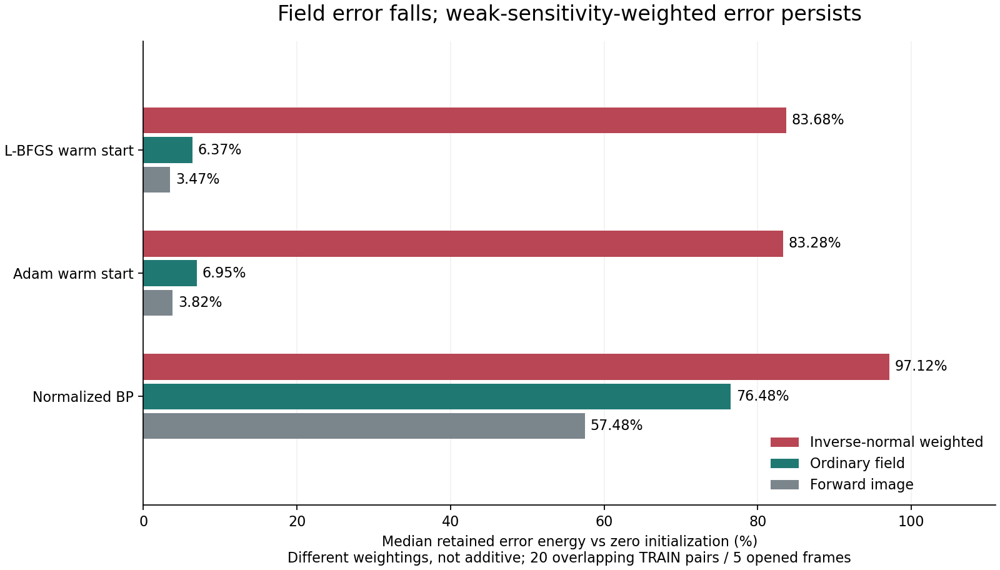

# 暖启动误差保留诊断 / Warm-Start Error Retention

2026-09-07

20个重叠训练折次与帧组合中，学习暖启动的普通场误差能量中位数只剩零初值的6.37%，但逆法矩阵加权误差仍剩83.68%；反投影也呈现同方向现象。双实现确认了弱灵敏度加权误差保留较多，不证明迭代慢的因果关系，也不是省算、泛化或真实BOST突破。

Across 20 overlapping TRAIN fold-frame pairs, the learned warm start retains a median 6.37% of zero-start field-error energy, but 83.68% under inverse-normal weighting. Backprojection shows the same ordering. Two implementations confirm greater retention under weak-sensitivity weighting, not a causal explanation of iteration counts or a speed, generalization or real-BOST breakthrough.

## 检查对象 / Population

只使用五条已开封PoolFire轨迹各一个既定中点。每个冻结模型折次使用其他四条训练轨迹，得到20个重叠折次与帧组合；不是20个独立样本，不是完整505帧，不是留出泛化测试。主模型为冻结L-BFGS暖启动，对照是同结构Adam暖启动与归一化反投影。没有拟合新参数、读取CFD真值或执行CGLS迭代。只诊断初值相对已独立验证、由观测求得的直接解之差。

Use one fixed midpoint from each of five opened PoolFire trajectories. Each frozen model fold uses the other four TRAIN trajectories, producing 20 overlapping fold-frame pairs, not 20 independent samples, all 505 frames or a held-out generalization test. The primary is the frozen L-BFGS warm start; controls are its Adam counterpart and normalized backprojection. No parameters are fitted, CFD truth read or CGLS iterations executed. Initializer error is measured against the independently qualified observation-derived direct solution.

## 测量和结果 / Measures and Result

令H=A^T A、直接解为t、初值误差e=t-x0。三种比值分别为(e^T H^-1 e)/(t^T H^-1 t)、||e||²/||t||²、||Ae||²/||At||²。均是相对零初值的平方能量比例，不是普通相对误差，也不是可以相加的能量分区。H^-1加大对低法算子特征值方向的权重；没有划定谱截止或选取秩。

Let H=A^T A, direct solution t and initializer error e=t-x0. The ratios are (e^T H^-1 e)/(t^T H^-1 t), ||e||²/||t||² and ||Ae||²/||At||². They are squared-energy fractions relative to zero initialization, not ordinary relative errors or additive energy partitions. H^-1 emphasizes directions with small normal-operator eigenvalues; no spectral cutoff or rank is selected.

| 初值 / Initializer | 逆法矩阵 / Inverse normal | 场 / Field | 前向 / Forward |
|---|---:|---:|---:|
| lbfgs1840 | 83.68% | 6.37% | 3.47% |
| adam1840 | 83.28% | 6.95% | 3.82% |
| normalized_bp | 97.12% | 76.48% | 57.48% |

两版都在全部20个组合上确认逆法矩阵比例>场比例>前向比例，且差距超过结果前固定的相对1e-6判别余量。表为正式实现中位数。主模型逆法矩阵比例范围76.07%至93.30%，场比例仅3.50%至9.18%。它确实改善了部分弱权重误差，不能说完全没有学到；但普通场能量的大幅改善没有对应同幅度的弱灵敏度加权改善。反投影也有同样顺序，故定性现象不是该模型特有的。

Both implementations confirm inverse-normal > field > forward on all 20 pairs, beyond the preregistered relative 1e-6 margin. The table gives formal medians. Primary inverse-normal fractions span 76.07%-93.30%, while field fractions span 3.50%-9.18%. Some weak-weighted error is improved, so this does not mean no learning occurred. However, the large field-energy improvement is not matched under weak-sensitivity weighting. Backprojection shares the ordering; the qualitative pattern is not model-specific.

## 验证和意义 / Verification and Meaning

正式版从Cholesky下三角解构造负谱矩；独立版从独立装配算子的带列置换QR分解构造，并用另一套张量收缩重建预测。两版都直接检查H g=e。最大法方程残差1.38e-12，指标最大缩放差2.99e-12，初始场最大相对差2.68e-15，物理误差投影最大相对差1.75e-13。两条路径分别封存后才比较，所有判别一致；父输入保持不变。

The formal path uses Cholesky triangular whitening. The independent path uses pivoted QR of the separately assembled operator and reversed tensor contractions for predictions. Both directly check H g=e. Maximum normal-equation residual is 1.38e-12, scaled metric difference 2.99e-12, initial-field relative difference 2.68e-15 and error-projection relative difference 1.75e-13. Each path seals before comparison; all descriptors agree and parent inputs remain unchanged.

它补充了此前晚期修正的平均Rayleigh商诊断：这次直接测量冻结学习初值，并检查逆法矩阵加权。结果支持先研究弱灵敏度误差处理，不支持声称误差只在近零空间、是傅里叶低频，或已经证明迭代数的因果解释。CG收敛与谱结构有关是标准知识，不是新颖性主张。[Netlib CG convergence](https://www.netlib.org/linalg/html_templates/node22.html).

This extends the prior mean-Rayleigh diagnosis of late corrections by measuring the actual frozen learned initializer under inverse-normal weighting. It supports investigating weak-sensitivity error handling. It does not establish exclusive near-null support, low Fourier frequency or a causal account of iteration counts. The relationship between CG convergence and spectral structure is standard, not a novelty claim. [Netlib CG convergence](https://www.netlib.org/linalg/html_templates/node22.html).

两版合计新增270A+220AT及260次三角求解，全部属于离线诊断；复用的几何组装和稠密分解不是免费部署算力。此前精度认证但未稳定省算的结论不变。本轮不授权重训、改损失、扩跑505帧或租GPU，不是算法突破、资源提速、外部泛化或真实BOST成果。

Both paths add 270 A and 220 AT actions plus 260 triangular solves, all offline diagnostic work. Inherited geometry assembly and dense factors are not free deployment resources. The previous certified-accuracy but unstable-call-savings result stands. This does not authorize retraining, a loss change, a 505-frame expansion or GPU rental; it is not an algorithm breakthrough, resource speedup, external generalization or real-BOST result.

[脱敏汇总 / Redacted summary](poolfire_inverse_moment_20260907.json)

[此前精度与成本判决 / Previous accuracy and cost decision](poolfire_functional_stop_20260907.md)
