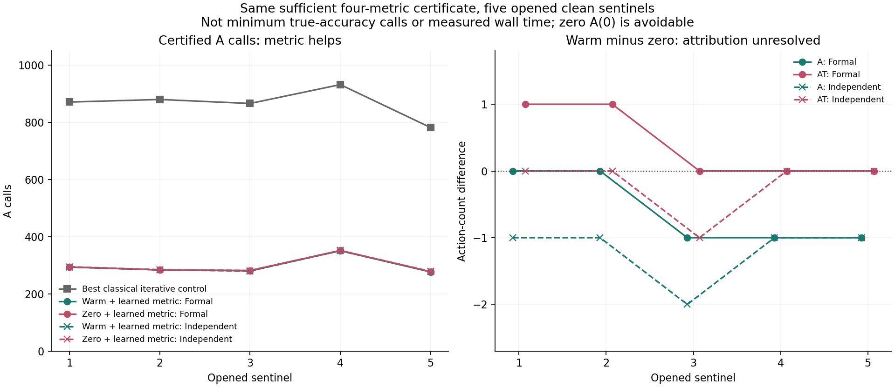

# 学习残差度量与暖启动归因 / Learned Residual Metric and Warm Attribution

2026-09-07

学习残差度量在五个已开封哨兵上均通过原始精度认证，A调用约降62.3%-67.7%；但零初值配合同一学习度量也几乎同样快。两版对暖启动额外收益的判决不一致，故总体仍为INCONCLUSIVE。这是小范围的学习度量收益，不是暖启动、完整序列或实测速度突破。

The learned residual metric certifies all five opened sentinels with about 62.3%-67.7% fewer A actions. Zero initialization with the same metric is almost as fast. The two paths disagree on warm-specific control dominance, so the overall result remains INCONCLUSIVE. This is limited learned-metric headroom, not a warm-start, complete-sequence or measured-speed breakthrough.

## 唯一变化 / Only Change

不重训，使用同一冻结正定dual映射T。由矩形因子F构造F^T F=T，解min||F(y-Ax)||²；初值仍为A^T T y。正式版在FA上使用标准CGLS，独立版用另一套收缩计算A^T T r和加权方向能量。每步只需1A+1AT，但F/FT或T应用并非免费。它与此前平方dual场预条件器不同，旧负结果保留。

Without retraining, use the same frozen positive dual map T. Construct a rectangular F with F^T F=T and solve min||F(y-Ax)||², retaining initial A^T T y. The formal path uses standard CGLS on FA; the independent path computes A^T T r and weighted direction energy through different contractions. Each iteration needs 1A+1AT, but F/FT or T work is not free. This differs from the previously rejected squared-dual field preconditioner; that rejection stands.

这改变最小二乘度量。只有一致clean系统的唯一解保持相同，含噪或模型失配时一般不等价。仅使用五条已开封轨迹各一个既定九相机中点和原有完整轨迹外折模型。用原始未加权物理残差、相同四项1%精度与充分认证停止；真值只评分已封存端点。不是完整505帧、连续位姿、其他相机基数或真实BOST验证。

The least-squares metric changes. The unique solution is preserved for the consistent clean system, not generally for noise or model mismatch. Use one fixed nine-camera midpoint from each of five opened trajectories and the original whole-trajectory outer-fold models. Stop using the original unweighted physical residual, the same four 1% metrics and sufficient certificate; truth only scores sealed endpoints. This is not all 505 frames, continuous poses, other camera counts or real BOST validation.

## 结果与严格边界 / Results and Strict Limits

| 哨兵 / Sentinel | 经典最小A / Classical best A | 学习度量+暖启动 A/AT / Learned metric + warm A/AT | 学习度量+零初值 A/AT / Learned metric + zero A/AT |
|---|---:|---:|---:|
| 1 | 871 | 294/293 | 294/292 |
| 2 | 880 | 284/283 | 284/282 |
| 3 | 866 | 281/280 | 282/280 |
| 4 | 932 | 351/350 | 352/350 |
| 5 | 782 | 277/276 | 278/276 |

表为正式路径。经典列是Zero-CGLS、Jacobi、BP和dual-ridge两版中逐帧最少A数。候选两版均5/5通过认证，A调用降低62.3%-67.7%；零初值配合同一学习度量也两版5/5。原几何固定度量在预算内0/5通过认证，但其所有端点实际四项1%精度已经通过，不能称重建失败。全30个端点实际精度通过，故这里比较的是同一充分认证的代价，不是达到1%真实精度的最少调用。

The table shows the formal path. Classical counts are per-frame minimum A counts across both versions of Zero-CGLS, Jacobi, BP and dual ridge. Both candidate paths certify 5/5, using 62.3%-67.7% fewer A actions; zero initialization with the same learned metric also certifies 5/5 in both paths. The fixed geometry-only metric certifies 0/5 within its cap, yet all its endpoints already meet actual four-metric 1% accuracy: it is not a reconstruction failure. All 30 endpoints meet actual accuracy. Thus this compares the cost of the same sufficient certificate, not minimum actions to attain true 1% accuracy.

暖启动归因未通过。正式路径前两个哨兵相对零初值多花1次AT，独立路径则没有这项劣势；其余差距主要是1-2步。结果前要求两版控制支配判决一致，故权威总体状态为INCONCLUSIVE_LEFT_METRIC_CONTROL_DOMINANCE，不改容差、不重跑选择更好版本。收益不能归给单独暖启动，也不能把学习度量机制等同于最终论文目标。

Warm attribution does not pass. On the first two formal sentinels the warm start adds one AT versus zero; the independent path has no such disadvantage. Other gaps are mainly 1-2 steps. The preregistered rule requires both control-dominance decisions to agree, so the authoritative overall status is INCONCLUSIVE_LEFT_METRIC_CONTROL_DOMINANCE. No tolerance change or favorable rerun is used. Gains cannot be attributed to the warm start alone, nor can this metric mechanism replace the paper objective.

## 复核与成本 / Verification and Cost

正式求解退出0。原独立程序在第一条认证计算因常数列表类型错误退出1；保留全部文件。另行核验仅转换为数值完全相同的float64数组，重放已封存端点，不重跑求解或改合同。新核验退出0、八项检查通过，退出后输入输出哈希再次不变。最大原生投影差7.15e-16、残差差1.56e-15、同场评分差1.89e-15；F^T F身份差5.37e-16，相机重排度量差5.42e-16。几百步后两路径并非逐位相同。

The formal solver exited 0. The original verifier exited 1 at its first certificate because constants remained a list; all files are retained. A separate audit only converts the identical numbers to a float64 array and replays sealed endpoints, without rerunning solvers or changing rules. It exits 0 with eight checks, followed by unchanged post-exit hashes. Maximum native projection difference is 7.15e-16, residual difference 1.56e-15 and same-field score difference 1.89e-15; F^T F identity difference is 5.37e-16 and camera-permutation metric difference 5.42e-16. Long floating-point trajectories are not bitwise identical.

正式每步1A+1AT+1F+1FT；独立每步1A+1AT+2T，初值、初始残差和额外物理认证另计。现行零初值程序还执行了一次可避免的A(0)：保留实际账，未来必须去掉这个无效动作，不允许借此制造暖启动优势。已有密集认证构建、模型训练和几何准备不免费；全缓存直接解仍是更强固定几何对照，未被击败。没有实测端到端提速、RSS、外部泛化或真实BOST成果。

Formal steps cost 1A+1AT+1F+1FT; independent steps cost 1A+1AT+2T, with initialization, initial residual and physical certification charged separately. The executed zero-start code includes one avoidable A(0): actual receipts remain, but future comparisons must omit it rather than manufacture warm-start benefit. Dense certificate setup, training and geometry preparation are not free. Fully cached direct remains a stronger fixed-geometry comparator and is not beaten. There is no measured end-to-end speedup, RSS, external generalization or real-BOST result.

## 结构性提醒 / Structural Caution

令K=A^T T A、g=A^T T y，当前暖初值恰为g。精确算术下，k步暖启动的搜索集合g+span(g-Kg,...,K^(k-1)(g-Kg))包含于span(g,Kg,...,K^k g)，即零初值多一步的Krylov空间。因此它并未提供这一空间以外的新方向；这不是对原始场/梯度误差或浮点认证次数的支配定理。下一初始化必须解释真正新增的信息。CG最小化性质及学习预条件器均有先例，不是首创主张。[Netlib CG](https://www.netlib.org/linalg/html_templates/node20.html)，[Li et al., ICML 2023](https://proceedings.mlr.press/v202/li23e.html)。

Let K=A^T T A and g=A^T T y. The warm initial field is exactly g. In exact arithmetic, its k-step search set g+span(g-Kg,...,K^(k-1)(g-Kg)) lies within span(g,Kg,...,K^k g), the cold-start Krylov space with one extra step. It adds no direction outside that space. This is not a dominance theorem for unweighted field/gradient error or floating-point certificate counts. The next initializer must justify genuinely new information. CG minimization and learned preconditioning have prior art, not novelty claims. [Netlib CG](https://www.netlib.org/linalg/html_templates/node20.html), [Li et al., ICML 2023](https://proceedings.mlr.press/v202/li23e.html).

[脱敏汇总 / Redacted summary](poolfire_left_metric_20260907.json)

[此前平方dual角色负结果 / Previous squared-dual rejection](poolfire_dual_pcgls_20260907.md)
