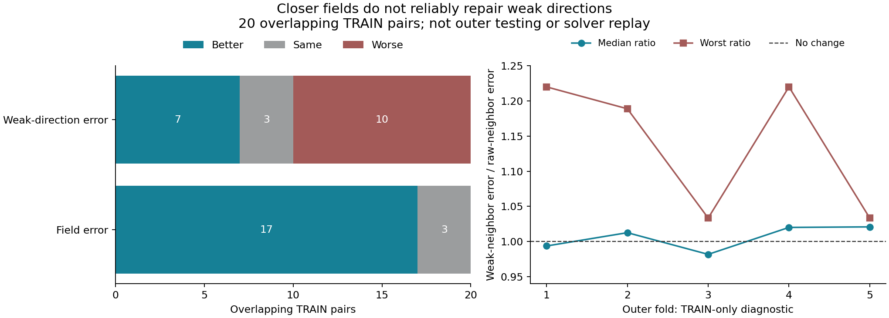

# 相似度与弱方向 / Similarity and Weak Directions

2026-09-08

相似度诊断已独立复算：在20个重叠的训练配对中，冻结学习度量选出的邻居有17个三维场误差更小、3个不变，但逆法向加权的弱方向误差有10个更差、7个改善、3个不变，最坏恶化22.01%。五个训练折筛选门为0/5。没有新拟合或外折测试；不能把“冷求解更快”直接当作“暖启动相似度更可靠”。505帧学习度量正结果不变。

The independently verified similarity diagnostic covers 20 overlapping training pairs. Neighbors selected by the frozen learned metric have smaller field errors in 17 pairs and ties in 3, but inverse-normal-weighted weak-direction errors worsen in 10, improve in 7 and tie in 3, with 22.01% worst harm. The five TRAIN-fold screens pass 0/5. No new fit or outer test is run. Faster cold solving does not automatically make warm-start similarity reliable. The 505-frame learned-metric result remains unchanged.

## 只检验了什么 / The Narrow Test

每个外折只用其余四条训练轨迹。取其中四个既有中点，各自只与另外三条轨迹的303帧比较。原始观测范数归一化不变，仅比较欧氏距离与同一冻结学习度量的距离。两套实现先封存邻居选择，再读取由观测和几何求得的教学解评分，不读CFD真值，不拟合预测器，不做求解器重放。

Each outer fold uses only the other four training trajectories. Its four existing midpoint queries each compare against 303 frames from the other three training trajectories. Raw observation-norm scaling stays fixed; Euclidean distance is compared with distance under the same frozen learned metric. Both implementations seal neighbor choices before reading observation/geometry-derived teaching solutions for scores. No CFD truth, predictor fit or solver replay is used.

**这些是20个重叠的训练配对，不是外折测试。** 冻结度量训练时已经见过这些训练样本。逆法向加权距离放大难恢复方向，它不是本轮重新测量的场/梯度精度门或迭代成本。排序相关性20/20改善，并不代表选择出的最近邻可靠补足弱方向。

**These are 20 overlapping training pairs, not outer tests.** The frozen metric has seen these training samples. Inverse-normal-weighted distance emphasizes weakly observed directions; it is not a newly measured field/gradient accuracy gate or iteration cost. Ranking correlation improves in all 20 pairs without making the nearest neighbor reliably supply weak-direction information.

## 固定判决 / Fixed Decision

比值为学习度量所选邻居的弱方向误差除以原始相似度所选邻居的误差，小于1才改善。每折必须中位数严格改善且四个配对均无伤害；五折均未通过。不据此启动相同度量核的ridge拟合，也不调幂次或权重救结果。没有实际运行新ridge，所以不能说所有度量核回归已被否定。

Ratios divide the metric-selected neighbor's weak-direction error by the raw-selected neighbor's error; values below 1 improve. Every fold must strictly improve its median with no harm in any of its four pairs. None passes. Do not start a same-metric ridge fit or tune powers or weights on this rationale. No new ridge is actually run, so this does not refute all metric-kernel regression.

| 训练折 / TRAIN fold | 弱方向误差比中位数 / Median weak-error ratio | 最坏比 / Worst ratio |
|---|---:|---:|
| 1 | 0.993582 | 1.220070 |
| 2 | 1.012512 | 1.188903 |
| 3 | 0.981631 | 1.033325 |
| 4 | 1.020011 | 1.220070 |
| 5 | 1.020759 | 1.033325 |

可用于解释但不参与选邻居的单帧教学解oracle，在13/20个配对中的弱方向相对误差仍不小于1，即不优于该诊断范数下的零场。这只是单邻居的限制，不能推广到多个教学解的有符号组合、非线性预测器或所有暖启动。

The offline, teacher-visible best single-neighbor oracle still has weak-direction relative error at least 1 in 13/20 pairs, no better than zero in that diagnostic norm. This is only a single-neighbor limitation, not a bound on signed combinations of teachers, nonlinear predictors or all warm starts.

## 理解与边界 / Interpretation and Limits

冷求解预条件和暖启动相似度承担不同任务。理想左白化可以让观测距离对应普通场距离，而逆法向诊断会进一步放大弱敏感方向。这里并未证明学习度量达到理想白化，也未证明某种诊断距离决定迭代成本。已经验证的505帧收益保留；暖启动额外价值仍需独立完整轨迹实验证明。

Cold-solver preconditioning and warm-start similarity serve different roles. Ideal left whitening can make observation distance correspond to ordinary field distance, whereas the inverse-normal diagnostic further emphasizes weak directions. This does not prove our learned metric is ideal whitening or that a diagnostic distance determines iteration cost. The verified 505-frame benefit remains; extra warm value still requires independent complete-trajectory experiments.

两套实现分别用因子空间距离和独立张量二次型复算，观测距离最大相对差2.56e-15，教学解距离2.79e-12，最坏比汇总4.29e-12；退出后输入输出与全部判决再核对。新增0A+0AT，但2020次F、2020次T及已有教学解、训练和几何准备不是免费。本轮不是重建、算力、实测速度、泛化或真实BOST突破。

The two implementations use factor-space distance and independently constructed tensor quadratic forms. Maximum relative discrepancies are 2.56e-15 for observation distances, 2.79e-12 for teacher distances and 4.29e-12 for worst-ratio summaries; post-exit auditing rechecks inputs, outputs and all decisions. New exact work is 0 A plus 0 adjoint actions, but 2020 F and 2020 T actions and inherited teachers, training and geometry are nonfree. This is not a reconstruction, resource, measured-speed, generalization or real-BOST breakthrough.

[脱敏汇总 / Redacted summary](poolfire_metric_similarity_20260908.json) | [既有505帧结果 / Retained 505-frame result](poolfire_full_control_cost_20260908.md)
