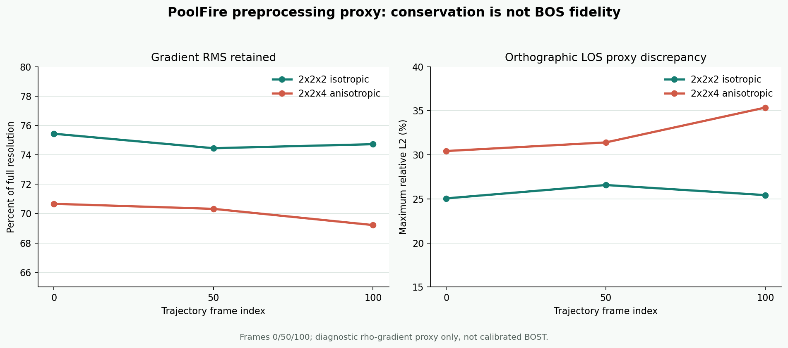

# PoolFire 低分辨率候选：守恒不等于 BOST 保真

> 状态：`CONTRACT_DESIGNED / NOT_AUTHORIZED_FOR_C0_TRAINING`
>
> 证据等级：`PUBLIC_CFD_PREPROCESSING_PROXY_ONLY`
>
> 这份报告证明低分辨率候选的来源、离散块平均和三帧梯度代理可复现。它不证明单位、真实 BOS/BOST forward、三维重建、warm start 加速或泛化。

## 1. 本轮真实决策

首条 PoolFire train trajectory 的 full-resolution rho 数据桥已经通过。低分辨率模型不能直接使用旧式 `rho[::k]` 抽点；BOS/BOST 依赖沿光路积分的折射率梯度，离散总量相同也可能抹平关键前缘。

本轮比较后冻结：

- 主候选：`(2,2,2)` 块平均，`80×80×200 → 40×40×100`；
- 审计对照：`(2,2,4)` 块平均，`80×80×200 → 40×40×50`；
- 直接 stride：拒绝作为训练预处理；
- C0 训练：继续关闭，直到物理语义和表示误差门通过。

选择 `(2,2,2)` 的理由不是它已经“足够准确”，而是它保留当前数值坐标下约 `0.03×0.03×0.03` 的等距网格。`(2,2,4)` 会得到约 `0.03×0.03×0.06`，额外压低竖直前缘。

## 2. 可复现派生合同

派生器先验证 source manifest、四文件 checksum 和 READY，再逐帧执行：

\[
\rho^c_{i,j,k} =
\frac{1}{f_x f_y f_z}
\sum_{a=0}^{f_x-1}
\sum_{b=0}^{f_y-1}
\sum_{c=0}^{f_z-1}
\rho^h_{f_x i+a,\ f_y j+b,\ f_z k+c}.
\]

三个原坐标轴均为降序。脚本把坐标和 rho 沿相同轴一起反序，再进行块平均；这只是重排存储顺序，不改变世界坐标或标量符号。

`(2,2,2)` 主候选：

| 项目 | 已验证值 |
|---|---|
| shape / dtype | `(101,40,40,100)` / `float32` |
| rho 文件大小 | `64,640,128 bytes` |
| finite / positive | 全部通过 |
| rho min / max / mean | `0.1970291 / 1.1793500 / 1.1608748` |
| x / y | `-0.585 → 0.585`，40 点 |
| z | `0.015 → 2.985`，100 点 |
| source manifest SHA | `a427121c4cf48bdf2b537c3cfc32538d3024b018694c80a1251eef284ba7f739` |
| candidate manifest SHA | `ca9d07f11cc00aaf5d282dbbcbd5ff53fd4aebafd4ccc2b7c4ec4996b2e3b489` |
| rho SHA | `73bc041435057a5cae39fde365cad61404ab0c72378d65633b7536c2c24db930` |

三帧 `0/50/100` 又被独立重算，候选与 full-resolution rho 的精确 float32 块平均逐点一致，最大绝对差均为 0。

## 3. 为什么不再写“质量守恒”

当前数据没有权威确认 rho 单位，也没有权威确认 `Cx/Cy/Cz` 是 cell center。脚本只能证明：

\[
\left|
\frac{f_x f_y f_z\sum \rho^c-\sum \rho^h}
{\sum \rho^h}
\right|
= 2.34\times10^{-10}.
\]

这叫**均匀网格离散和等价**，不是已确认单位下的物理质量守恒。它也完全不保证梯度、光线积分或图像位移得到保留。

作为对照，`(2,2,2)` 的直接 stride 离散和误差为 `2.46×10^-5`，stride 与块平均场的相对 L2 为 `0.985%`。这些是预处理差异，不是重建误差。

## 4. 三帧梯度与 LOS 代理

为避免“守恒，所以可用于 BOS”的错误推理，新增独立审计器。对帧 `0/50/100`：

1. 在 full-resolution 与 coarse grid 上分别用二阶有限差分求 `∇rho`；
2. 报告 coarse/full 的三分量梯度 RMS 比值；
3. 分别沿 x/y/z 做正交直线积分，只保留横向梯度分量；
4. 将 full-resolution detector plane 用同一块平均限制到 coarse plane；
5. 报告两个二维向量代理的 relative L2，并取三条 LOS 中最大值。

结果：

| 候选 | 梯度 RMS 保留 | LOS 代理最大 relative L2 | 判定 |
|---|---:|---:|---|
| `(2,2,2)` | `74.45%–75.44%` | `25.06%–26.57%` | 最小主候选，未授权训练 |
| `(2,2,4)` | `69.22%–70.67%` | `30.43%–35.36%` | 仅审计，拒绝作默认 |



这里没有相机透视、折射率常数、曲光线、背景图案、像素标定或遮挡。因此它只是 rho-gradient 的正交 LOS 代理，不是 BOS/BOST forward，更不能作为论文测量误差。

## 5. 为什么 C0 仍被关闭

当前同时存在五个硬阻塞：

1. metadata 没有 rho、time、coordinate 的权威单位；
2. 数值坐标像 `1.2×1.2×3.0`，公开说明却写 `3×3×3 m³`；
3. `Cx/Cy/Cz` 看起来像 cell center，但原始 exporter/mesh 尚未证明；
4. 只有一条 train trajectory，不能冻结 train-only normalization；
5. 师兄工具的输入是 rho、n、n-1 还是 `Δn`，以及偏折单位和最终背景渲染仍未确认。

尤其要避免 inverse crime：full-resolution 或更高保真 forward 生成观测，低分辨率/不同离散的 forward 才用于反演。生成与反演共用同一网格和同一积分器时，只能标为调试结果。

## 6. 下一份可验收合同

C0 前必须依次完成：

1. 获得全部 11 条 train trajectory；2 val/2 test 不参与 reference 或 normalization；
2. 由公开作者或师兄确认单位、cell-center 语义和 domain 冲突；
3. 冻结部署可得的 `rho_ref`，先在 full resolution 形成 `Δrho`；
4. 若 Gladstone-Dale 系数随组分变化，先在高分辨率形成 `Δn`，再限制到 coarse grid；
5. 常数场偏折为零、线性场符号和尺度与解析式一致；
6. 计算 `F_hi(x_hi)` 与 `F_coarse(Rx_hi)` 的逐视角表示误差；
7. 只有当表示误差小于噪声预算和目标停止阈值的预定比例，才启动 Zero/BP/CGLS；
8. 经典闭环成立后，再训练 C0 warm start。

相关一级入口：

- [NeRIF 开放全文：BOST 前向模型与神经折射率场](https://arxiv.org/html/2409.14722v2)
- [BOS 综述 DOI](https://doi.org/10.1007/s00348-015-1927-5)
- [REALM PoolFire 公开数据](https://huggingface.co/datasets/realm-bench/realm-bench-PoolFire/tree/main)
- [The inverse crime](https://arxiv.org/abs/math-ph/0401050)

## 7. 允许与禁止的表述

当前允许：

> 一条公开 PoolFire train trajectory 已产生可校验的 `40×40×100` 等距低分辨率候选；三帧代理表明它仍损失约四分之一的梯度 RMS，并产生约四分之一的 LOS 代理差，因此尚未授权进入 C0 训练。

当前禁止：

- “块平均已经保留 BOST 信息”；
- “低分辨率数据已经物理正确”；
- “已经生成可靠 BOS 图像”；
- “已经完成三维重建”；
- “warm start 已经提速或可泛化”。

## 8. 复现入口

结果数据：`learning_labs/results/poolfire_preprocessing_proxy_v0/result.json`

实现与测试：

```text
site_tools/derive_poolfire_rho_blockmean.py
site_tools/audit_poolfire_preprocessing_proxy.py
site_tools/test_derive_poolfire_rho_blockmean.py
site_tools/test_audit_poolfire_preprocessing_proxy.py
```

两套 Python 环境合计均通过 10 项定向测试。真实候选的 manifest/checksum/READY 也已独立复核。
