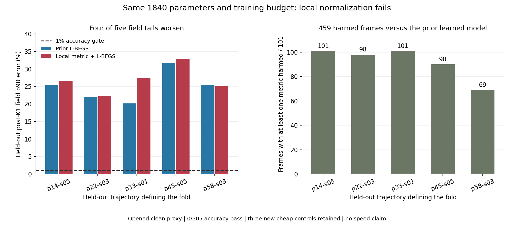

# 局部几何归一化训练 / Local Geometry Normalization

2026-09-07

局部几何归一化已完成五折训练与独立复算：保持1840参数和训练预算，只加入每条射线的双分量灵敏度归一化。1%门仍为0/505、0/5完整轨迹；相对原L-BFGS模型，459帧至少一项指标变差，五条轨迹中四条场误差p90恶化。该固定方案关闭，不追加训练。新模型仍严格优于三个新增便宜对照和九个旧弱对照，但没有胜过已有强学习基线，也不是算法突破。

Local geometry normalization is independently verified after five-fold training: keep1840 parameters and the same training budget, adding only per-ray two-component sensitivity normalization. The1% gate remains0/505, with0/5 complete trajectories. Versus the prior L-BFGS model,459 frames worsen in at least one metric and field p90 worsens in four of five trajectories. This fixed recipe is closed without extra training. It still strictly beats three new cheap controls and nine older weak controls, but not the existing strong learned baselines; this is not an algorithmic breakthrough.

## 做了什么 / What Changed

在相同1840参数世界坐标张量的输入与输出两侧，加入每条射线双分量物理灵敏度的对称逆平方根。参数量、原初始化、训练目标、L-BFGS预算、精确lift和未修改K1保持不变。几何归一化不读观测或真值；每折仅使用404训练帧重新标定一个尺度，101帧完整轨迹留出，不用留出误差选停止点。五折均达到200次迭代预算，未证明已收敛。

Place the symmetric inverse square root of each ray's two-component physical sensitivity on both sides of the same1840-parameter world-coordinate tensor. Parameter count, original initialization, objective, L-BFGS budget, exact lift and unchangedK1 remain fixed. Geometry normalization reads neither observations nor truth. Each fold recalibrates one scale using only404 training frames, holding out an entire101-frame trajectory without query-based stopping. All five fits reach the200-iteration budget; convergence is not established.

## 结果 / Results

| 留出轨迹 / Held-out | 原模型场p90 / Previous field | 归一化场p90 / Normalized field | 受损帧 / Harmed frames |
|---|---:|---:|---:|
| p=14kw_size=05 | 25.42% | 26.54% | 101/101 |
| p=22kw_size=03 | 21.99% | 22.38% | 98/101 |
| p=33kw_size=01 | 20.13% | 27.41% | 101/101 |
| p=45kw_size=05 | 31.77% | 32.98% | 90/101 |
| p=58kw_size=03 | 25.40% | 25.04% | 69/101 |

表中为K1之后的场误差。459个受损帧指至少一个指标恶化，不等于459帧所有指标都恶化。三个新增便宜对照分别是双分量独立归一化、完整局部双分量逆、归一化但不优化的固定张量，各仅有一个训练折尺度。新学习模型逐帧四指标均严格优于这三个对照和九个旧弱对照；但相对旧L-BFGS有459帧受损、相对旧Adam有250帧受损，故不能宣称更优学习算法。所有2020个重叠训练折样本也未过1%门；它们来自505个有时间相关性的不同帧，不是2020份独立数据。完整直接解仍通过505/505。

The table reports post-K1 field error. The459 harmed frames each worsen in at least one metric, not necessarily every metric. The three new cheap controls are independent-component normalization, the full local two-component inverse, and a normalized but unoptimized fixed tensor, each with one training-fold scale. The new learned model strictly beats all three and nine older weak controls on every frame and metric. However, it harms459 frames against prior L-BFGS and250 against Adam, so it is not a better learned algorithm. All2020 overlapping train-fold pairs also fail1%; they come from505 temporally correlated distinct frames, not2020 independent observations. Full direct remains505/505.

## 复算与成本 / Verification and Cost

独立解析梯度、预测、K1物理重放、四指标、尾部、相机乱序和调用账均通过复算。评分最大差1.11e-16，梯度最大相对差2.84e-12。两套物理矩阵和K1实现重建全部2525个学习端点及1515个新增对照端点；原生前向核验全部2020个留出端点和60个训练哨兵。未重训第二个完整优化器；不可将端点/梯度复算说成完整训练重复。

Independent analytic gradients, predictions, K1 physical replay, metrics, tails, camera permutations and call accounting pass verification. Score difference is1.11e-16; relative gradient difference is2.84e-12. Two physical matrices and K1 implementations rebuild all2525 learned and1515 new-control endpoints; native forward covers every2020 query endpoint and60 training sentinels. The complete optimizer is not independently retrained; endpoint/gradient verification is not a second full training repetition.

在线逻辑账仍是2A+2AT，训练与复算全部单独记为离线。几何矩阵构建包含继承的8192次原生基向量动作，局部归一化还需额外构建与缓存，不能当作免费。没有端到端速度、内存、未开工况、5/7/12相机精度、外部泛化或真实BOST结论。此前局部矩阵的稳定求值核验只是工程前提，不能替代本次精度判决。

Logical online cost remains2A+2AT, with training and verification charged separately offline. Geometry construction includes8192 inherited native basis actions plus additional local metric construction and caching; setup is not free. No end-to-end speed, memory, unopened-condition,5/7/12-camera accuracy, external generalization or real-BOST conclusion is established. The preceding stable local-matrix evaluation was only an engineering prerequisite, not a substitute for this accuracy decision.

这条固定归一化训练方案封存，不追加迭代、阻尼或更大模型。正确的局部归一化并不保证有限预算下更好的学习重建；这也不是所有归一化或张量表示不可能成功的证明。后续应优先检验当前表示尚未刻画的物理耦合，而非把同一假设继续调参包装成成功。

This fixed normalized fit is closed without more iterations, damping or a larger model. Correct local normalization does not guarantee better learned reconstruction under a finite budget; it is not an impossibility proof for every normalization or tensor representation. Subsequent work should test physical couplings missing from the current representation rather than relabel tuning of this same hypothesis as success.

[脱敏完整汇总 / Redacted summary](poolfire_ray_metric_tensor_20260907.json)

[上一项优化器对照 / Previous optimizer comparison](poolfire_tensor_lbfgs_20260907.md)
