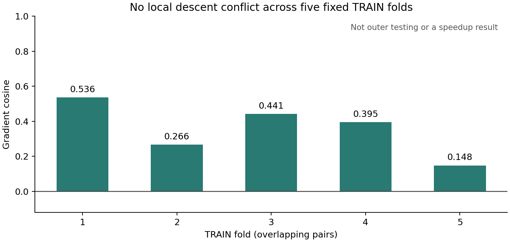

# 局部梯度冲突诊断 / Local Gradient-Conflict Diagnostic

2026-09-08

新的局部诊断未发现梯度冲突：5个训练折、20个重叠TRAIN配对中，初值损失与16步后损失的梯度余弦均为正，约0.148至0.536；沿初值下降方向的两档固定小步都降低两项损失，冲突0/5。独立复算已完成。因此不以“两个目标方向相反”为理由重训。仅为固定模型训练点的回顾性解释检查，不是外折测试、暖启动收益或加速结果；505帧学习度量证据不变。

The local diagnostic finds no gradient conflict: across five training folds and 20 overlapping TRAIN pairs, initial and 16-step loss gradients have positive cosines, about 0.148 to 0.536. Both fixed positive steps along initial-loss descent reduce both losses: 0/5 conflicts. Independent checks are complete. This does not justify refitting on an opposing-objectives explanation. It is a retrospective fixed-model TRAIN diagnostic, not outer testing, warm benefit or speedup. The 505-frame learned-metric evidence stands.

| TRAIN折 / Fold | 梯度余弦 / Gradient cosine |
|---|---:|
| 1 | 0.536171374 |
| 2 | 0.266093356 |
| 3 | 0.441368180 |
| 4 | 0.395472336 |
| 5 | 0.148150323 |

## 含义 / Meaning

每个模型只读取本折TRAIN内的4个既有中点，五折合计20个重叠配对；不是20个独立新样本。模型、度量、16步递推和四项归一化平方损失不变。教师是由观测和几何直接求得的解，不是实验真值。判据要求余弦为负，且两档预定正向小步都使初值误差下降、16步误差上升；本次没有一折满足。两档小步实际上都降低了两项损失。

Each model reads only four existing midpoints inside its TRAIN fold: 20 overlapping pairs, not 20 independent new samples. The model, metric, 16-step recurrence and four normalized squared losses are unchanged. Teachers are direct observation/geometry-derived solutions, not experimental truth. The fixed descriptor requires a negative cosine and both prescribed positive steps to lower initial error while raising 16-step error. No fold meets it; both steps instead lower both losses.

不能把本结果扩展为所有时刻、所有初值或迭代成本都不存在冲突；它没有检验后期收敛、外轨迹泛化或新训练配方。停止以这个特定冲突解释为依据重训，不否定全部求解器内训练。已有505帧度量收益与暖启动成本负结果分别保留，不相互替代。

This does not rule out conflict at other snapshots or horizons, or mismatch with iteration cost. It does not test late convergence, outer-trajectory generalization or a new training recipe. Stop refitting on this specific conflict rationale, without rejecting all solver-in-the-loop training. Retain the 505-frame metric benefit and warm-cost failure as separate facts.

## 独立验证 / Independent Checks

自动求导与手写反向传播的完整参数梯度最大相对差5.27e-12。新复步长校验确认240个方向导数，最大绝对差3.89e-16；720个原物理状态重新评分，480个新实部与切向状态做原生投影核验，投影最大差7.31e-16。旧有限差分失败记录保留；这是独立的新回顾性确认，不是放宽旧门。

Autograd and explicit reverse full parameter gradients differ relatively by at most 5.27e-12. New complex-step checks confirm 240 directional derivatives, with maximum absolute difference 3.89e-16. All 720 old physical states are rescored and 480 new real/tangent states receive native projection checks; maximum projection discrepancy is 7.31e-16. The old finite-difference failure remains; this is a separate retrospective confirmation, not a relaxed old gate.

新增离线账6520 A、4080 Aᵀ、7680 T、3840 F及3840 Fᵀ，另有1200次原生A。原有教师、训练与几何准备均非免费。没有新拟合、CFD真值读取、外折测试、资源加速、算法突破或真实BOST结果。

Additional offline work is 6520 A, 4080 adjoint A, 7680 T, 3840 F and 3840 adjoint F, plus 1200 native A. Inherited teachers, training and geometry preparation are nonfree. No new fit, CFD-truth reading, outer testing, resource speedup, algorithm breakthrough or real-BOST result is claimed.

复步长是既有数值方法，不是本研究的创新：[作者方法介绍 / Author method page](https://mdolab.engin.umich.edu/bibliography/Martins2003a)。求解器内训练也已有先例 / Solver-in-the-loop learning also has prior work: [official CG example](https://github.com/tum-pbs/CG-Solver-in-the-Loop).

[脱敏汇总 / Redacted summary](poolfire_solver_loss_alignment_20260908.json) · [保留的505帧证据 / Retained 505-frame evidence](poolfire_full_control_cost_20260908.md)
