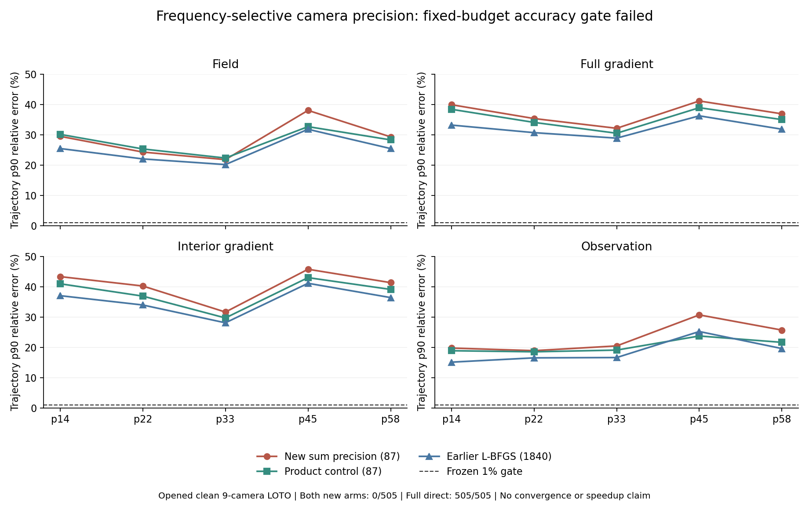

# 87参数频率选择相机模型 / 87-Parameter Frequency-Selective Camera Model

2026-09-07

87参数频率选择相机模型已完成训练和独立复算：新模型与同规模便宜对照均为0/505、0/5完整轨迹通过四指标1%门。新模型在505帧上均至少一项指标差于对照，直接解仍505/505通过。两版都在200次迭代预算用完后停止，并未证明收敛；关闭这套固定训练方案，不把它扩大成整个表示类别无效的结论，也不是精度或速度突破。

The 87-parameter frequency-selective camera model has been trained and independently verified. Both it and the same-size cheaper control pass 0/505 frames and 0/5 complete trajectories at four-metric 1% accuracy. The new model worsens at least one metric on all 505 frames versus the control; full direct still passes 505/505. Both stop at the 200-iteration budget, without demonstrated convergence. Close this fixed training recipe, not the entire representation class; this is not an accuracy or speed breakthrough.

## 本次实际做了什么 / What Was Actually Trained

上一轮定位到暖启动阶段的梯度损失。本次从头训练一个87参数小模型，使相机信息交换随探测器空间频率变化；以加性相机与探测器精度算子的逆实现，固定余弦基、不学习特征向量。便宜对照同样87参数，但使用可分离的乘积精度。两版分别用训练折校准一个尺度，训练预算、目标、数据和精化器相同。不是增加CNN/FNO宽度，也不是恢复旧权重。

Following the initializer-stage diagnosis, this run freshly trains an 87-parameter model whose camera exchange varies by detector spatial frequency. It uses the inverse of additive camera and detector precision with fixed cosine bases, not learned eigenvectors. The cheaper control also has 87 parameters but uses separable product precision. Each arm calibrates one training-only scale; data, objective, budget and refiner match. This neither widens CNN/FNO models nor resumes old weights.

只使用已打开的五条PoolFire轨迹、干净九相机代理。每折404训练帧，完整101帧轨迹留出；五个训练集合重叠，不重复帧总数为505而非训练对数，不能假设同一轨迹内帧彼此独立。输入仅观测与已报告几何。直接解teacher只进入训练折，不使用留出truth选参数、目标、停止或回退。全部参数与外折端点封存后才评分。机械支持5/7/9/12相机和乱序，不等于已验证其他相机数量的精度。

Only the five already-opened PoolFire trajectories and the clean nine-camera proxy are used. Each fold has 404 training frames and a complete 101-frame held-out trajectory. Training sets overlap: there are 505 unique frames, not one independent sample per training pair; independence within a trajectory cannot be assumed. Inputs are observations and reported geometry only. Direct-solver teachers are restricted to training folds; held-out truth selects no parameters, objective, stopping or fallback. All parameters and outer endpoints seal before scoring. Mechanical support for 5/7/9/12 cameras and permutations does not establish other-cardinality accuracy.

## 精度与对照 / Accuracy and Controls

下表为逐轨迹p90相对误差；完整四指标p50/p90/worst与22个版本均保留在脱敏汇总中。新模型在前几条轨迹的场误差有局部优势，但内部梯度及其他指标的损失阻断全指标改善，不能把“每帧至少一项更差”误写成“所有指标在所有帧都更差”。

The table reports trajectory p90 relative error; the redacted summary retains all four-metric p50/p90/worst values and all 22 arms. Some earlier trajectories show better field error with the new model, but interior-gradient and other harms prevent all-metric improvement. “At least one worse metric per frame” does not mean every metric worsens on every frame.

| 轨迹 / Trajectory | 新模型场 / New field | 对照场 / Control field | 新模型内部梯度 / New inner | 对照内部梯度 / Control inner |
|---|---:|---:|---:|---:|
| p=14kw_size=05 | 29.45% | 30.09% | 43.33% | 40.96% |
| p=22kw_size=03 | 24.25% | 25.28% | 40.23% | 36.90% |
| p=33kw_size=01 | 21.76% | 22.29% | 31.64% | 29.69% |
| p=45kw_size=05 | 38.01% | 32.64% | 45.76% | 42.99% |
| p=58kw_size=03 | 29.26% | 28.27% | 41.34% | 39.10% |

两版均0/505、0/5完整轨迹通过四指标1%绝对门；相同预算下，新模型相对便宜对照505帧均存在至少一项严格损失，相对原1840参数L-BFGS模型也为505帧。20个既有版本没有删除，Zero/BP/CGLS/PCGLS/dual-ridge及更强学习对照完整保留，直接解仍505/505通过。这不是仅因参考解失效而无法判断。

Both arms pass 0/505 frames and 0/5 complete trajectories at the four-metric 1% absolute gate. At matched exact-call cost the new model harms at least one metric on all 505 frames against the cheaper control, and on all 505 against the earlier 1840-parameter L-BFGS model. None of the 20 inherited arms is removed: Zero/BP/CGLS/PCGLS/dual-ridge and stronger learned controls remain. Full direct still passes 505/505, so inadequate reference is not the reason for this decision.

十次训练均在200次迭代上限停止。新模型训练目标从约0.70降到0.1143至0.1387，便宜对照降到0.1080至0.1231；这些是精化前的四项相对平方teacher误差，不是留出重建指标。没有证明优化收敛或找到了表示最优值，因此只能关闭当前固定训练配方，不能证明全部非可分离结构没有容量。

All ten fits stop at the 200-iteration cap. The new model's training objective falls from about 0.70 to 0.1143-0.1387; the cheaper control reaches 0.1080-0.1231. These are four-block relative squared teacher errors before refinement, not held-out reconstruction metrics. Neither convergence nor a representation optimum is established, so only this fixed training recipe closes, not the capacity of every nonseparable structure.

## 独立复算与成本 / Independent Verification and Cost

正式路径使用Torch余弦变换、批量线性求解和自动微分；另一实现使用SciPy DCT、相机特征分解和解析隐式梯度。独立校准全部10个尺度、核对10个最终训练目标及梯度，并重建1010个外折预测、精确lift、未修改CGLS一步、四指标、尾部、相机乱序和调用账。最终训练梯度最大相对差4.76e-12，外折评分最大绝对差1.72e-15。全部1010个外折端点经原生forward核验；封存源码与输入输出保持不变。独立程序没有重新运行优化器，不能称独立重训。

The formal path uses Torch cosine transforms, batched linear solves and autograd; the second implementation uses SciPy DCT, camera eigendecomposition and analytic implicit gradients. It independently recalibrates all ten scales, checks ten final training objectives and gradients, and rebuilds 1010 outer predictions, exact lifts, unchanged one-step CGLS, metrics, tails, permutation behavior and call accounts. Maximum relative final-gradient difference is 4.76e-12; maximum absolute outer-score difference is 1.72e-15. Native forward checks all 1010 endpoints, and sealed sources and inputs/outputs remain unchanged. The independent program does not rerun the optimizer: this is not independent retraining.

每个部署端点逻辑账仍2A+2AT；余弦变换和相机求解有额外算术成本，不因没有新增精确调用就免费。本轮新增训练、校准及审计调用分列在汇总中；继承的teacher与几何构建成本仍须另计，不在这份新增调用账内。没有fresh-process wall、全管线RSS或有效加速证据，不能用24分钟左右的本轮离线执行时间冒充部署速度。

Logical cost per deployment endpoint remains 2A+2AT. Cosine transforms and camera solves require extra arithmetic even without additional exact calls. The summary itemizes this run's new training, calibration and audit calls; inherited teacher and geometry construction still incur separate costs and are excluded from that incremental ledger. No fresh-process wall, whole-pipeline RSS or valid speedup evidence exists; this run's roughly 24-minute offline execution is not deployment timing.

张量和精度表示有既有文献基础，但本模型没有复现该文的图形lasso估计器或统计保证，文献并不保证当前BOST映射有效。[TeraLasso](https://arxiv.org/abs/1705.03983)

Tensor-sum precision has prior literature, but this model does not reproduce its graphical-lasso estimator or statistical guarantees. That literature does not establish this BOST map's effectiveness. [TeraLasso](https://arxiv.org/abs/1705.03983)

## 判决与边界 / Decision and Scope

关闭当前87参数加性精度与固定训练预算组合。不追加迭代、频率、带宽、目标搜索或大网络，把失败改写成成功。本轮新增的是被独立验证的表示比较负证据，不是算法突破、外部泛化或真实BOST。下一轮先依据既有负证据审计物理表示的可识别性；没有清楚的新机制就不制造重复试验。

Close this 87-parameter additive-precision and fixed-budget recipe. Do not add iterations, frequencies, bandwidths, objective searches or a larger network to relabel failure as success. The increment is independently verified negative comparative evidence, not an algorithm breakthrough, external generalization or real BOST. Next, audit physical identifiability against the accumulated negatives; do not manufacture another trial without a clear new mechanism.

[脱敏完整汇总 / Full redacted summary](poolfire_spectral_camera_precision_20260907.json)

[上一轮阶段归因 / Previous stage attribution](poolfire_camera_mix_ablation_20260907.md)
