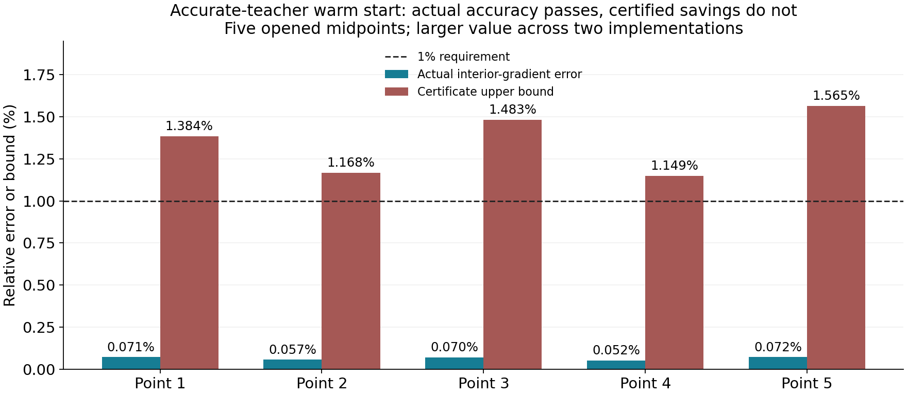

# 教师质量与暖启动 / Teacher Fidelity and Warm Initialization

2026-09-08

教师质量对照已独立复算：保持ridge映射、学习度量和停止规则不变，只把早停教师换成观测/几何生成的高精度解，额外省调用认证门仍为0/5。全部20个端点的实际四指标精度都达标，失败的是更省计算的停止认证，不是重建失败。关闭这套固定配置，不扩跑505帧；此前学习度量的完整轨迹收益不变。

The teacher-quality comparison is independently verified: with the ridge map, learned metric and stop fixed, replacing early-stopped teachers with accurate observation/geometry-derived solutions still passes 0/5 extra-call-saving certificate gates. All 20 endpoints meet the actual four-metric accuracy target; the failure concerns certified savings, not reconstruction. Close this configuration without a 505-frame expansion. The previous complete-trajectory metric advantage remains unchanged.

## 改了什么 / The Single Change

仅把历史ridge的K4教师换成同一观测、几何下已经验证的高精度解。保留原ridge=0.01、逐观测归一化、学习残差度量和物理停止认证。五条已开封PoolFire轨迹各取原定中点，每个预测只用其余四条轨迹的404帧拟合。没有新网络、参数搜索或真实实验数据。所有预测和20个求解端点封存后才读取真值评分。

Only the historical ridge's K4 teacher is replaced by a qualified accurate solution derived from the same observations and geometry. Ridge=0.01, per-observation normalization, the learned residual metric and physical stopping certificate stay fixed. One old midpoint from each of five opened PoolFire trajectories is queried; each fit uses the other four trajectories' 404 frames. There is no new network, parameter search or real experimental input. All predictions and 20 solver endpoints seal before truth scoring.

## 否定的具体内容 / The Exact Rejection

新暖启动必须在比合格零初值及同度量K4-ridge对照更少的A、AT预算内，完成原四指标1%停止认证。两套实现均为0/5通过。全部点都卡在内部梯度认证，第三点还未通过全梯度认证。未跑更多步骤，不放宽门，也不把它扩展到505帧。

The new warm start must certify the original four-metric 1% accuracy within fewer A and AT actions than qualified zero-start and same-metric K4-ridge controls. Both implementations pass 0/5. Every point fails the interior-gradient certificate, and point 3 also fails the full-gradient certificate. No extra iterations, looser gate or 505-frame expansion is used.

**但全部20个端点的实际四指标精度均通过。** 新暖启动实际最坏场误差0.04573%、内部梯度误差0.07153%，都远小于1%。这是停止认证与额外调用优势的失败，不能写成重建失败或最少真实达标迭代数已经测得。表格逐点取两套实现较大值；只有五个中点，不是完整轨迹尾部。

**All 20 endpoints nevertheless meet the actual four-metric accuracy target.** The new warm start's worst actual field and interior-gradient errors are 0.04573% and 0.07153%, well below 1%. The rejection concerns certified stopping with extra call savings, not reconstruction failure or a measured minimum iteration count to actual accuracy. The table takes the larger value across implementations for each of five midpoints; it is not a complete-trajectory tail result.

| 中点 / Point | 实际内部梯度误差 / Actual interior-gradient error | 认证上界 / Certificate bound |
|---|---:|---:|
| 1 | 0.0714% | 1.3840% |
| 2 | 0.0568% | 1.1681% |
| 3 | 0.0698% | 1.4827% |
| 4 | 0.0523% | 1.1487% |
| 5 | 0.0715% | 1.5646% |

初始场误差最大值由K4教师的67.91%降为高精度教师的55.57%，但仍未形成额外认证省算。这个最大值比较不证明每帧都改善，也不证明教师质量完全无关；它只排除了“换准教师就足够”的这套固定配置。

Maximum initial field error decreases from 67.91% with K4 teachers to 55.57% with accurate teachers, without establishing additional certified savings. Comparing maxima does not prove improvement on every frame or that teacher quality never matters. It rejects only this fixed configuration as a sufficient remedy.

## 便宜解释和边界 / Cheaper Explanation and Limits

固定几何下，相同ridge权重直接混合教师三维场，与混合dual后做精确Aᵀ lift在代数上等价，独立数值差为3.29e-13。前者少一次初始Aᵀ；没有为了好看重复运行这个等价求解，也没有虚构其迭代数。因此本次不能证明dual表示独有的优势。全缓存直接解仍未被击败。

At fixed geometry, mixing teacher fields with the same ridge weights is algebraically equivalent to mixing duals and applying exact A-transpose lift, with independently checked relative discrepancy 3.29e-13. The former avoids one initial adjoint action. Its duplicate refinement is not executed and no iteration counts are invented. No dual-specific advantage follows, and fully cached direct remains unbeaten.

新增教师准备2020A+1010AT及2020次三角右端求解；两版实验求解合计5934A+5924AT。回归、字典混合、F/FT/T度量、评分和旧几何/教师/训练准备都不是免费。运行日志耗时不是fresh wall/RSS比较。独立同场评分差4.02e-15，原生投影差7.11e-16，退出后再次核对全部绑定文件、回归方程、混合、成本和判决。

New teacher preparation costs 2020 A plus 1010 adjoint actions and 2020 triangular right-hand-side solves. Experimental refinement across both paths totals 5934 A plus 5924 adjoint actions. Regression, dictionary mixing, F/FT/T metric work, scoring and inherited geometry/teacher/training setup are nonfree. Log duration is not a fresh wall/RSS comparison. Independent same-field scoring differs by at most 4.02e-15 and native projection by 7.11e-16; post-exit auditing rechecks all bound files, regression equations, mixtures, costs and decisions.

此前505/505帧的学习度量调用优势保持不变。这次不支持暖初始化额外价值、实测加速、新相机/噪声泛化、外部公开条件或真实BOST结论。下一步先审计训练数据中的观测相似度与弱敏感方向，不追加参数或改门救结果。

The previous learned-metric action advantage on 505/505 frames remains unchanged. This pilot does not establish extra warm-initializer value, measured acceleration, new-camera/noise generalization, an external public condition or real BOST. Next audit observation similarity and weak-sensitivity directions on training data before adding parameters or altering a gate.

[脱敏汇总 / Redacted summary](poolfire_teacher_fidelity_warm_20260908.json) | [仍有效的完整轨迹对照 / Retained complete-trajectory comparison](poolfire_full_control_cost_20260908.md)
