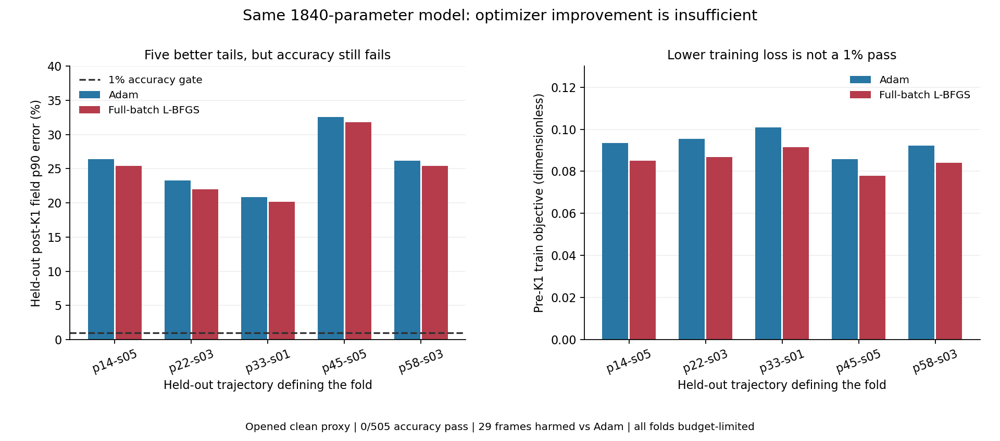

# 全批量优化对照 / Full-Batch Optimizer Comparison

2026-09-07

全批量L-BFGS已独立复算：同一1840参数模型从原初始化训练，五折训练目标比Adam降低8.65%–9.45%，五条留出轨迹的场误差p90均改善，但1%门仍为0/505、0/5完整轨迹。29帧至少一项指标比Adam更差，公平不伤害门也失败。优化有帮助，但该固定方案没有解决精度问题；五折均到200次迭代上限，不能声称已收敛或表示必然不足。

Independently verified full-batch L-BFGS: the same1840-parameter model is trained from its original initialization. Train objectives are 8.65%-9.45% below Adam and held-out field p90 improves in all five trajectories. Yet the1% gate remains0/505, with0/5 complete trajectories. At least one metric worsens on29 frames versus Adam, so the no-harm comparison also fails. Optimization helps but this fixed recipe does not solve accuracy. All five folds reach the200-iteration cap; convergence and intrinsic representation failure are not established.

## 做了什么 / What Changed

只把小批量Adam换为全批量L-BFGS-B；模型、1840参数、原初始化、训练折标定、四指标训练目标、精确lift与未修改K1全部不变。五个完整轨迹外折各用404训练帧、101留出帧；所有线搜索和停止仅依据训练集。每折从原初始化重训，不延长旧Adam模型，不根据留出误差选权重。

Only minibatch Adam is replaced by full-batch L-BFGS-B. The model,1840 parameters, original initialization, fold-only calibration, four-metric training objective, exact lift and unchangedK1 are retained. Each complete-trajectory fold uses404 training and101 held-out frames. Line searches and stopping use training only; each fit starts from the original initialization, without extending Adam or selecting weights from query scores.

优化器预先固定200次迭代、300次目标评估预算与停止容差，五折均因迭代预算停止，梯度无穷范数仍约0.00094–0.0031，高于1e-6停止标准。因此本次没有收敛或表示能力下界证书。

The optimizer has a fixed200-iteration and300-objective-evaluation budget with predetermined tolerances. All five folds stop at the iteration cap; gradient infinity norms remain about0.00094-0.0031, above the1e-6 gradient criterion. This provides neither a convergence certificate nor a lower bound on representational capacity. [SciPy optimizer options](https://docs.scipy.org/doc/scipy/reference/optimize.minimize-lbfgsb.html)

## 实际精度 / Measured Accuracy

| 留出轨迹 / Held-out | Adam场p90 / Field | L-BFGS场p90 / Field | Adam内部梯度p90 / Interior | L-BFGS内部梯度p90 / Interior | 受损帧 / Harmed |
|---|---:|---:|---:|---:|---:|
| p=14kw_size=05 | 26.40% | 25.42% | 39.21% | 37.04% | 2/101 |
| p=22kw_size=03 | 23.25% | 21.99% | 36.38% | 33.97% | 0/101 |
| p=33kw_size=01 | 20.86% | 20.13% | 30.07% | 28.09% | 8/101 |
| p=45kw_size=05 | 32.54% | 31.77% | 42.62% | 41.13% | 16/101 |
| p=58kw_size=03 | 26.18% | 25.40% | 38.30% | 36.41% | 3/101 |

表中是未修改K1之后的留出误差。五条轨迹的场和内部梯度p90都改善，但不能由分位数改善推出逐帧无伤害；29帧在场、全梯度或观测至少一项变差。四指标1%门仍为0/505，训练内2020个重叠折样本也全部未过。这些样本来自505个不同但有时间相关性的帧，不是2020份独立数据。

The table reports held-out error after unchangedK1. Field and interior-gradient p90 improve in every trajectory, but better quantiles do not imply per-frame non-harm:29 frames worsen in field, full gradient or observation. The four-metric1% gate remains0/505; all2020 overlapping train-fold pairs also fail. These pairs come from505 distinct, temporally correlated frames, not2020 independent observations.

训练目标比旧Adam降低8.65%–9.45%是训练损失的相对变化，不是重建误差降低同样的百分比，更不是已达到1%。两个模型都严格优于九个较弱对照，但新模型对旧Adam有伤害，因此精度门和公平门都未通过。完整直接解仍通过505/505，基线充分性未被放宽。

The8.65%-9.45% reduction versus Adam is a relative change of training loss, not an equal percentage reduction in reconstruction error or achievement of1%. Both models strictly improve on nine weaker controls, but the new model harms the prior Adam model, failing both accuracy and fairness. The qualified full direct solver still passes505/505; reference adequacy is unchanged.

## 复算与边界 / Verification and Limits

独立解析参数梯度与自动微分最大相对差2.85e-13；后验独立评分最大差1.11e-16，全部尾部归约差不超过3.49e-12。两种完整物理矩阵和两种K1实现重建所有2525个训练/留出端点；原生前向额外覆盖全部505个留出端点及60个事先固定的训练哨兵。未重训第二个完整优化器；不可将端点/梯度复算说成完整训练重复。

Independent analytic parameter gradients and autograd differ by at most2.85e-13 relatively. Post-exit independent score difference is1.11e-16, with all tail reductions within3.49e-12. Two complete physical matrices and twoK1 implementations rebuild all2525 train/query endpoints. Native forward additionally covers every505 held-out endpoint and60 preselected training sentinels. The complete optimizer is not independently retrained; endpoint/gradient verification is not a second full training repetition.

完整保留11个父对照证据，不重复运行未变化的基线。逻辑在线账仍为2A+2AT，全部训练与复算算子调用单独列为离线；几何和teacher构建成本不被抹去。没有端到端速度、内存、未开外部条件、相机基数泛化或真实BOST结论。

All11 parent comparison arms retain their complete evidence without rerunning unchanged baselines. Logical online cost remains2A+2AT, with all training and verification calls disclosed separately as offline. Geometry and teacher setup costs are not erased. There is no end-to-end speed, memory, unopened external-condition, camera-cardinality generalization or real-BOST claim.

这条固定优化方案封存，不再追加迭代或换停止点。后续需要能区分参数非唯一性、优化条件与不可分离物理耦合的证据；不能把一次有限训练失败等同于表示必然不足，也不能继续靠算力盲试。

This fixed optimizer recipe is closed, without extra iterations or a different stopping point. Further evidence must distinguish parameter non-uniqueness, optimization conditioning and nonseparable physical coupling. A finite training failure does not prove intrinsic representation failure, and repeated compute alone is not a mechanism.

[脱敏完整汇总 / Redacted full summary](poolfire_tensor_lbfgs_20260907.json)

[此前训练诊断 / Previous training diagnosis](poolfire_tensor_train_diagnosis_20260907.md)
