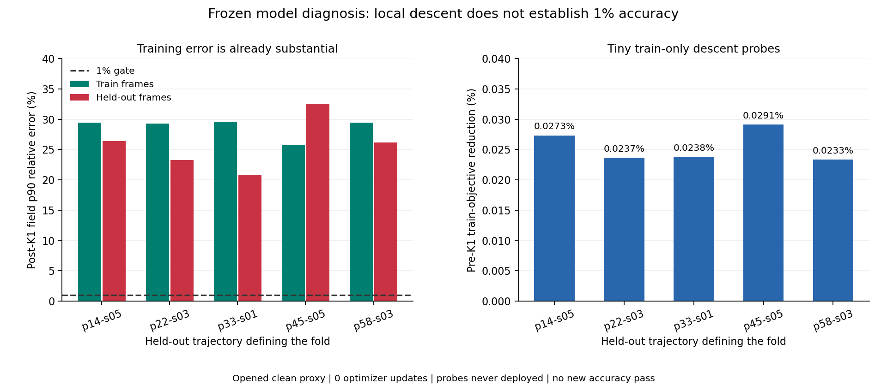

# 训练内误差与优化状态 / Training Error and Optimization State

2026-09-07

封存权重诊断已独立确认：2020个重叠训练折样本的1%门通过0个，留出帧仍为0/505。训练内已经有明显误差，不能只归因于跨轨迹数据不足。五折都有训练目标下降方向，但微扰只降低目标约0.023%–0.029%，不证明多训就能达标，也未证明表示能力不足。没有更新或部署新权重。

Independent frozen-weight diagnosis: 0/2020 overlapping train-fold pairs pass the 1% gate; held-out frames remain at 0/505. Substantial error is already present in training, so cross-trajectory data shortage cannot be the sole explanation. All five folds have a train-objective descent direction, but the tiny probes reduce that objective by only about 0.023%-0.029%. This proves neither that more training reaches the target nor that the representation lacks capacity. No new weights were updated or deployed.

## 实测 / Measurements

五折分别评估固定模型的404个训练帧，共2020个折内样本；它们只来自505个不同且有时间相关性的帧，不能算2020份独立数据。留出结果与11个对照继承此前独立封存证据，完整直接解仍通过505/505。本次没有重新训练，也没有使用扰动权重预测留出帧。

Each frozen fold model is evaluated on its404 training frames, giving2020 fold/train pairs from only505 distinct, temporally correlated frames, not2020 independent observations. Held-out results and all11 comparison arms inherit prior independent evidence; full direct solving still passes505/505. No optimizer update occurs, and perturbed weights never predict held-out frames.

| 留出轨迹 / Held-out trajectory | 训练场p90 / Train field | 留出场p90 / Query field | 训练内部梯度p90 / Train interior | 留出内部梯度p90 / Query interior | 训练目标相对下降 / Train objective reduction |
|---|---:|---:|---:|---:|---:|
| p=14kw_size=05 | 29.42% | 26.40% | 40.89% | 39.21% | 0.0273% |
| p=22kw_size=03 | 29.25% | 23.25% | 40.69% | 36.38% | 0.0237% |
| p=33kw_size=01 | 29.61% | 20.86% | 40.64% | 30.07% | 0.0238% |
| p=45kw_size=05 | 25.74% | 32.54% | 37.94% | 42.62% | 0.0291% |
| p=58kw_size=03 | 29.41% | 26.18% | 40.80% | 38.30% | 0.0233% |

上表误差均为未修改K1之后的p90，四指标1%门不变。训练内误差与留出误差的总体量级相近，但这不是证明没有分布差异；例如p45留出折仍有更大的误差。最后一列是K1之前训练目标的相对变化，不能当作重建精度提升，也不能外推到长时间训练。

The errors are p90 after unchangedK1, with the same four-metric1% gate. Train and query errors have broadly comparable magnitudes, which does not prove an absence of distribution shift: the p45 held-out fold still has greater error. The last column is a relative change of the pre-K1 training objective, not an improvement in reconstruction accuracy or a prediction of long-run optimization.

## 为什么检查梯度 / Why Check the Gradient

两种实现分别计算封存终点的全训练集梯度，并用两个事先固定的正负微扰验证方向导数。五折均有可核验的局部下降，有限差分与梯度的最大相对差约3.61e-5。该证据只说明这些终点尚有局部优化空间；它不能证明表示充分、全局最优可达，或单靠优化就能达到1%。旧20轮实验的失败判决保持不变。

Two implementations separately compute full-training-set gradients at the sealed final points and verify directional derivatives with two fixed positive/negative probes. All five folds have certified local descent; maximum finite-difference/gradient relative disagreement is about3.61e-5. This establishes local optimization headroom at those points, not sufficient representation, an attainable global optimum or a guarantee of1% accuracy through optimization alone. The old twenty-epoch experiment remains failed.

## 独立验证与成本 / Verification and Cost

新的2020个训练端点按两种实现求解，并作原生前向复算；独立进程重新计算全部前后指标、尾部、折划分、梯度/微扰归约和调用账。评分及残差最大差为1.11e-16与9.88e-16，输入输出封存不变。所有额外工作属于离线诊断，不是新的部署结果；原在线2A+2AT账不变，无速度或内存优势结论。

Both implementations solve the2020 new training endpoints, with native-forward replay. A separate process recomputes all pre/post metrics, tails, fold assignments, gradient/probe reductions and call receipts. Maximum score and residual differences are1.11e-16 and9.88e-16; sealed inputs/outputs are unchanged. All additional work is offline diagnosis, not new deployment evidence. The original online2A+2AT count is unchanged; there is no speed or memory advantage claim.

接下来应先区分优化不足与表达不足，不再机械要求补数据或扩大网络。没有授权延长旧训练、事后改门、租GPU、打开新测试条件或声称论文成功。

Next work should distinguish incomplete optimization from inadequate representation, rather than mechanically requesting more data or widening a network. This diagnosis authorizes no extension of the old fit, post-hoc threshold change, GPU rental, new test opening or paper-success claim.

[完整脱敏汇总 / Full redacted aggregates](poolfire_tensor_train_diagnosis_20260907.json)

[原学习实验 / Original learning experiment](poolfire_world_tensor1840_20260907.md)
