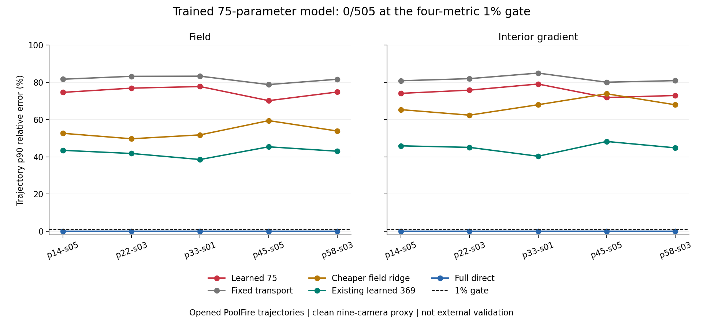

# 75参数几何输运：已开封轨迹留一结果 / 75-Parameter Geometry Transport: Opened-Trajectory LOTO

2026-09-07

## 结论 / Decision

75参数几何输运模型已完成五折训练与独立预测、物理复算：505帧的四指标1%门通过0帧、完整轨迹0/5；合格完整直接解为505/505、5/5。它在503/505帧上四项均不劣于固定输运对照，但每帧至少一项仍弱于已有岭回归和369参数模型。这个固定方案已关闭，不加轮数挽救；没有学习加速或论文突破。

The 75-parameter geometry-transport model completed five-fold training and independent prediction/physical replay: 0/505 frames and 0/5 trajectories pass the four-metric 1% gate; qualified full direct solving passes 505/505 and 5/5. It is jointly no worse than fixed transport on 503/505 frames, but at least one metric remains worse than ridge and the existing 369-parameter model on every frame. This fixed recipe is closed without extra epochs; no learned speedup or paper breakthrough.

图：五条已开封轨迹的p90相对误差，越低越好；虚线为1%门。图中完整直接解接近零，不代表省略其准备与求解成本。

Figure: p90 relative errors for five already-opened trajectories, lower is better; dashed line is the 1% gate. Full direct solving is near zero, without omitting its setup or solve costs.

## 真正运行了什么 / What Was Actually Run

实际训练75个共享参数，另有每折一个只用训练数据确定的尺度；五个完整轨迹留一外折，每折404帧训练、101帧预测，固定20轮，共2600次更新。部署输入只有观测和已报告几何；训练折直接解场和观测作teacher，查询轨迹不参与拟合、归一化或停止。全部预测封存后才读CFD真值评分。精确lift后运行未修改K1，不是只画容量曲线。

Seventy-five shared parameters were actually trained, with one additional train-only scale per fold. Five complete-trajectory outer folds use 404 training and 101 query frames each, at a fixed 20 epochs and 2600 total updates. Deployment inputs are observations and reported geometry only. Train-fold direct fields and observations supply teachers; query trajectories do not enter fitting, normalization or stopping. All predictions seal before CFD-truth scoring. Exact lift is followed by unchanged K1, rather than a capacity-only curve.

实际准确率范围是同一九相机干净代理、五条已开封PoolFire轨迹、505帧。5/7/12相机仅做机械单元测试，不能称可变相机准确率或外部泛化；旧模型没有重新训练，完整直接解也没有重新拟合。这里是已开封数据上的研究结果，不是未见新工况的确认。

Actual accuracy coverage is one nine-camera clean proxy, five opened PoolFire trajectories and 505 frames. Mechanical unit checks at 5/7/12 cameras do not establish variable-camera accuracy or external generalization. The old model is not retrained and full direct solving is not refitted. This is evidence on opened research data, not prospective confirmation on a new condition.

## 主要误差 / Primary Errors

下面均是每条轨迹的p90相对误差百分数；例如74.61%不是0.7461%。每个样本必须四指标全部不超过1%，完整轨迹必须101帧全过。本次1%绝对门与历史相对K4的matched计数不同，不能混为一谈。

These are trajectory-level p90 relative-error percentages: 74.61% is not 0.7461%. Every cell must meet 1% on all four metrics, and every complete trajectory requires all 101 frames. This absolute gate differs from historical counts matched against K4; the counts must not be conflated.

| 轨迹 / Trajectory | 场 / Field | 全梯度 / Full gradient | 内部梯度 / Interior gradient | 观测 / Observation |
|---|---:|---:|---:|---:|
| p=14kw_size=05 | 74.61% | 65.87% | 74.08% | 56.52% |
| p=22kw_size=03 | 76.88% | 68.11% | 75.81% | 67.15% |
| p=33kw_size=01 | 77.74% | 67.21% | 79.09% | 68.33% |
| p=45kw_size=05 | 70.17% | 67.49% | 71.86% | 59.59% |
| p=58kw_size=03 | 74.80% | 68.19% | 72.93% | 65.64% |

## 对照与成本 / Controls and Cost

十一种方法包括新模型、固定输运、标量、dual-ridge、Zero-CGLS K2、Jacobi-PCGLS K2、归一化BP、旧369参数模型、完整直接解、零场和更便宜的直接场ridge。新模型比归一化BP在505帧的四项指标上都好；与固定输运相比503帧四项均不劣，另2帧至少一项受损。但与dual-ridge、直接场ridge及旧369参数模型分别比较，每帧至少一项更差。除完整直接解外，各方法均未通过本次完整1%门。

The eleven arms are the new model, fixed transport, scalar, dual-ridge, Zero-CGLS K2, Jacobi-PCGLS K2, normalized BP, the old 369-parameter model, full direct solving, zero field and cheaper direct-field ridge. The new model improves all four metrics over normalized BP on every frame. It is jointly no worse than fixed transport on 503 frames, with harm in at least one metric on two frames. Against each of dual-ridge, direct-field ridge and the old 369-parameter model, at least one metric is worse on every frame. No arm except full direct solving passes this complete 1% gate.

新模型逻辑在线账2A+2AT；直接场ridge为2A+1AT。完整直接解为1A+1AT加两次三角求解，并须计入准备成本。模型计算、几何准备和带状求解不是免费；本轮没有比较性fresh wall或whole-pipeline RSS结果，不能宣称速度或内存优势。

The new model's logical online cost is 2A+2AT, versus 2A+1AT for direct-field ridge. Full direct solving uses 1A+1AT plus two triangular solves, with setup charged separately. Model computation, geometry preparation and band solves are not free. This run does not establish comparative fresh-process wall time or whole-pipeline RSS, so it establishes no speed or memory advantage.

## 独立验证与边界 / Independent Verification and Limits

独立实现重建几何特征、预测和求解，并核对梯度/Adam探针；最终复算5555个物理端点及全部评分、逐轨迹尾部和调用记录。评分、原生前向、残差最大差约7.22e-15、7.50e-16、7.79e-16，输入输出封存树不变。使用的是共同封存权重，并未独立重复整段优化训练。

The separate implementation rebuilds geometry features, prediction and solving, with gradient/Adam probes. The final audit replays 5555 physical endpoints and recomputes all scores, trajectory tails and call receipts. Maximum score, native-forward and residual disagreements are about 7.22e-15, 7.50e-16 and 7.79e-16; sealed input/output trees are unchanged. Both implementations use the same sealed weights; the complete optimizer trajectory is not independently retrained.

固定方案停止，不追加轮数、加宽或改参数包装成功。它排除的是这个具体学习方案，不是整个输运机制或C路线。现有数据与CPU仍可支持后续研究，无需因本次失败租GPU，也不重复索取已丢失的实验配对。尚无算法突破、论文成功、外部泛化、资源加速或真实BOST结论。

The fixed recipe stops without extra epochs, width or parameter changes to manufacture success. This rejects the specific learner, not all transport mechanisms or the C route. Existing data and CPU still support further research; this failure does not justify GPU rental or repeated requests for lost experimental pairs. Algorithm breakthrough, paper success, external generalization, resource speedup and real BOST remain unestablished.

[脱敏数值 / Redacted aggregates](poolfire_vector_transport75_20260907.json)
