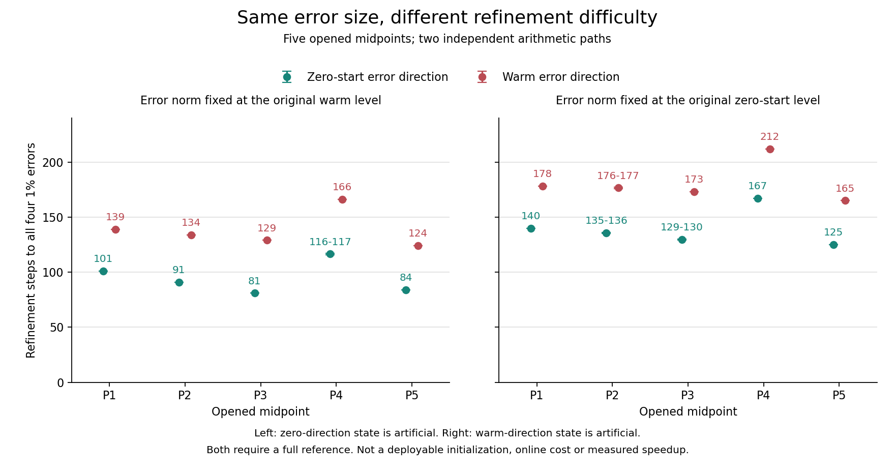
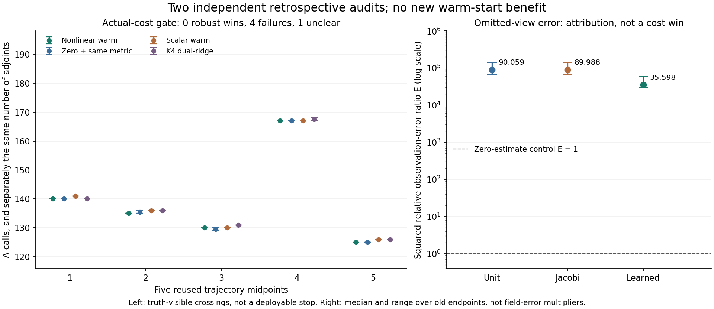

# 暖启动实际成本与缺失视角误差 / Warm Actual Cost and Omitted-View Error

2026-09-08

## 最新哨兵判决 / Latest Warm-AMG Sentinel Verdict

暖启动出现五点正信号：已冻结的学习映射只生成一次初值，随后使用强经典AMG-PCGLS。在五个已开封九相机样本上，两套实现均通过四项1%精度和共同观测停止证书；已计入初值构造后，分别需要110/100/93/111/112次A调用。补充的历史dual-ridge配同一AMG仍需116/109/111/118/119次，其他规定对照也未解释这五点优势。这是必要哨兵检验，不是完整轨迹、实际速度或论文突破；完整505帧验证尚待独立判决。

A positive five-point warm-start signal: the frozen learned map produces only one initial field, followed by strong classical AMG-PCGLS. Both implementations meet all four 1% accuracy targets and the common observation-only stopping certificate on five opened nine-camera samples. Including initialization, A counts are 110/100/93/111/112. Historical dual ridge with the same AMG still needs 116/109/111/118/119; the other prescribed controls also do not explain this five-point advantage. This is a necessary sentinel test, not complete trajectories, a wall-time win or a paper breakthrough. Full 505-frame verification awaits independent adjudication.

| 哨兵 / Point | 学习初值 / Learned | 零初值 / Zero | BP | 未训练T0 / Untrained T0 | 一次V / One V | 历史ridge / Historical Ridge |
|---|---:|---:|---:|---:|---:|---:|
| 1 | 110 | 119 | 119 | 119 | 119 | 116 |
| 2 | 100 | 121 | 120 | 121 | 121 | 109 |
| 3 | 93 | 122 | 121 | 121 | 122 | 111 |
| 4 | 111 | 121 | 121 | 121 | 121 | 118 |
| 5 | 112 | 125 | 123 | 124 | 125 | 119 |

表中为A次数，每格AT均比A少1；两套实现的这些计数全部一致。相对最便宜的已测对照，五点分别节省6/9/18/7/7次A及AT，对应A节省5.17%/8.26%/16.22%/5.93%/5.88%。不是两个总体中位数相除，也不是事后读真值选停止点。初值的1A+1AT、观测线搜索和最终物理确认均计入。

The table reports A calls; AT is one less in every cell. Both implementations agree on all listed counts. Versus the cheapest tested control, the five points save 6/9/18/7/7 A and AT calls, or 5.17%/8.26%/16.22%/5.93%/5.88% of A calls. These are paired savings, not a ratio of aggregate medians or truth-selected stopping points. The initial 1A+1AT, observation line search and final physical confirmation are included.

改变的是组合方式：已冻结的学习算子只产生一次观测侧方向，经精确伴随提升和观测线搜索形成初值；之后保持原始未加权观测目标，用经典AMG-PCGLS求精。对照也使用同一AMG。历史dual-ridge是用训练数据拟合的经典对照，不是无训练方法；它被单独补测，未因先前五点看似通过而跳过。学习映射没有重新拟合，查询轨迹仍完整排除在其训练外。

The change is the composition: the frozen learned operator supplies one observation-space direction, lifted by the exact adjoint and scaled by an observation line search. Classical AMG-PCGLS then refines the original unweighted observation objective. Controls use the same AMG. Historical dual ridge is a classical data-fitted control, not training-free; it was tested separately rather than skipped after the earlier five-point pass. The learned map was not refit, and its entire query trajectory remains excluded from training.

两批共50条新路径均先封存预测再读真值评分。学习初值试验的独立同状态评分最大差2.22e-16、原生重放7.09e-16、相机乱序差7.61e-16；ridge补测对应评分差1.11e-16。退出后的独立审裁核对了证书历史和调用账。旧的“连续使用学习度量不敌经典AMG”全量结论保留，本轮五点初值组合不是把旧负结果改写为成功。

Both batches, 50 new paths in total, sealed predictions before truth scoring. The learned-initializer study has maximum independent same-state score discrepancy 2.22e-16, native replay discrepancy 7.09e-16 and camera-permutation discrepancy 7.61e-16; the added ridge test has score discrepancy 1.11e-16. Post-exit independent adjudication checks certificate histories and call accounts. The earlier full-roster result that a continuously applied learned metric loses to classical AMG remains intact; this five-point initialization composition does not rewrite that negative evidence.

只授权完整已开封轨迹验证，不代表完整暖启动路线成功。几何预处理、停止证书准备、V循环、学习与ridge准备均不免费；完整缓存直接求解在单看在线调用时仍未被超越。没有实际耗时/内存、未开外部工况、变相机/噪声或真实BOST结论，也不主张组件原创。

This authorizes complete opened-trajectory verification only, not success of the full learned-warm route. Geometry preprocessing, certificate preparation, V cycles, learned and ridge preparation are not free; full cached direct solving remains unbeaten on online calls alone. There is no wall/RSS, unopened external-condition, camera/noise-shift or real-BOST result, and no component-originality claim.

保持模型、初值、AMG、停止规则与精度门不变，完成五条完整已开封轨迹及全部规定对照的独立验证；不从五点推断速度、外部泛化或论文成功。

Keep the model, initializer, AMG, stopping rule and accuracy gates fixed while independently validating all five complete opened trajectories and every prescribed control. Do not infer speed, external generalization or paper success from five points.

## 最新全量判决 / Latest Full-Roster AMG Verdict

完整已开封轨迹验证完成：固定经典AMG对照在505/505帧、5/5条完整轨迹上通过四项1%精度门，并在与原学习方法相同、只用观测的停止证书下，用更少的A和AT调用。逐帧保守配对的A调用节省中位数为60.14%，最小54.02%。两套求解实现、物理重放与退出后独立审裁一致。这否定了原学习方法相对此强对照的调用数优势；不是新的学习算法、实际速度或论文突破。仅限固定九相机、无噪声、已开封数据；几何缓存、停止证书准备和V循环均不免费。

Full opened-roster verification is complete: fixed classical AMG passes all four 1% accuracy gates on 505/505 frames and 5/5 complete trajectories, with fewer A and AT calls under the same observation-only stopping certificate as the learned method. Conservatively paired per-frame A savings have median 60.14% and minimum 54.02%. Two solver implementations, physical replay and separate post-exit adjudication agree. This rejects the learned method's call advantage over this stronger control, not a new learned algorithm, wall-time win or paper breakthrough. Scope is fixed nine-camera, clean, already opened data; geometry caches, certificate preparation and V cycles are not free.

| 轨迹 / Trajectory | 达标且领先 / Qualified and Fewer Calls | AMG A中位 / Median A | A节省中位 / Median Paired Saving | 最小节省 / Minimum Saving |
|---|---:|---:|---:|---:|
| 1 | 101/101 | 118 | 60.75% | 58.02% |
| 2 | 101/101 | 118 | 59.22% | 55.97% |
| 3 | 101/101 | 120 | 58.19% | 54.02% |
| 4 | 101/101 | 117 | 63.52% | 59.80% |
| 5 | 101/101 | 119 | 59.32% | 54.87% |

AMG的保守A调用范围102至125、中位119，AT范围101至124、中位118；原学习方法的有利A下界范围261至352、中位297，AT范围260至351、中位296。节省是每帧配对后统计，不是两个中位数相除。每一步包含一个非免费V循环，成功停止另含一次显式物理确认。两套旧层级复用并重新核验作用，两套求解独立运行全部505帧；不是重新构造层级，也没有重新训练学习模型。

Conservative AMG A counts range from 102 to 125, median 119; AT from 101 to 124, median 118. Favorable learned A lower bounds range from 261 to 352, median 297; AT from 260 to 351, median 296. Savings are paired per frame before aggregation, not the ratio of two medians. Every step includes a nonfree V cycle and successful stopping includes an explicit physical confirmation. Both previously qualified hierarchies are reused and their actions rechecked; two solvers independently process all 505 frames. No hierarchy reconstruction or learned-model refit occurs.

本轮主比较双方使用同一个不读真值的精度停止证书；它与此前五点70至75次调用的事后真值交叉不同，不能混用。二级Zero/BP/dual-ridge/未训练度量/Jacobi比较各为505/505，但对照使用其原先更有利的事后首次达标或截尾下界，必须单独标明。原505帧相对于旧对照的结果保留，不能再扩写成相对于所有经典方法的学习优势。

Both primary methods use the same truth-free accuracy stopping certificate. This differs from the earlier five-point retrospective true-error crossings at 70 to 75 calls; the counts must not be mixed. Each secondary comparison against Zero/BP/dual ridge/untrained metric/Jacobi passes 505/505, but those controls use their earlier favorable ideal first-hit or censoring bounds and must be labelled separately. The old 505-frame result against old controls remains valid, not evidence of superiority over all classical methods.

全部1010个终点先封存，再读真值评分。独立同状态评分最大差2.17e-19，原生物理重放7.97e-16，成对早期状态3.67e-14；退出后的调用数、证书触发历史和轨迹汇总完全一致。四项误差均低于1%，不是要求两个方法误差逐值相等。

All 1010 endpoints are sealed before truth scoring. Maximum independent same-state score difference is 2.17e-19, native physical replay discrepancy 7.97e-16, and paired early-state discrepancy 3.67e-14. Post-exit call counts, certificate-trigger histories and trajectory summaries agree exactly. Both methods meet all four 1% thresholds; their errors are not required to be numerically identical.

结论只涉及同一固定几何的已开封、无噪声数据。完整直接求解在单看在线调用数时仍未被超越；几何预处理、停止证书准备、V循环和学习成本都须另计，当前没有端到端时间或内存优势。AMG是已有经典方法，本轮没有学习型暖启动创新、未开外门或真实BOST成功。

The conclusion concerns already opened clean data at one fixed geometry only. Full cached direct solving remains unbeaten on online calls alone. Geometry preprocessing, certificate preparation, V cycles and learning costs require separate accounting; no end-to-end time or memory advantage has been established. AMG is an established classical method, not a new learned warm initializer, unopened external result or real-BOST success.

保留AMG和完整直接求解为强对照。下一步先明确学习必须补足的实际不足，再冻结最小机制；不继续扩张已失去调用数优势的模型，也不把调用数等同于速度。

Retain AMG and full direct solving as strong controls. Identify the practical deficit that learning must address before freezing a minimal mechanism; do not expand the model whose call advantage is lost or equate calls with speed.

## 最新改判：标准AMG对照 / Latest: Standard AMG Comparator

更强经典对照改变了判断：五个已开封、无噪声九相机样本上，固定标准AMG预条件PCGLS用70至75次A和同量AT达到四项1%精度，原学习度量需125至167次。两套独立层级与求解实现、退出后评分均通过。学习方法相对于这个新对照没有调用数优势。AMG的几何缓存和每步V循环不免费，因此尚不能说实际更快。旧505帧对旧对照的结果保留；本轮不是完整轨迹、暖启动成功或论文突破。

A stronger classical control changes the verdict: on five opened clean nine-camera samples, fixed standard AMG-preconditioned PCGLS attains all four 1% accuracy targets in 70 to 75 A actions and the same AT count, versus 125 to 167 for the learned metric. Independent hierarchy and solver implementations and post-exit scoring pass. The learned method has no call advantage over this new control. AMG geometry caches and V cycles are not free, so lower wall time is unproven. The old 505-frame result against old controls remains valid; this is not a full-trajectory result, successful warm initializer or paper breakthrough.

| 旧样本 / Old Point | 经典AMG / Classical AMG | 原学习度量 / Learned Metric |
|---|---:|---:|
| 1 | 71 | 140 |
| 2 | 70 | 135 to 136 |
| 3 | 73 | 129 to 130 |
| 4 | 70 | 167 |
| 5 | 75 | 125 |

每个数字同时表示A与AT次数。AMG两套实现首次与持续达标次数一致；持续仅指之后保持到256步前缀末尾。四指标均要求误差不超过1%，不靠真值提前停止。它是零初值、原始观测目标的经典预条件PCGLS，不是学习型暖启动。五点不能写成五条完整轨迹；旧505帧试验未被重跑或篡改。

Each number denotes both A and AT counts. Both AMG implementations agree on first and sustained crossings; sustained refers only to the remaining 256-step prefix. All four errors must be at most 1%; no truth-based stopping is used during iteration. This is classical zero-start PCGLS for the original observation objective, not a learned warm initializer. Five points are not five full trajectories; the old 505-frame experiment is neither rerun nor altered.

几何构建、缓存法矩阵和每步V循环必须另计。固定层级含四次对称前后平滑扫掠、粗解与限制/延拓等工作，因此调用次数减少不能直接等同于更快或更省内存。完整直接求解也仍是强对照。独立层级作用差1.94e-15，原生物理重放差7.08e-16，退出后独立评分最大差5.33e-15；这些证明本轮数值与判决可复核，不证明部署速度。

Geometry setup, cached normal matrices and every V cycle have separate costs. The fixed hierarchy includes four forward/backward smoothing sweeps, a coarse solve, and restriction/prolongation work; fewer calls do not imply lower wall time or memory. Full direct solving remains a strong comparator. Independent hierarchy-action discrepancy is 1.94e-15, native replay 7.08e-16, and post-exit score discrepancy 5.33e-15. These qualify the numerical verdict, not deployment speed.

保留AMG为后续学习的必需对照，先核验完整已开封轨迹覆盖及非免费开销。不以旧对照优势继续扩模型，不把经典求解当成暖启动创新。

Retain AMG as a mandatory learning comparator; qualify full opened-trajectory coverage and nonfree overhead before wider claims. Do not expand the model on old-control superiority or relabel a classical solver as warm-start innovation.

采用已有[PyAMG平滑聚合 / PyAMG smoothed aggregation](https://pyamg.readthedocs.io/en/latest/generated/pyamg.aggregation.html)，不主张组件创新。配置在看结果前固定，没有搜索强度、层数或平滑参数。

This uses established PyAMG smoothed aggregation, with no component-novelty claim. Configuration was fixed before results, without searching strength, levels or smoothing parameters.

## 最新检验：固定16步交接 / Latest: Fixed 16-Step Handoff

固定交接检验未通过：五个已开封九相机样本上，学习度量先跑16步，经精确伴随提升初值后交给原始CGLS，全部算到273A+273AT仍未达到四项1%精度目标。同点重启但继续用学习度量，在128至169A及同量AT达到目标，比不中断只多2至3次调用。两个独立实现与退出后评分一致。这只关闭固定16步交接，不否定505帧无噪声冷启动证据，也不是完整轨迹、速度、外部泛化或真实BOST结论。

The fixed handoff test fails: on five opened nine-camera samples, 16 learned-metric steps followed by an exact adjoint lift and original CGLS never attain all four 1% accuracy targets through 273A+273AT. Resetting at the same initial field while retaining the learned metric attains them in 128 to 169A and the same number of AT actions, only 2 to 3 extra calls over uninterrupted solving. Both independent implementations and post-exit scoring agree. This closes only the fixed 16-step handoff, preserves the 505-frame clean cold-solver evidence, and establishes no full-trajectory, speed, external-generalization or real-BOST result.

| 旧样本 / Old Point | 交给原始CGLS / Original CGLS Handoff | 同点重启学习度量 / Learned-Metric Reset | 不中断学习度量 / Uninterrupted Metric |
|---|---:|---:|---:|
| 1 | >=274 | 142 | 140 |
| 2 | >=274 | 138 | 135 to 136 |
| 3 | >=274 | 132 | 129 to 130 |
| 4 | >=274 | 169 | 167 |
| 5 | >=274 | 128 | 125 |

表中每个数字同时表示A次数和AT次数，包含16步初值生成、一次精确伴随提升和后续初始前向计算。交接后k步的总账为(17+k)A+(17+k)AT。两个实现的首次达标与持续达标结果一致；不中断控制的单步差以区间披露。主方案只是在273A+273AT的预注册前缀内没有达标，下界274不是发散或永远无法重建的证明。四指标是场、完整梯度、内部梯度和观测，全部要求不超过1%。

Each table number denotes both the A count and AT count, including the 16-step initializer, one exact adjoint lift and the suffix's initial forward. After k suffix steps the total is (17+k)A+(17+k)AT. First and sustained hits agree; one-step implementation differences for uninterrupted solving remain intervals. The primary simply has no hit within the preregistered 273A+273AT prefix: its lower bound of 274 is not proof of divergence or permanent reconstruction failure. Field, full-gradient, interior-gradient and observation errors must all be at most 1%.

同点重启控制与主方案使用完全相同的初值，只是继续使用原来的学习度量；它比不中断仅多2至3次A/AT。这支持本次固定16步组合依赖后续持续加权，而不能只把失速归因于重启。它不排除所有其他暖启动。旧经典控制同样存在前缀截断，因此不能把两个未达标前缀强行排出优劣；完整直接解仍是不能省略的强资源对照。

The reset control starts at exactly the primary's initial field but retains the original learned metric, costing only 2 to 3 more A/AT actions than uninterrupted solving. This supports dependence on continued weighting in this fixed 16-step construction; the slowdown cannot be attributed merely to restarting. It does not exclude all other warm initializers. The older classical prefixes are also censored, so two censored methods cannot be forcibly ranked; full direct solving remains an essential strong resource comparator.

20条新路径的5140个后续状态和170个前缀状态均在真值评分前封存。前缀与旧状态逐位一致；精确提升差1.12e-15，原生物理重放差7.11e-16，退出后独立评分差1.11e-15。实际新增求解5300A+5300AT；离线共用初值仅节省审计工作，每个方法的逻辑账仍独立计入完整初值成本。度量应用、继承训练、几何构建、完整直接因子、存储和评分不免费。首次达标来自事后真值，不是部署停止规则，也不构成速度证明。

All 5,140 suffix states and 170 prefix states from 20 new paths are sealed before truth scoring. Prefixes reproduce the old states bitwise; exact-lift discrepancy is 1.12e-15, native physical replay 7.11e-16, and post-exit independent scoring 1.11e-15. Actual new solving uses 5,300A+5,300AT. Offline prefix sharing only saves audit work: each method's logical account still includes its complete initializer. Metric applications, inherited training, geometry, full direct factors, storage and scoring are not free. Truth-derived first hits are not deployable stopping rules or speed evidence.

封存固定16步交接，不搜索其他交接深度。下一种暖启动须提供非冗余、计入部署成本的慢误差校正信息，并保留强冷启动和完整直接求解对照。

Close the fixed 16-step handoff without searching switch depths. A next warm mechanism needs nonredundant, deployment-costed information about slow error components, retaining strong cold and full-direct controls.

求解与初值校正是经典数值方法，不声称组件首创：[Stanford CGLS说明 / Stanford CGLS documentation](https://web.stanford.edu/group/SOL/software/cgls/)。文献用于核对方法角色，不能替代本轮的性能验证。

Solving and initial-guess correction are classical numerical methods; no component novelty is claimed. The linked documentation clarifies the method's role, not this experiment's performance.

## 补充边界：加权目标不等于暖启动 / Boundary: Weighted Objective Is Not Warm Initialization

目标边界核验：在同一个九相机几何的8个共享人工观测方向上，五个冻结学习度量全部改变了原始最小二乘的驻点条件；未训练的同结构度量也如此，恒等对照没有。两个独立实现与退出后复算一致。因此左侧残差加权不能自动当作保持原问题的暖启动。505帧无噪声冷启动结果保留；本轮没有训练、噪声重建评分、速度或真实BOST结论。

Objective boundary checked: on eight shared artificial measurement directions in one nine-camera geometry, all five frozen learned metrics change the stationary-point condition of original least squares. The untrained same-architecture metric also does; the identity control does not. Two independent implementations and a post-exit audit agree. Left residual weighting is therefore not automatically an objective-preserving warm start. The 505-frame clean cold-solver result remains; this audit adds no training, noisy-reconstruction score, speedup or real-BOST result.

设P为观测空间到A值域的正交投影，T=F^T F为冻结残差度量。本轮只从已知几何生成8个单位方向n，满足A^T n约为零。对于y=n，原始最小二乘在x=0驻定；加权问题在该点的梯度为-A^T T n。五个学习度量的40个“模型×方向”组合均非零，两个实现一致。未训练度量也出现反例，因此不是学习独有的问题。这里没有读取CFD观测或真值，也没有模拟或估计真实实验噪声。

Let P project measurement space orthogonally onto the range of A, and let T=F^T F be a frozen residual metric. Eight unit directions n are generated from known geometry alone, with A^T n approximately zero. For y=n, original least squares is stationary at x=0; the weighted gradient there is -A^T T n. All 40 learned-map/direction combinations are nonzero, with both implementations agreeing. The untrained metric also supplies counterexamples, so this is not specific to learning. No CFD observations or truth are read, and no experimental noise is simulated or estimated.

报告的比值是||P T n||/||T n||，不是场误差或噪声百分比。恒等对照最大约1.08e-13，未训练度量中位数0.182751，五个学习度量中位数0.329956至0.347536。两条独立路径的比值最大差9.64e-14，原生伴随重放最大差4.49e-18。只有8个共享人工方向，不得把重复实现和模型组合当成独立样本。

The reported ratio is ||P T n||/||T n||, not a field error or noise percentage. Its identity-control maximum is about 1.08e-13; the untrained median is 0.182751, and the five learned medians range from 0.329956 to 0.347536. The two independent paths differ in this ratio by at most 9.64e-14; native-adjoint replay differs by at most 4.49e-18. There are only eight shared artificial directions; repeated implementations and model combinations are not independent samples.

这是对实际冻结度量的目标兼容性反例，不是“学习度量必然有害”的定理，也没有否定已封存的505帧无噪声结果。未来必须区分保留原始目标的暖启动与另有物理依据的加权估计，不能省略强冷启动和完整直接求解对照。本轮离线主计算128A+256AT，另有128次原生AT、256个三角求解右端项、48F+48FT+48T；退出后复算112A+240AT。继承几何因子、存储和度量应用并不免费，无部署资源优势声明。

These are objective-compatibility counterexamples for the actual frozen metrics, not a theorem that learned metrics must harm reconstruction or a rejection of the sealed 505-frame clean result. Future work must distinguish original-objective warm initialization from physically justified weighted estimation, retaining strong cold and full-direct controls. Offline main work is 128A+256AT, plus 128 native AT actions, 256 triangular right-hand sides and 48F+48FT+48T; the post-exit audit adds 112A+240AT. Inherited geometry factors, storage and metric application are not free, and no deployment resource advantage is claimed.

## 最新检验：固定压缩暖启动的必要门 / Latest: Necessary Gate for Fixed Sketch Warm Start

几何压缩检验完成：五个已开封相机集合的25个检查点中，固定近似逆平方暖启动数值有效但精度通过0/25；更简单的压缩直接求解与其精确对偶版本均为25/25。完整对照组仍因旧ridge对照的17个数值超差保持“不确定”；独立封存输出审计只支持关闭原主方案的必要精度门，不恢复完整比较。没有新训练、速度或论文突破，505帧冷启动学习度量证据保留。

The geometry-sketch test is complete: across 25 checkpoints in five opened camera sets, the fixed inverse-squared warm initializer is numerically valid but passes accuracy at 0/25. Simpler direct sketch-and-solve and its exact-dual version each pass 25/25. The whole comparison remains inconclusive because the old ridge control has 17 numerical mismatches. An independent sealed-output audit supports only a necessary-accuracy rejection of the original primary, not rehabilitation of the family. There is no new training, speedup or paper breakthrough; the 505-frame cold learned-metric evidence remains.

| 固定方法 / Fixed arm | 数值有效 / Numerically valid | 精度通过 / Accuracy passes |
|---|---:|---:|
| 近似逆平方暖启动 / Inverse-squared warm start | 25/25 | 0/25 |
| 压缩直接求解 / Direct sketch solve | 25/25 | 25/25 |
| 精确对偶压缩解 / Exact-dual sketch solve | 25/25 | 25/25 |
| 对角控制 / Diagonal control | 25/25 | 0/25 |
| Zero CGLS3 | 25/25 | 0/25 |
| Jacobi PCGLS3 | 25/25 | 0/25 |
| BP + CGLS2 | 25/25 | 0/25 |
| 旧ridge / Old ridge | 8/25 | 仅诊断 / diagnostic only |
| 完整直接参考 / Full direct reference | 25/25 | 25/25 |

这是五个已开封相机集合(5/7/9/5/7相机)各五个旧CFD中点，不是完整轨迹或新的独立外部测试。四指标仍为场、完整梯度、内部梯度和观测，全部须不超过1%。两个独立实现分别重建压缩算子并使用QR或SVD；预测封存后才读真值评分。

These are five old CFD midpoints in each of five opened camera sets (5/7/9/5/7 cameras), not full trajectories or a new external test. Field, full-gradient, interior-gradient and observation errors must all remain at or below 1%. Two independent implementations rebuild the sketch and use QR or SVD; truth is read for scoring only after prediction sealing.

完整family保持不确定，不能因为删除一个坏对照就改称全组通过。随后只读封存输出的全九方法审计没有重跑求解、生成预测或调阈值：它确认原主方案的25个点均数值有效但精度失败。因此只能作必要条件否决。主方案场/观测跨实现最大差为1.94e-12/1.08e-12；压缩直接解为6.82e-13/1.42e-14。旧ridge的观测最大差4.01e-7超过原1e-8门，17个点无效，不能参与有效比较。

The whole family remains inconclusive; removing an invalid control cannot make it a full pass. The subsequent read-only audit of all nine sealed arms reruns no solver, generates no prediction and changes no threshold. It establishes that all 25 original-primary cells are numerically valid but fail accuracy, allowing only necessary-condition rejection. Primary field/image discrepancies are at most 1.94e-12/1.08e-12; direct-sketch discrepancies are 6.82e-13/1.42e-14. The old ridge image discrepancy reaches 4.01e-7 against the unchanged 1e-8 gate, invalidating 17 cells and preventing valid family comparison.

令H=A^T A、B=SA、M=(B^T B)^-1。固定主方案得到H M^2 A^T y；即使y=A x且B满秩，也不能把H M^2 H当成单位阵。简单压缩解B^+ S y是不同的经典方法。本轮五个压缩矩阵均满列秩，条件数约683至7884；这不保证原组合的精度，也不构成新算法。

Let H=A^T A, B=SA and M=(B^T B)^-1. The fixed primary produces H M^2 A^T y; even when y=A x and B has full rank, H M^2 H need not be identity. The simpler B^+ S y is a different classical method. All five sketches here have full column rank, with condition numbers around 683 to 7884; this does not guarantee the original composition's accuracy or establish a new algorithm.

主方案查询为3A+3AT及四次三角求解。直接压缩解形成场时不需要查询A/AT，但要计压缩、稠密因子作用和一次三角求解；构造与存储几何因子绝非免费。精确对偶版本还要附加因子与散射工作，并走2A+2AT。没有fresh wall/RSS、完整轨迹、训练或泛化结论，强完整直接解仍是不可省略的资源对照。

The primary query costs 3A+3AT plus four triangular solves. Direct sketch solving needs no query A/AT to form the field, but still incurs sketch application, dense factor work and one triangular solve; geometry construction/storage are not free. The exact-dual version adds factor/scatter work and a 2A+2AT shell. No fresh wall/RSS, full-trajectory, training or generalization result is established. A strong full direct solver remains an essential resource comparator.

压缩最小二乘与压缩解初始化有既有文献，本轮不声称组件首创：[数值稳定性研究 / Numerical stability study](https://arxiv.org/abs/2302.07202)。这里只采用其方法区分，不借文献替代本项目的性能验证。

Sketch-based least squares and sketch-and-solve initialization have prior literature; no component novelty is claimed here. The linked numerical-stability study supports the methodological distinction, not this project's performance.

关闭固定近似逆平方组合，不调整压缩种子或规模，不训练更大替代模型。后续重计算前先核验继承对照，新增暖启动价值必须超越已验证冷启动和强经典解法。

Close the fixed inverse-squared composition without changing sketch seeds/sizes or training a larger surrogate. Qualify inherited controls before another heavy run; additional warm value must beat the validated cold solver and strong classical methods.

## 最新检验：损失最优校正的实际成本 / Latest Test: Actual Cost of Loss-Optimal Correction

实际求解检验完成：给当前固定特征逐样本的初始损失最优系数，保留原观测线搜索后，五个旧CFD中点的调用区间仍与原训练模型一致，比同一求解度量的零启动更贵，稳健优势0/5。独立复算通过。这只是依赖昂贵参考解的条件成本诊断，不是可部署算法；损失最优不等于调用数最优，不能据此排除所有系数组合。此前505样本冷启动求解度量结果保留，学习暖启动目标仍未完成。

Actual refinement is now checked: per-example initial-loss-optimal coefficients in the frozen features, followed by the original observation line search, give the same call-count intervals as the trained model at all five opened CFD midpoints. All cost more than zero-start with the same solver metric: 0/5 robust wins. Independent recomputation passed. This is conditional-cost diagnosis using an expensive reference, not a deployable algorithm; loss-optimal is not call-optimal and does not exclude all coefficient choices. The earlier 505-sample cold-start solver-metric result remains; the learned warm-start goal is unmet.

| 旧CFD中点 / Midpoint | 损失最优 / Loss oracle | 原模型 / Trained | 不加校正 / Prefix only | 零启动 / Zero metric |
|---|---|---|---|---|
| 1 | (154, 153) | (154, 153) | (153, 152) | (140, 140) |
| 2 | (150, 149) | (150, 149) | (149, 148) | (135-136, 135-136) |
| 3 | (143-144, 142-143) | (143-144, 142-143) | (143, 142) | (129-130, 129-130) |
| 4 | (178, 177) | (178, 177) | (177, 176) | (167, 167) |
| 5 | (139, 138) | (139, 138) | (139, 138) | (125, 125) |

表中每格为条件调用账(A, AT)，范围覆盖两种数值实现；首次同时通过与此后持续通过四项1%精度门的账一致。所有校正分支计入相同16步前缀与实际校正、后续迭代。原网络和BP控制也纳入正式审裁，完整六分支数据见本报告JSON。

Each entry is a conditional (A, AT) count; ranges cover both numerical implementations. First and sustained crossings of all four 1% accuracy gates have identical counts. Correction branches include the same 16-step prefix, actual correction and refinement. Old-network and BP controls are also included in adjudication; the report JSON retains all six arms.

昂贵完整参考解及逐样本最优系数的准备成本没有计入表格，因此这不是可部署在线成本或算法优势。即使暂不计这些额外成本，这个校正组合也没有优于原训练模型或不加校正，且五点均比同一度量零启动昂贵。只覆盖五个已开封中点，不是完整轨迹结果。

The expensive full reference and per-example oracle preparation are excluded from this table, so these are not deployable online costs or an algorithmic advantage. Even excluding those extra costs, the correction composition does not robustly beat the trained model or prefix-only control, and costs more than zero-start with the same metric at every point. These are five opened midpoints, not complete trajectories.

本轮不重训：直接使用上一轮已封存、在线搜索之前最小化联合初始损失的系数，保留原观测线搜索和未修改的求解器。线搜索前联合损失为0.862163/0.852286/0.837797/0.876078/0.837845，线搜索后为0.868085/0.857439/0.843567/0.881056/0.844313。线搜索降低观测损失，不保证降低联合损失。这些系数不是使调用数最少的答案；失败只关闭这个固定组合，不能推出17方向中所有系数组合都无效，更不能推出所有暖启动不可能。

No retraining occurs: the preceding sealed coefficients minimize joint initial loss before line search, followed by the original observation line search and unchanged solver. Joint losses before line search are 0.862163/0.852286/0.837797/0.876078/0.837845, and after it 0.868085/0.857439/0.843567/0.881056/0.844313. The line search reduces observation loss, not necessarily joint loss. These coefficients do not minimize call count. Failure closes this fixed composition, not every coefficient choice in the 17-direction span or every warm start.

10条新求解轨迹在读取CFD真值评分前封存，共2570条存储并评分的状态记录，其中170条继承前缀，2400条为本轮校正及迭代记录。独立实现重建输入、校正、后续迭代、原生物理重放和四指标；损失下界重现最大差3.33e-15，同状态指标最大差1.85e-15。退出后另行重建60行成本与裁决，封存树未变。

Ten new solver paths were sealed before reading CFD truth for scoring. Of 2570 stored/scored entries, 170 are inherited prefix entries and 2400 are new correction/refinement entries. Independent implementations rebuilt inputs, corrections, refinement, native physical replay and all four metrics. Maximum loss-floor reproduction discrepancy is 3.33e-15; same-state metric discrepancy is 1.85e-15. A separate post-exit audit rebuilt 60 cost/decision rows with unchanged seals.

实际新增校正和迭代为2400A+2390AT；继承前缀仅在逻辑账计160A+160AT，没有重算。另有原生校正核验10A+10AT，评分2570次稀疏正向、2570次原生正向和10次一致性正向。求解度量工作另计1195F+1190FT+2380T。以上均是离线诊断工作，不是速度或内存优势。没有训练成功、外部泛化、真实BOST或论文成功结论。下方此前的容量报告保持其历史范围，不应误读为本轮没有实际求解。

Actual new correction/refinement work is 2400A+2390AT. Inherited prefixes contribute a logical 160A+160AT without recomputation. Additional work comprises 10A+10AT for native correction audits, 2570 sparse forwards, 2570 native forwards and 10 consistency forwards for scoring. Metric work is separately 1195F+1190FT+2380T. These are offline diagnostic costs, not time or memory gains. No training success, external generalization, real-BOST or paper success is established. The earlier capacity report below retains its historical scope; it does not mean this new test omitted actual refinement.

当前固定损失最优系数与线搜索的组合关闭；不扩大或重训被否定的模型。下一机制先检验物理方向与实际求解成本，不能只凭初始损失下降授权训练。

Close this fixed loss-oracle and line-search composition; do not enlarge or retrain the rejected model. A next mechanism must first test physical directions and actual solver cost, not authorize training from initial-loss reduction alone.

## 最新定位：固定特征的校正损失下界 / Latest Diagnosis: Frozen-Feature Correction-Loss Floor

固定新模型的隐藏特征后，即使给17个校正方向逐样本最优的组合系数，五个CFD检验点仍有98.1%至98.7%的当前联合平方校正损失无法消除；32个合成审计样本的中位数为99.845%。独立复算确认该下界，排除只改最后读出系数来修复主要损失。这不是完整网络的能力上限，也不是最终CGLS调用数或速度结论；已有505样本求解度量结果及上一轮暖启动失败均保留。

With the new model's hidden features fixed, even per-example optimal coefficients for its 17 correction directions leave 98.1%-98.7% of the current joint squared correction loss at the five CFD checks; the median across 32 synthetic audit examples is 99.845%. Independent recomputation confirms this floor, ruling out readout-coefficient changes alone as a fix for most of that loss. This is not a whole-network capacity limit or a final CGLS call-count/speed result. The earlier 505-sample solver-metric result and the previous warm-start failure both remain.

| 旧CFD中点 / CFD midpoint | 当前联合平方损失 / Current joint squared loss | 最优空间下界 / Best span floor | 下界占当前损失 / Floor share |
|---|---:|---:|---:|
| 1 | 0.875265893 | 0.862163288 | 98.503014% |
| 2 | 0.864627450 | 0.852285772 | 98.572602% |
| 3 | 0.849716642 | 0.837797412 | 98.597270% |
| 4 | 0.887622606 | 0.876078016 | 98.699381% |
| 5 | 0.854042150 | 0.837844860 | 98.103455% |

这里的损失是场、全梯度、内部梯度、观测四个归一化平方误差的平均，目标是16步迭代后仍需补上的场。百分比不是丢失了多少密度、单一场相对误差，也不是最终求解器的误差下界。每个样本单独使用知道目标的最优系数，仅用于数学诊断，不能部署。

The loss is the average of normalized squared errors in field, full gradient, interior gradient and observation, targeting the field still missing after 16 solver steps. The percentage is not missing density, a single relative field error, or a lower bound on the final solver error. Each example receives target-aware optimal coefficients solely for mathematical diagnosis, not deployment.

固定的是隐藏权重，而不是所有样本共用的三维基底。17个方向仍随各样本的观测与几何变化，下界也是逐样本独立求解。

The hidden weights are frozen, not a common 3D basis for all samples. The 17 directions still depend on each example's observation and geometry, and its floor is solved separately.

两个总体分别报告：32个合成审计样本全部由空间下界主导，下界比例为99.689%至99.909%，中位数99.8449%；五个已开封CFD中点也全部主导。合成目标来自已知构造误差，CFD目标来自此前验证的观测/几何全解减去实际前缀场，不解析CFD真值。CFD实际校正包含原有观测线搜索，合成审计保留原始模型输出；不将两组混为同一种试验。

The populations are reported separately. All 32 synthetic audit examples are span-floor-dominant, with fractions 99.689%-99.909% and median 99.8449%; all five opened CFD midpoints are also dominant. Synthetic targets are known manufactured errors; CFD targets are previously qualified observation/geometry-derived full solutions minus the actual prefix, without parsing CFD truth. Actual CFD corrections include their existing observation line search, while the synthetic audit uses raw model outputs; the populations are not pooled as equivalent experiments.

固定的学习特征比单一BP方向更有表达能力：五个CFD点的最佳标量BP联合损失约0.9573至0.9694，17方向下界约0.8378至0.8761。但相对于当前模型，只改组合系数最多消除约1.30%至1.90%的当前联合损失，不能修复主要初始损失。这不改变上一轮实际调用数失败，也不证明修改隐藏特征无效或所有网络都不可能。

The frozen learned features are more expressive than a scalar BP direction: the five CFD scalar-oracle losses are about 0.9573-0.9694 versus 0.8378-0.8761 for the 17-direction floor. But changing only the readout coefficients can remove at most about 1.30%-1.90% of the current joint loss, not repair most initial loss. This does not overturn the previous actual-call failure, nor prove hidden-feature changes ineffective or all networks impossible.

分别重建了17个真实物理方向，采用独立Torch/NumPy特征、两份已验证物理算子、不同梯度离散实现及QR/SVD求解，原生正向和伴随核验通过。空间最优场最大相对差约1.50e-13，损失下界最大绝对差6.51e-14；退出后独立重建74行下界与判决，并确认封存输入输出不变。没有重训或生成新的CGLS轨迹。

The 17 actual physical directions were separately rebuilt with Torch/NumPy features, two qualified physical operators, different gradient implementations and QR/SVD solves. Native forward and adjoint audits passed. Maximum relative oracle-field discrepancy is about 1.50e-13 and absolute loss-floor discrepancy 6.51e-14. A post-exit audit independently rebuilt 74 floor/decision rows and verified unchanged seals. No retraining or new CGLS trajectory was produced.

新增全部为离线诊断：1332次正向与1258次伴随，另有666次原生正向和629次原生伴随核验。并未降低在线调用，也没有端到端耗时/内存、外部泛化、真实BOST或论文成功结论。此前独立结果与图表均保留。

All new work is offline diagnosis: 1332 forward and 1258 adjoint actions, plus 666 native-forward and 629 native-adjoint audits. No online-call reduction, end-to-end time/memory benefit, external generalization, real-BOST or paper success is established. Earlier independent results and figures remain.

下一机制必须提供物理上不同的校正方向，并先通过便宜容量与经典对照检验；不继续更换标签、回归器或读出系数来修复当前固定特征。暖启动目标尚未完成。

A next mechanism must supply physically different correction directions and first pass a cheap capacity/classical-control test; do not replace labels, regressors or readout coefficients to repair the current frozen features. The warm-start objective remains unmet.

## 最新：合成残差学习未形成暖启动收益 / Latest: Manufactured Residual Learning Does Not Produce Warm-Start Value

这次实际训练了一个369参数的误差校正器：512个训练样本由物理算子及16步迭代生成，不用CFD真值训练新模型。独立复算后0/5点获得稳定调用数优势，且没有胜过同前缀的“不校正”对照。固定配方已关闭，不加长训练或扩大网络。此前505样本的求解度量收益仍保留，但暖启动、端到端提速与论文成功尚未成立。

A new 369-parameter error corrector was actually trained on 512 samples manufactured by the physical operator and 16 solver steps, without CFD truth in the new fit. Independent recomputation finds 0/5 robust call-count wins and no advantage over the same-prefix no-correction control. The fixed recipe is closed without longer training or a larger network. The separate 505-sample solver-metric benefit remains; warm-start, end-to-end speed and paper success are not established.

| 旧中点 / Midpoint | 新校正器 / New corrector | 旧校正器 / Old corrector | BP | 不校正 / No correction | 零初始 / Zero |
|---|---:|---:|---:|---:|---:|
| 1 | 154 / 153 | 154 / 153 | 154 / 153 | 153 / 152 | 140 / 140 |
| 2 | 150 / 149 | 150 / 149 | 150 / 149 | 149 / 148 | 135-136 / 135-136 |
| 3 | 143-144 / 142-143 | 143 / 142 | 144 / 143 | 143 / 142 | 129-130 / 129-130 |
| 4 | 178 / 177 | 178 / 177 | 178 / 177 | 177 / 176 | 167 / 167 |
| 5 | 139 / 138 | 140 / 139 | 140 / 139 | 139 / 138 | 125 / 125 |

每格为正向A调用数 / 伴随调用数，包含16步前缀、校正、精确lift、线搜索及重启残差计算。首次和持续满足四指标1%的次数一致。范围仅表示两种数值实现，不是统计置信区间；停止位置由事后真值评分得到，不是可部署证书。

Each cell lists forward / adjoint counts, including the 16-step prefix, correction, exact lift, line search and restart residual calculation. First and sustained four-metric 1% crossings agree. Ranges reflect two numerical implementations, not statistical confidence intervals; stopping locations use retrospective truth scoring, not deployable certificates.

唯一新模型从零训练：已知随机三维场经物理正向和16步Jacobi-PCGLS生成残余误差标签，再训练369参数、相机共享的校正器。512个训练样本、32个独立合成审计样本，固定20轮、640次更新，没有CFD真值训练或事后选择。下游求解度量仍来自各查询自身的跨轨迹外折训练，因此不能称整个系统不使用CFD训练。架构支持相机集合输入，但这里只检验固定九相机。

One new model was trained from scratch: known random 3D fields pass through the physical forward operator and 16 Jacobi-PCGLS steps to manufacture remaining-error targets for a 369-parameter camera-shared corrector. The fixed fit uses 512 training samples, 32 separate synthetic audit samples, 20 epochs and 640 updates, without CFD truth in that fit or post-hoc selection. The downstream metric still comes from each query's own cross-trajectory outer-fold training, so the whole system is not CFD-training-free. The architecture accepts camera sets, but only fixed nine-camera performance is tested here.

新校正器在第五点比旧校正器/BP少一对调用，却只追平“不校正”；没有一点稳定胜过同前缀不校正，五点均输给零初始。因此不能把局部小改善包装为实际暖启动收益。该试验不能唯一归因于训练分布、表示能力或损失，也不证明所有残差学习不可能。

At the fifth point, the new corrector saves one action pair against the old corrector/BP but merely ties no correction. It never robustly beats same-prefix no correction, and all five points lose to zero initialization. This small local improvement is not warm-start value. The test does not uniquely attribute the limitation to training distribution, representation or loss, nor prove all residual learning impossible.

每次更新均独立重建梯度和Adam步骤；最大相对差约3.80e-14和4.74e-17。全部10,280个新物理状态先封存后评分，四指标第二实现与原生正向重放通过，最大评分/重放差约2.29e-15/7.15e-16；退出后独立重建50行成本判决并确认封存数据不变。

Every update received an independent gradient and Adam reconstruction, with maximum relative differences about 3.80e-14 and 4.74e-17. All 10,280 new physical states were sealed before scoring; second-implementation four-metric scoring and native forward replay passed, with maximum discrepancies about 2.29e-15 / 7.15e-16. A post-exit audit independently rebuilt 50 cost-decision rows and verified unchanged sealed evidence.

离线合成与校验、训练、推断账分开披露于配套摘要。实际共享前缀160A+160伴随，校正及递推9590A+9550伴随；训练和独立训练核验各20480A+20480伴随。研究总计算量不是在线收益，当前也没有fresh wall/RSS、完整序列、外部或真实BOST结论。

Offline synthesis/audits, training and inference are accounted separately in the companion summary. Actual shared prefixes consume 160 forward/160 adjoint actions, correction/refinement 9590 forward/9550 adjoint, and training plus independent training audit each 20480 forward/20480 adjoint. Aggregate research work is not online saving. Fresh wall/RSS, full-sequence, external and real-BOST conclusions remain absent.

下一次训练前，先用便宜对照检验真正不同的校正机制是否有容量；不继续更换标签来重训同一表示。求解度量的跨相机与可部署停止局限仍需解决，不能替代暖启动目标。

Before another fit, test a genuinely different correction mechanism with a cheap capacity/control gate; do not retrain the same representation on another label set. Cross-camera and deployable-stopping limits of the solver metric remain unresolved and do not replace the warm-start objective.

此前独立结论与反事实图保留在下方 / Earlier independent conclusions and counterfactual figure remain below.

## 最新对照：几何逆模式没有省下求解 / Latest Control: Geometry Inverse Modes Do Not Save Work

新对照只用几何生成16个逆算子模式、只用二维观测确定系数，随后执行原CGLS。独立复算后0/5点优于对照：该初始化需208至239对正向/伴随调用，零初始化需125至167对；未滤波随机模式也未带来优势。固定配方已关闭，不增加维数或更换种子。已有505样本的求解度量收益仍保留，但这不是暖启动、速度或论文成功。

A new control generates 16 inverse-operator modes from geometry alone, chooses coefficients from 2D observations, then runs unchanged CGLS. Independent recomputation finds 0/5 wins: it needs 208-239 forward/adjoint pairs, versus 125-167 for zero initialization; raw random modes also provide no advantage. The fixed recipe is closed without rank or seed changes. The separate 505-sample solver-metric benefit remains, but this is not warm-start, speed or paper success.

| 旧中点 / Midpoint | 几何逆模式 / Inverse modes | 原始随机模式 / Raw modes | 零初始 / Zero | 旧神经暖初始 / Old neural |
|---|---:|---:|---:|---:|
| 1 | 217 | 156 | 140 | 140 |
| 2 | 208 | 143 | 135-136 | 135 |
| 3 | 210 | 138-139 | 129-130 | 130 |
| 4 | 239 | 194 | 167 | 167 |
| 5 | 218 | 137 | 125 | 125 |

每个数字同时表示A和A转置调用数，已包含暖初始化的精确lift及初始残差计算。首次与持续四项1%达标的次数相同；区间仅表示两种数值实现的差异，不是统计置信区间。这些停止点在事后通过真值评分得到，不是可部署的停止规则。

Each number is both the forward and adjoint count, including the warm exact lift and initial residual evaluation. First and sustained four-metric 1% crossings agree; ranges are differences between two numerical implementations, not statistical confidence intervals. These stopping points are evaluated retrospectively with truth, not deployable stopping rules.

结果前固定16个随机世界坐标探针，经过一次几何正规算子逆作用，形成主候选空间；未滤波探针构成对照。基空间不读场、误差、时间或轨迹标签，系数只读二维观测。它不同于此前从场误差训练的全局子空间，但随机子空间方法本身已有文献。两个新增方案都在五点输给零初始；逆滤波方案也输给原始探针对照。

Sixteen random world-coordinate probes were fixed before results. One inverse-normal geometry action generates the primary span; unfiltered probes form the control. Neither field, error, time nor trajectory labels enter the span, and coefficients use only2D observations. This differs from the earlier field-error-trained global space, but randomized subspace methods are established literature. Both new arms lose to zero at all five points; inverse filtering also loses to raw probes.

全部5140个新状态先封存，再独立进行四指标评分和原生正向重放；评分最大相对差2.32e-15，重放差7.08e-16，初始场独立差9.81e-12。实际新增递推为5140A+5120A转置，初始lift为20A转置；几何构造与核验160A+96A转置、192个完整因子向量三角求解；初始化核验20A+20A转置；评分5140A+5140原生A+10一致性A。完整几何分解的继承成本并不免费；系数与dual读取还需16方向稠密运算。直接输出同一缓存场在数学上等价且可少一次A转置，因此没有dual编码自身的优势。

All 5140 new states were sealed before independent four-metric scoring and native forward replay. Maximum relative discrepancies are 2.32e-15 for scoring, 7.08e-16 for replay and 9.81e-12 for independent initials. New recurrences consume 5140forward/5120adjoint actions; initialization 20adjoints; geometry construction/audits 160forward/96adjoints and 192 full-factor vector triangular solves; initial audits 20forward/20adjoints; scoring 5140forward/5140native-forward/10consistency actions. Inherited full geometry factorization is nonfree, and readout requires dense 16-direction work. Direct output of the same cached field is mathematically equivalent and avoids one adjoint, so there is no intrinsic dual-encoding advantage.

这只关闭固定16模式、一次逆作用、一次观测投影的方案，不证明所有几何表示、合成误差训练或暖启动都不可能。没有训练新模型、扩跑完整轨迹或打开新数据，也没有真实BOST、端到端提速或论文成功。已有505样本的学习求解度量结果单独保留。当前数据足够继续有边界的虚拟研究，不需要为了此失败租GPU或追加数据。

Only the fixed 16-mode/one-inverse/one-observation-projection recipe is closed, not all geometry representations, synthetic-error training or warm starts. No new model, full-trajectory expansion or new data was used, and no real-BOST, end-to-end speed or paper success is established. The separate 505-sample learned solver-metric result remains. Existing data suffice for bounded virtual research; this failure does not require GPU rental or additional data.

方法背景 / Method context: [Randomized subspace iteration](https://arxiv.org/abs/1408.2208); [canonical-angle analysis](https://doi.org/10.1137/18M1179432). 文献背景不是本实验性能或首创证明 / Literature is neither performance evidence for this experiment nor an originality claim.

此前独立结论与反事实图保留在下方 / Earlier independent conclusions and counterfactual figure remain below.

## 最新诊断：相同误差大小，不同细化难度 / Latest: Equal Error Size, Different Refinement Difficulty

新诊断把误差大小与方向分开：在五个已打开中点，把初始场误差调到相同范数后，旧暖启动的误差方向仍需多38至50步才满足原四项1%精度。独立复算说明瓶颈不只是初始误差大小。这是需要完整参考解的离线反事实诊断，不是可部署暖启动、实际调用节省或速度突破。

A new diagnosis separates error size from direction: at five opened midpoints, with initial field-error norms matched, the old warm error direction needs38-50 more refinements to meet the original four1% accuracy gates. Independent recomputation shows that initial error size is not the only issue. These offline counterfactuals require a full reference; they are not deployable warm starts, achieved call savings or a speed breakthrough.

| 旧中点 / Midpoint | 零方向、暖范数 / Cold direction, warm norm | 原暖启动 / Original warm | 原零初始 / Original zero | 暖方向、零范数 / Warm direction, zero norm |
|---|---:|---:|---:|---:|
| 1 | 101 | 139 | 140 | 178 |
| 2 | 91 | 134 | 135-136 | 176-177 |
| 3 | 81 | 129 | 129-130 | 173 |
| 4 | 116-117 | 166 | 167 | 212 |
| 5 | 84 | 124 | 125 | 165 |

表格是细化步数，不是在线A/A转置成本。用已有观测求得的合格完整参考场t和冻结暖初始w，令a=||t-w||/||t||。两个额外离线初始场为(1-a)t和t-(t-w)/a，分别保持零初始、暖初始的误差方向，并把误差范数调至另一组。它们事先已经需要完整解，不能拿来宣称省下求解成本。原两个对照沿用封存轨迹，额外两组真实执行未改动的CGLS细化，不用缩放旧曲线冒充重算。

The table lists refinement steps, not online forward/adjoint cost. From the qualified full observation-derived reference t and frozen warm initial w, set a=||t-w||/||t||. Two additional offline initials, (1-a)t and t-(t-w)/a, retain zero-start and warm error directions while matching the other error norm. They already require the full solution and cannot claim to save its cost. The two original controls reuse sealed curves; both new arms actually run unchanged CGLS refinement rather than rescaling old curves as simulated computation.

暖初始误差的L2范数是零初始的39.09%至46.01%，不是能量比例。把范数固定在暖初始层级，保留零初始误差方向的对照比原暖初始少38至50步；固定在零初始层级，暖误差方向多38至45步。两层级、五点、首次与持续达标均一致。只看field的预注册次要结果也呈现同向差异，因此不是只有梯度验收条件造成的现象；但它不替换四指标主判据。

The warm initial L2 error norm is39.09%-46.01% of zero's norm, not an energy fraction. At the warm norm, retaining zero's error direction needs38-50 fewer refinements than the original warm state; at the zero norm, warm direction needs38-45 more. Both norm levels, all five points, and first/sustained hits agree. Preregistered secondary field-only crossings show the same directional effect, so it is not solely the gradient acceptance criterion; that secondary result does not replace the four-metric primary.

独立执行20条额外数值轨迹，共5140状态；全体状态先封存再读取CFD真值评分。独立范数差1.42e-16，稀疏/网格评分差8.68e-15，原生重放差7.11e-16。新增递推5140A+5120A转置，度量2570F+2560F转置+5120T；构造验证20A、10原生A、10A转置；评分5140A、5140原生A和10一致性A，均为离线诊断成本。完整参考、模型训练与缓存不免费。

Twenty additional numerical paths produce5140 states, all sealed before CFD-truth scoring. Independent norm discrepancy is1.42e-16, sparse/grid scoring8.68e-15, and native replay7.11e-16. New recurrences consume 5140A+5120adjoints and metric2570F+2560F-transpose+5120T. Construction validation uses20A,10nativeA,10adjoints; scoring 5140A,5140nativeA and10consistencyA. All are offline diagnostic costs; full reference, training and caches are nonfree.

该受控干预支持：这套初始化的剩余误差形状抵消了大部分幅度改善收益。它只适用于这五个已打开中点和冻结求解器，不是完整轨迹或外部验证；没有识别专属低频/近零空间模式，也没有证明某种新损失或模型一定有效。后续优先审查如何改变慢收敛误差结构，而不盲目降低初始L2、加大模型或重训旧配方。没有新算法突破、实际提速、真实BOST或论文成功。

This controlled intervention supports that this initializer's remaining error shape offsets much of its amplitude-reduction benefit. It is conditional on five opened midpoints and the frozen solver, not complete-trajectory or external evidence. It does not identify exclusive low-frequency/near-null modes or prove a new loss/model will work. Next prioritize how to change slow error structure, not blindly reduce initial L2, enlarge models or refit old recipes. No new algorithm breakthrough, achieved speedup, real-BOST or paper success.

方法背景而非本实验结论来源 / Method context, not evidence of this experiment's outcome: [CGLS, Fong thesis Algorithm1.7](https://web.stanford.edu/group/SOL/dissertations/david-fong-thesis-online.pdf); [Axelsson on initial error and convergence phases](https://doi.org/10.1016/S0378-4754(02)00097-6).

下方保留此前封存结果 / Previously sealed results remain below.

## 新增：一次残差复用 / Addition: One-Shot Residual Reuse

残差复用检验也未带来调用收益：固定16步后，把旧小模型应用于当前残差，只校正一次再继续原CGLS，五个已打开中点均未胜过便宜对照。独立复算已封存；不扩跑、不调深度或放大旧模型。它只关闭这套不重训的复用配方，不否定全部残差学习。既有固定九相机学习度量收益保留，但暖启动、资源与论文成功仍未成立。

Residual reuse also gives no call savings: after a fixed16-step prefix, the old small model corrects the current residual once before unchanged CGLS resumes. It fails against cheaper controls at all five opened midpoints, with independent recomputation sealed. No expansion, depth tuning or model enlargement. This closes only the no-refit reuse recipe, not all residual learning. Existing fixed-nine-camera learned-metric evidence remains; warm, resource and paper success remain unproved.

| 中点 / Midpoint | 残差模型 / Residual model | BP校正 / BP correction | T校正 / T correction | 零初始 / Zero | 旧暖启动 / Old warm | K4 ridge |
|---|---|---|---|---|---|---|
| 1 | 143, 142 | 143, 142 | 142, 141 | 140, 140 | 140, 140 | 140, 140 |
| 2 | 139, 138 | 139, 138 | 138, 137 | 135-136, 135-136 | 135, 135 | 136, 136 |
| 3 | 133, 132 | 133, 132 | 132, 131 | 129-130, 129-130 | 130, 130 | 131, 131 |
| 4 | 171, 170 | 170, 169 | 169, 168 | 167, 167 | 167, 167 | 167-168, 167-168 |
| 5 | 129, 128 | 129, 128 | 127-128, 126-127 | 125, 125 | 125, 125 | 126, 126 |

每格为(A调用数, A转置调用数)，不是求和或迭代数。模型不重训、不改参数；固定16步零初始迭代后，用原小模型读取残差和已知几何，经精确伴随lift与观测线搜索只校正一次，再继续未修改CGLS。BP与T校正使用相同前缀和预算；另复用零初始、旧暖启动和K4 ridge封存对照。三个新方案上限为256A+255A转置，旧对照比较窗口截至256A；前缀、lift、线搜索投影和初始重放全部计费，不把线下共享前缀当免费部署计算。

Each cell lists (A calls, adjoint calls), not their sum or an iteration count. Without refitting or changing parameters, the old small model reads residual and known geometry after a fixed16-step zero-start prefix, supplies one exact-adjoint correction with an observation line search, then unchanged CGLS resumes. BP and T corrections share the same prefix and budget. Zero, old-warm and K4-ridge controls reuse sealed curves. New arms end at256A+255adjoints; reused controls are compared through256A. Prefix, lift, line-search projection and initial replay are charged; offline prefix sharing is not free deployment computation.

首次四项1%达标与持续达标结论一致。五个模型校正点全部被便宜对照以更少或相等的两种调用击败；四点与BP校正同价，第四点还多一次A和A转置。该结果不能证明所有残差学习无效，也不是HINTS复现。五点仍是已开封轨迹的中点，而非五条完整序列或独立新工况。两种递推的一步差异保留为区间；这些是真值可见的事后理想停止时刻，不是部署停止规则。

First four-metric 1% hits and sustained hits agree. Every model-correction point is beaten by cheaper controls in both action counts; four tie BP correction, while midpoint4 costs one extra forward and adjoint. This does not disprove all residual learning or reproduce HINTS. These are midpoints of opened trajectories, not five complete sequences or independent new conditions. One-step differences between recurrences remain intervals. Crossings are truth-visible retrospective ideal stopping times, not deployable stops.

全部7710个状态先封存再读真值，逐状态稀疏与网格导数独立评分最大相对差2.87e-15，原生物理重放差7.21e-16，相机逆序差2.46e-16。新增递推7360A+7330A转置；度量应用3670F+3650F转置+7310T另计；离线评分7710A、原生重放7710A、一致性10A另计。预测、训练和几何缓存均不免费。没有fresh wall/RSS、可变相机预测、外部、真实BOST或论文成功。

All7710 states sealed before truth scoring. Independent sparse/grid scoring differs by at most2.87e-15 relatively, native replay by7.21e-16 and reversed-camera inference by2.46e-16. New recurrences consume7360A+7330adjoints; metric work3670F+3650F-transpose+7310T is separate. Offline scoring7710A, native replay7710A and consistency10A are separate. Inference, training and geometry caches are nonfree. No fresh wall/RSS, variable-camera prediction, external, real-BOST or paper success.

后续不调这套复用配方的深度、预算或模型大小。既有学习度量证据保留，但不能把预条件收益称为暖启动成功。下方为此前已封存的结果，不因本次补充而重算或改写。

Do not tune this reuse recipe's depth, budget or model size. Existing learned-metric evidence remains, but preconditioning gains are not warm-start success. The prior sealed results below are retained, not rerun or rewritten by this addition.

旧非线性暖启动的实际达标成本已核清：五个已打开中点中，可靠节省调用为0/5，4个比较未过，1个因一调用区间重叠仍不确定。5920个恢复状态均经独立物理评分，旧预算和计算轨迹未变；不是只有停止证明太保守。另一个误差归因显示，减少相机后三类方法剩余误差都更容易被缺失视角看见，但未确认单一共享误差方向。两项都不是算法突破；固定九相机的既有学习度量收益保留，暖启动收益仍未成立。

The old nonlinear warm start now has actual-accuracy costs: 0/5 robust savings at five opened midpoints, four failed comparisons and one inconclusive one-call overlap. All 5920 recovered states received independent physical scoring, with the original budgets and numerical trajectories unchanged; certificate conservatism is not the only issue. A separate attribution finds remaining errors more visible from omitted cameras in all three methods, without confirming one shared error direction. Neither audit is an algorithm breakthrough. The existing fixed-nine-camera learned-metric benefit remains, while warm benefit is unproved.

## 实际成本 / Actual Cost

| 旧中点 / Old midpoint | 非线性 / Nonlinear | 零初始 / Zero | 标量 / Scalar | K4 dual-ridge |
|---|---:|---:|---:|---:|
| 1 | 140 | 140 | 141 | 140 |
| 2 | 135 | 135-136 | 136 | 136 |
| 3 | 130 | 129-130 | 130 | 131 |
| 4 | 167 | 167 | 167 | 167-168 |
| 5 | 125 | 125 | 126 | 126 |

每个数字表示A调用数与A转置调用数各为多少，不是二者之和。全部方法使用同一学习度量；三个暖启动均计初始精确lift和投影，零初始不虚计A(0)。首次达标与持续达标至第256步的结果一致。两个独立递推实现的一步差异保留为区间，不能选择有利的一条。第二中点与零初始区间重叠，所以是“不确定”，不能写成五个都失败或一个胜出。

Each number is the count of A calls and separately the equal count of adjoint calls, not their sum. All arms use the same learned metric. Warm starts pay for their initial exact lift and projection; zero does not pay a fictitious A(0). First hits and sustained hits through step256 agree. One-step differences between independent recurrences remain intervals, not a favorable path choice. Midpoint2 overlaps the zero-start interval: it is inconclusive, neither a fifth failure nor a win.

五个查询都是已打开轨迹的固定中点，各自模型训练时排除了整条查询轨迹；这不是五条完整序列或外部验证。仅恢复原来20条数值轨迹，共5920个状态，原始前三步、端点、残差逐位一致，预算、停止条件和调用记录均未改。所有状态封存后才读取CFD真值；原始初始场未单独保存，仅由同一封存dual和同一精确lift重建。独立评分最大相对差3.47e-15，原生物理投影差7.08e-16。结果为FAIL_NONLINEAR_RETROSPECTIVE_ACTUAL_COST，旧停止证明成本失败结论另行保留。

All five queries are fixed midpoints of opened trajectories; each model excluded its query's complete trajectory during training. This is not full-sequence or external validation. Only the original20 numerical paths were recovered, totaling5920 states, with bitwise-identical first three states, endpoints and residuals, and unchanged budgets, stops and ledgers. States sealed before CFD-truth scoring. The old initial field was not separately stored; it is rebuilt by the same sealed dual and exact lift. Independent scoring differs by at most3.47e-15 relatively and native projection by7.08e-16. The result is FAIL_NONLINEAR_RETROSPECTIVE_ACTUAL_COST; the old certificate-cost rejection remains separate.

这些调用数是依赖真值的事后理想停止时刻，不是可部署停止规则。度量应用、预测、训练、几何缓存和停止常数成本均非免费。完整缓存直接解仍未被击败，不能声称端到端速度、内存或算力突破。本轮不授权重训、扩跑或放大旧模型。

These are truth-visible retrospective ideal crossing costs, not a deployable stopping rule. Metric applications, inference, training, geometry caches and certificate constants are nonfree. Full cached direct remains unbeaten; there is no end-to-end speed, memory or compute breakthrough. No refit, expansion or enlargement of this old model is authorized.

## 缺失视角 / Omitted Views

另一个独立诊断只读取减少相机实验的60个封存端点和由现有观测求得的直接参考场，不读取CFD真值。对误差e=参考场-端点，以及参考场t，比较缺失相机与保留相机的每相机平均投影能量，并用t的同类能量比归一化。所得E是“缺失视角相对观测误差 / 保留视角相对观测误差”的平方，不是场误差倍数或振幅倍数。保留视角残差接近零会放大比值。

A separate audit reads only60 sealed camera-removal endpoints and direct reference fields derived from available observations, without CFD truth. For error e=reference minus endpoint and reference t, it compares per-camera mean projection energies in omitted versus retained views and normalizes by the analogous ratio for t. E is the SQUARED ratio of omitted-view to retained-view relative observation errors, not a field-error multiplier or amplitude ratio. Near-zero retained-view residuals amplify this ratio.

普通CGLS、Jacobi和学习度量均为20/20端点E>1，中位数分别约90059、89988、35598。这些端点包含两种数值实现，不是60个独立工况。三类方法都留下偏向缺失视角可见的误差，但学习方法相对两类经典误差的有符号余弦仅0.165至0.612，40个比较均未达到预注册0.9门，未确认单一共享误差方向。不同端点停止成本不同，不能用E较小宣称同价优势；也不排除多个共享几何模式。

Ordinary CGLS, Jacobi and the learned metric each have20/20 endpoints with E>1, with medians about90059,89988 and35598. Endpoints include two numerical implementations, not60 independent conditions. All three leave errors preferentially visible in omitted views. However, signed cosine between learned and classical field errors ranges from0.165 to0.612; none of40 comparisons reaches the preregistered0.9 gate, so one shared error direction is not confirmed. Different endpoint stopping costs prevent interpreting smaller E as matched-cost superiority; multiple shared geometry modes remain possible.

两个forward实现、独立标量归约与原生重放一致，最大角度统计差3.00e-15；零估计解析对照E=1。正式、独立和原生审计各80次A、零次A转置，全部属于离线诊断，不是新算法成本。

Two forward implementations, independent scalar reductions and native replay agree; maximum angular-summary discrepancy is3.00e-15. The analytic zero-estimate control gives E=1. Formal, independent and native audits each use80 forward actions and zero adjoints, all offline diagnostic work, not a new algorithm cost.

## 结论边界 / Limits

固定九相机完整505帧的既有学习度量收益不被改写，但它不等于暖启动有效。本轮关闭旧非线性初始化的实际成本补充门；减少相机的既有失败也保留。不改预算、门或模型大小挽救。后续优先审查物理上不同的观测可见初始方向，并排除只是冷启动Krylov一步的改名。没有新的外部泛化、真实BOST、资源优势或论文成功结论。

The existing full505-frame fixed-nine-camera learned-metric evidence remains, but does not establish warm-start value. This audit closes the missing actual-cost gate for the old nonlinear initializer, while the camera-removal failure also remains. No budget, threshold or model-size rescue. Next, review physically different observation-visible initial directions and exclude renamed cold Krylov steps. No new external-generalization, real-BOST, resource or paper-success claim.

[脱敏汇总 / Redacted summary](poolfire_warm_cost_angular_audit_20260908.json) · [减少相机小门 / Camera-removal pilot](poolfire_camera_subset_metric_20260908.md)
