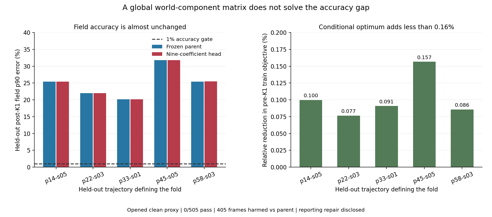

# 全局世界分量耦合 / Global World-Component Coupling

2026-09-07

独立复算完成：冻结1840参数模型，只拟合九系数世界分量混合矩阵，另设三系数对角与单系数缩放对照。五折训练目标仅相对降低0.08%–0.16%；1%精度仍为0/505、0/5完整轨迹，相比原模型405帧至少一项指标变差。这说明只补全局分量混合不足，关闭该固定补丁；不是所有物理耦合都无效，也不是算法突破。

Independent verification is complete: freeze the1840-parameter model and fit only a nine-coefficient world-component matrix, with diagonal-three and scalar-one controls. Training objectives fall by only0.08%–0.16% across five folds. The1% accuracy gate remains0/505 and0/5 complete trajectories;405 frames worsen in at least one metric against the parent. Global component mixing alone is insufficient, so this fixed patch is closed. This does not reject all physical coupling and is not a breakthrough.

## 为什么做 / Why This Test

原模型让三个世界坐标分量共享同一空间与相机滤波。本次保留较强的原L-BFGS模型，仅把分量间的单位矩阵换为一个全局实3×3矩阵。每折仅用404训练帧求解九系数，并与三系数对角和单系数缩放比较；完整101帧轨迹留出。五折训练集合相互重叠，不是2020份独立数据。

The parent shares the same spatial and camera filter across three world components. Keep the stronger original L-BFGS features fixed and replace only the component identity with one global real3×3 matrix. Fit its nine coefficients on404 training frames per fold, alongside diagonal-three and scalar-one controls; hold out an entire101-frame trajectory. Training folds overlap and are not2020 independent observations.

训练目标是相对于离线直接解teacher的K1之前四项相对平方误差，不读取留出真值。正式Cholesky和独立流式QR/SVD均重新求得全部15组头部系数，最大系数相对差5.02e-14。因此本次可以谈固定特征、固定训练目标下的条件最优；不能说所有张量模型、空间相关耦合或K1之后的误差都达到理论最优。

The objective is the mean of four relative squared pre-K1 errors against an offline direct-solver teacher, with no held-out truth access. Formal Cholesky and independent streamingQR/SVD refit all15 heads; maximum relative coefficient difference is5.02e-14. This supports a conditional optimum for fixed features and this training objective, not a theoretical optimum over every tensor, spatial coupling or post-K1 error.

## 结果 / Results

| 留出轨迹 / Held-out | 原模型场p90 / Parent field | 九系数场p90 / Head field | 训练目标相对改善 / Train improvement |
|---|---:|---:|---:|
| p=14kw_size=05 | 25.42% | 25.41% | 0.100% |
| p=22kw_size=03 | 21.99% | 21.98% | 0.077% |
| p=33kw_size=01 | 20.13% | 20.13% | 0.091% |
| p=45kw_size=05 | 31.77% | 31.76% | 0.157% |
| p=58kw_size=03 | 25.40% | 25.45% | 0.086% |

1%四指标门仍为0/505、0/5完整轨迹。相比原模型405帧至少一项指标变差，相比三系数对角对照382帧受损；不能用训练目标略降冒充重建进步。完整直接解仍为505/505。新头部仍逐帧四指标优于十二个较弱对照，但精度和强对照公平门都没有通过。

The1% four-metric gate remains0/505 and0/5 complete trajectories. At least one metric worsens in405 frames against the parent and382 against the diagonal control. A slightly lower training objective is not reconstruction progress. Full direct remains505/505. The head still beats twelve weaker controls on every frame and metric, but fails both accuracy and strong-control fairness.

## 审计与边界 / Audit and Limits

保留一次汇总工程失败：旧检查把接近零的直接解误差用相对差比较，放大了约2.8e-12的绝对差。之后单独修正为无量纲指标的绝对差核验，未改候选、系数、数据、1%精度门或物理容差，也未重新训练父模型。原失败记录保留；这不是从未修复过的前瞻试验。

An aggregation failure is retained: the original check compared near-zero direct-solver metric tails relatively, magnifying an approximately2.8e-12 absolute difference. A separate reporting repair uses absolute differences for dimensionless metrics. Candidate, coefficients, data,1% accuracy and physical tolerances stay unchanged; the parent is not retrained. The original failure remains recorded. This is not an untouched prospective experiment.

修复后独立重新拟合所有训练头部，重建1515个外折端点、精确lift和未修改K1、四指标尾部、相机乱序与成本账。评分最大差5.55e-17，全部尾部绝对差不超过3.49e-12；原生forward也完整复核了1515个端点。此前计算已经发生的离线成本仍计入，失败前未落盘的动作账明确由固定源码和完成记录重建，另列修复与独立验证开销。

The repaired audit independently refits every training head and rebuilds1515 outer endpoints, exact lift, unchangedK1, four-metric tails, camera permutation and costs. Score difference is5.55e-17; absolute tail differences stay below3.49e-12. Native forward also checks all1515 endpoints. Previously incurred offline work remains charged; counts not persisted before the failure are explicitly reconstructed from fixed source and completed stages, with repair and independent audit costs separate.

在线仍为2A+2AT；1840个冻结父参数及其训练、几何构建和离线teacher不免费。本次只覆盖已打开的五条轨迹、干净九相机代理；没有5/7/12相机精度、未开工况、时间/内存优势、外部泛化或真实BOST结论。这条全局线性补丁关闭，不通过加参数或换目标挽救。下一问题应定位空间与相机交互，而不是继续调整同一个全局矩阵。

Online cost remains2A+2AT; the1840 frozen parent parameters, their training, geometry and offline teacher are not free. Evidence covers only five already-opened trajectories and a clean nine-camera proxy. No5/7/12-camera accuracy, unopened condition, time/memory advantage, external generalization or real-BOST result is established. This global linear patch is closed without extra parameters or a changed objective. The next question concerns spatial/camera interactions rather than tuning the same global matrix.

[脱敏完整汇总 / Redacted summary](poolfire_world_component_head_20260907.json)

[前一项局部归一化 / Previous local normalization](poolfire_ray_metric_tensor_20260907.md)
