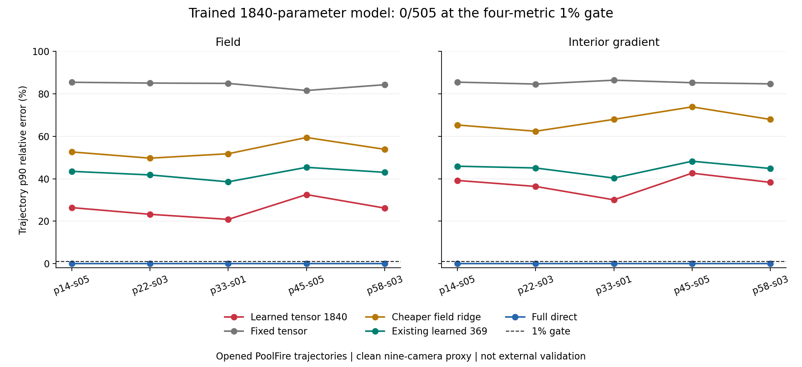

# 世界坐标张量模型 / World-Frame Tensor Learner

2026-09-07

1840参数世界坐标张量模型完成五折训练与独立物理复算：四指标1%门通过0/505帧、完整轨迹0/5；合格完整直接解仍为505/505、5/5。505帧四项指标均优于所列九个非完整直接解对照，包括岭回归、PCGLS和旧369参数模型；但仍未达到1%精度门。该固定方案停止，不追加轮数或扩大模型；没有学习加速或论文突破。

The 1840-parameter world-frame tensor model completed five-fold training and independent physical replay: 0/505 frames and 0/5 trajectories pass the four-metric 1% gate. Qualified full direct solving still passes 505/505 and 5/5. The learner improves every metric on every frame over all nine listed non-full-direct controls, including ridge, PCGLS and the old369-parameter model, but fails the1% accuracy gate. This fixed recipe stops without extra epochs or a larger model; no learned speedup or paper breakthrough.

## 实际实验 / Actual Experiment

实际训练1840个共享参数，另有每折一个仅用训练帧确定的尺度。每折404帧训练、101帧留出，固定20轮、总2600次更新，只取最终迭代。输入仅为观测和已报告几何；教师来自训练折直接解。全部预测与求解端点封存后才读CFD真值评分。九相机干净代理上的505帧、五条轨迹均已开封，不是新工况外部验证。5/7/12相机只验证了机械性质，不代表这些相机数下精度通过。

There are1840 shared trained parameters and one additional train-only scale per fold. Each fold uses404 training and101 held-out frames,20 fixed epochs and2600 total updates, with the final iterate only. Inputs are observations and reported geometry; teachers come from train-fold direct solving. Predictions and solver endpoints seal before CFD scoring. The505 frames and five trajectories belong to an already-opened clean nine-camera proxy, not prospective external validation. Mechanical checks at5/7/12 cameras do not establish accuracy at those cardinalities.

## 误差与对照 / Errors and Controls

下表是各轨迹p90相对误差百分数，四项均需不超过1%，完整轨迹需101帧全过。不是历史相对K4的matched计数。

The table gives trajectory p90 relative errors in percent. All four metrics must be at most1% on every frame; a complete trajectory requires101/101. This is not the historical K4-matched count.

| 轨迹 / Trajectory | 场 / Field | 全梯度 / Full gradient | 内部梯度 / Interior gradient | 观测 / Observation |
|---|---:|---:|---:|---:|
| p=14kw_size=05 | 26.40% | 34.70% | 39.21% | 15.68% |
| p=22kw_size=03 | 23.25% | 32.31% | 36.38% | 17.20% |
| p=33kw_size=01 | 20.86% | 29.26% | 30.07% | 17.11% |
| p=45kw_size=05 | 32.54% | 37.66% | 42.62% | 25.32% |
| p=58kw_size=03 | 26.18% | 33.19% | 38.30% | 20.22% |

下表“受损”指新模型相较该对照至少一项指标更差，不能用某一平均值掩盖。

Harm means at least one metric is worse for the new model than the indicated control; a favorable average does not remove it.

| 对照 / Control | 任一指标受损帧 / Frames with any harm | 对照绝对门全过 / Control passes all |
|---|---:|---|
| fixed_world_tensor | 0/505 | False |
| scalar | 0/505 | False |
| dual_ridge | 0/505 | False |
| zero_cgls2 | 0/505 | False |
| jacobi_pcgls2 | 0/505 | False |
| normalized_bp | 0/505 | False |
| rayset369 | 0/505 | False |
| full_direct | 505/505 | True |
| zero | 0/505 | False |
| direct_field_ridge | 0/505 | False |

## 成本与验证 / Cost and Verification

模型精确lift后接未修改K1，逻辑在线2A+2AT；更便宜的直接场ridge为2A+1AT，完整直接解为1A+1AT加两次三角求解。模型计算和几何准备不免费。本次不声称速度或内存优势；此前缓存查询筛查失败保持不变，缺完整准备成本时也不能据它断言端到端不可能。

Exact lift followed by unchangedK1 costs2A+2AT logically online. Cheaper field ridge uses2A+1AT; full direct uses1A+1AT plus two triangular solves. Model computation and geometry preparation are not free. No speed or memory advantage is claimed. The earlier failed cached-query screen remains failed, but without full setup costs it also cannot establish end-to-end impossibility.

独立实现重建几何、预测、梯度探针、求解及5555个物理端点的评分和尾部。评分、原生前向和残差最大差分别为7.88e-15、7.5e-16和7.79e-16。两路使用同一封存权重，未独立重复整段优化训练；输入输出保持不变。

The independent implementation rebuilds geometry, predictions, gradient probes, solving and all scores/tails for5555 physical endpoints. Maximum score, native-forward and residual differences are7.88e-15,7.5e-16 and7.79e-16. Both paths use the same sealed weights; the complete optimization trajectory is not independently retrained. Inputs and outputs remain unchanged.

该固定方案停止；现有数据足够继续研究，但下一步必须有不同的、可证伪的物理依据，不以加宽或加轮数挽救。尚无算法突破、论文成功、资源加速、外部泛化或真实BOST结论。

This fixed recipe stops. Existing data remain sufficient for research, but a next mechanism needs a different, falsifiable physical basis rather than width or epoch rescue. Algorithm breakthrough, paper success, resource speedup, external generalization and real BOST remain unestablished.

[脱敏数值 / Redacted aggregates](poolfire_world_tensor1840_20260907.json)
