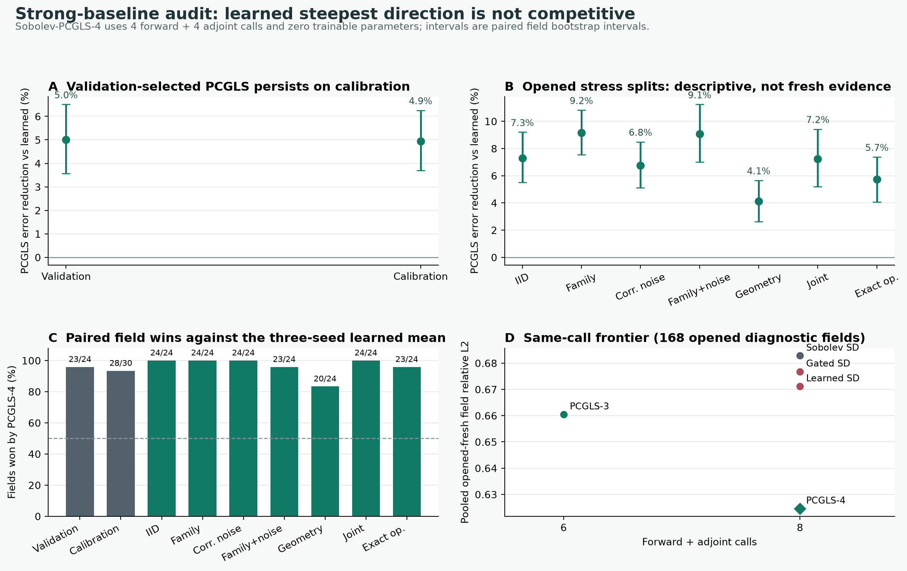

# PSU B0 强基线审计：当前学习方向判为 no-go

**日期：** 2026-07-16
**状态：** 开发阶段否定性结论；不是新的独立 fresh 结果
**结论：** 当前“残差条件化正频谱方向 + 精确线搜索”不应继续作为主算法。后续应转向 PCGLS 内的可证明正定学习预条件器，或学习停止/保护策略。

## 一句话解释

旧方法每一步都沿学习得到的“更聪明的梯度方向”前进。此前它只和固定 Sobolev 梯度下降比较，因此看起来平均改善约 1%–3%。加入真正同预算的 **Sobolev 预条件共轭梯度（PCGLS）** 后，经典算法在相同的 4 次前向和 4 次伴随调用内稳定取得更低三维场误差，而且没有训练参数。

这说明原来的提升主要来自“比固定梯度下降更会利用频谱”，而不是学习模型发现了超过 Krylov 子空间方法的新逆算子结构。

## 核心结果

PCGLS 的 Sobolev 强度和频率偏置只在旧 `risk_validation` 上选择：

- 预条件器：各向同性 Sobolev，`strength = 4`，`epsilon = 0.05`
- PCGLS-4：`4 forward + 4 adjoint`，与学习方法严格同预算
- PCGLS-3：`3 forward + 3 adjoint`，比学习方法少 2 次算子调用
- 可训练参数：0；学习方向参数：2,227

与三个 raw learned seed 的逐场均值相比：

| 数据分区 | PCGLS-4 相对误差降低 | 95% 配对 bootstrap 区间 | 逐场胜率 |
|---|---:|---:|---:|
| `risk_validation` | 5.00% | [3.57%, 6.51%] | 23/24 |
| `risk_calibration` | 4.94% | [3.69%, 6.26%] | 28/30 |
| fresh IID support | 7.30% | [5.50%, 9.20%] | 24/24 |
| fresh family OOD | 9.16% | [7.55%, 10.82%] | 24/24 |
| fresh correlated noise | 6.76% | [5.11%, 8.49%] | 24/24 |
| fresh family + noise | 9.07% | [7.02%, 11.24%] | 23/24 |
| fresh geometry OOD | 4.11% | [2.62%, 5.66%] | 20/24 |
| fresh joint OOD | 7.24% | [5.19%, 9.43%] | 24/24 |
| fresh exact-operator control | 5.74% | [4.07%, 7.37%] | 23/24 |

七类 fresh 数据已在此前 OCRRG 审计中打开，因此这里只能作为**描述性诊断**。可用于开发决策的关键链条是：验证集选参后，未参与选择的 `risk_calibration` 仍保持约 4.94% 的配对改善。

## 168 场统一比较

| 方法 | F / AT | 参数量 | 平均 field relative L2 |
|---|---:|---:|---:|
| 固定 Sobolev steepest descent | 4 / 4 | 0 | 0.6828 |
| gated learned 三种子均值 | 4 / 4 | 2,227 | 0.6768 |
| raw learned 三种子均值 | 4 / 4 | 2,227 | 0.6711 |
| Sobolev-PCGLS-3 | 3 / 3 | 0 | 0.6604 |
| **Sobolev-PCGLS-4** | **4 / 4** | **0** | **0.6246** |

## 为什么最后一次伴随不需要计算

固定执行 \(K\) 次 CGLS/PCGLS 时，第 \(K\) 次更新后已经得到最终体场和测量残差。只有准备构造第 \(K+1\) 个搜索方向时，才需要再次计算 \(A^\top r_K\)。如果算法在第 \(K\) 次更新后停止，这个最终伴随是未使用工作。

因此 PCGLS-3 可实现为 `3F + 3AT`，PCGLS-4 可实现为 `4F + 4AT`。数值重建与“多算一次但不使用最终 normal residual”的实现逐元素一致；等价性、目标单调性和调用账本均已加入自动测试。

## 当前路线哪些部分作废

以下表述不能继续使用：

1. “学习频谱方向优于强经典算法。”
2. “1%–3% 的平均增益足以支撑新算法贡献。”
3. “固定 Sobolev steepest descent 是充分的主要数值基线。”
4. “OCRRG 风险门只需在 learned 与 Sobolev fallback 之间选择。”

OCRRG 还有独立的特征契约问题；即使修复风险门，它所保护的 learned candidate 也已经被 PCGLS 强基线淘汰。

## 哪些资产仍然有效

- 真实 PSU B0 支撑域、有限孔径 QMC32/QMC8 前向与精确伴随
- 32³ 体素矩阵自由重建接口与调用计数
- 反应场形态生成器和相机相关噪声 stress
- 场误差、梯度误差、front top-10% F1、测量残差指标
- 支撑域外精确 fallback、可观察风险特征和失败模式诊断
- 私有报告、公网页面、开发/校准/fresh 证据分层

## 新算法主线

### 路线 A：BOST-GC-SPD-PCGLS，首选

在第一次迭代前，根据相机子集、视角几何、每视角噪声、初始白化残差和有限孔径元数据生成一个正频谱乘子；该乘子在全部 PCGLS 阶段保持固定。

最低创新门槛：

1. 严格优于静态 Sobolev-PCGLS-4，而不是只优于 steepest descent。
2. 在 `risk_calibration` 上仍有正增益，并在新 independent repeat 前冻结模型。
3. 对 6/7/8/9 视角、IID/相关噪声、低频 plume、thin front 和 oblique shock 分层报告。
4. 正频谱、上下界、几何均值归一化和支撑投影均可审计。
5. 对照 UNO-CG、NeuralIF、学习近似逆和各向异性静态 PCGLS。

### 路线 B：PCGLS 学习停止与保护，低风险

不学习搜索方向，只在第 1–4 步之间选择停止点，或检测是否应回退到更平滑的早期迭代。输入只能使用残差、视角和几何特征。实现简单、容易解释，但论文创新性可能较低。

### 路线 C：Flexible learned Krylov，高风险

若预条件器随残差和迭代阶段变化，标准 PCG 共轭性不再成立。必须使用 flexible CG 和显式方向正交化，并把额外向量存储、内积和网络计算计入预算。

## 必补的强基线

- 静态 Sobolev-PCGLS-3/4
- 各向异性和不同 `epsilon` 的 PCGLS
- TV-superiorized PCGLS
- 学习停止但不学习方向
- 固定 learned SPD multiplier + PCGLS
- flexible CG（仅用于残差自适应预条件器）

## 关键文献边界

- [Notay, Flexible Conjugate Gradients](https://epubs.siam.org/doi/abs/10.1137/S1064827599362314)：变化预条件器不能直接沿用标准 PCG。
- [Li et al., Learning Preconditioners for Conjugate Gradient PDE Solvers](https://proceedings.mlr.press/v202/li23e.html)：学习 SPD 分解并嵌入 PCG 已是明确先例。
- [Neural incomplete factorization](https://openreview.net/forum?id=FozLrZ3CI5)：结构化、可逆学习预条件器及无监督矩阵损失。
- [UNO-CG](https://arxiv.org/abs/2508.02681)：convergence-safe 学习预条件器意味着泛化的“FNO + CG”本身不再足够新。
- [Superiorization of PCG for tomography](https://arxiv.org/abs/1807.10151)：TV-superiorized PCG 是层析前沿保持必须面对的非学习对照。
- [PSU open-source BOST dataset](https://arxiv.org/abs/2508.17120)：当前真实几何来源及 TV/NIRT 背景。

## 下一次可以称为成功的条件

当前没有新算法成功。下一候选只有同时满足以下条件才进入 fresh preregistration：

1. 同预算 `4F + 4AT` 下，验证和校准均优于 PCGLS-4。
2. 平均 field gain 至少 2%，且 95% 配对 bootstrap 下界大于 0。
3. gradient relative L2 与 front F1 不发生实质恶化。
4. 任一视角层和主要形态的 >1% harm rate 不超过冻结阈值。
5. 三个训练种子中至少两个通过。
6. 模型、数据生成、基线、tie-break 和失败条件在新种子生成前全部冻结。

在这些条件之前，所有结果都只能叫“开发信号”，不能叫“优于现有算法”。
