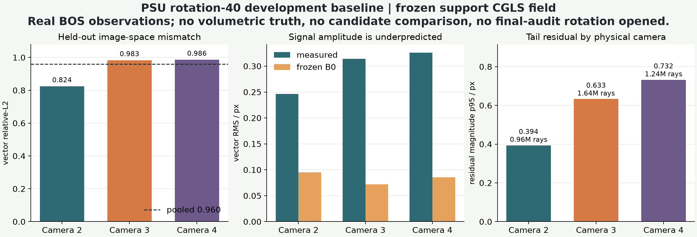

# PSU rotation-40 真实观测：冻结 support 场的首个重投影基线

## 一句话结论

冻结的九视角 support CGLS 场能够在 rotation-40 的 3,847,050 条真实 active 射线上完成
可复现 forward，但 pooled vector relative-L2 为 **0.959591**。这说明它对未见旋转真实
观测的解释力很弱；它没有给出三维场真值，也没有比较任何新算法。

## 评分前先修了什么

初版开发 observation shard 使用了 NumPy 默认 C-order 展平，而作者 MATLAB 脚本使用
`epsu(:)'`，即 column-major 顺序。这个差异会把位移与射线行错配。当前实现已改为显式
`order="F"`，并用非对称测试矩阵锁定行序。

rotation-40 官方 calibration MAT 中的 `Arotcam` 是绕 x 轴 40° 的齐次旋转。相机 2、3、4
的官方逐像素 `ray_dir` 与“0° support 射线乘该旋转”在全部 5,529,600 行上吻合：

| 相机 | official ray max-abs | official ray RMS | 0/50/90 已知旋转 max-abs | scalar invariance max-abs |
|---:|---:|---:|---:|---:|
| 2 | 3.238e-8 | 1.087e-8 | 6.187e-8 | 0 |
| 3 | 2.522e-8 | 9.979e-9 | 5.468e-8 | 0 |
| 4 | 3.240e-8 | 1.110e-8 | 6.200e-8 | 0 |

这同时核验了相机身份、旋转规则和逐像素行序。私有 geometry shard 只保存 active 行；
公开摘要只保存哈希、数量和误差聚合。

## 冻结评分合同

- 场：九个 support views 上 CGLS-4 得到的冻结 `32^3` 场；
- support：一层 zero outer boundary；
- forward：与 support 基线相同的有限差分、三线性插值和 16-sample finite aperture；
- development：rotation 40、physical cameras 2/3/4、全部 active rows；
- 精度：CPU `float64`，8 torch threads，32,768 rays/chunk；
- smoke：冻结前每相机 1,000 条 quantile rays，只检查接口、有限值和 B0 hit，未选参数；
- final audit：rotation 30/60/70/80 没有打开。

## 全量结果

| 范围 | rays | vector rel-L2 | component RMSE / px | component MAE / px | residual p95 / px | measured RMS / px | predicted RMS / px |
|---|---:|---:|---:|---:|---:|---:|---:|
| Camera 2 | 959,098 | 0.824194 | 0.143484 | 0.086268 | 0.393926 | 0.246200 | 0.094993 |
| Camera 3 | 1,643,912 | 0.982907 | 0.218467 | 0.120879 | 0.632954 | 0.314332 | 0.071899 |
| Camera 4 | 1,244,040 | 0.985630 | 0.226997 | 0.138127 | 0.732229 | 0.325702 | 0.085517 |
| **Pooled** | **3,847,050** | **0.959591** | **0.205403** | **0.117827** | **0.617790** | **0.302716** | **0.082605** |

单次 logical forward 遍历 119 chunks，用时约 `6.98 s`，峰值 RSS 约 `1.28 GB`；全部 active
射线命中 B0，预测有限。Mac 足以承担当前 baseline 与轻量候选筛选，网络不是训练瓶颈。

## 它对新算法的启发

1. **主要矛盾是跨视角系统误差和不可辨识性。** support residual 约 0.627，并没有转化为
   未见 rotation 的一致性；只在 support 上继续压 loss 很可能过拟合几何。
2. **相机间差异必须进入模型。** Camera 2 明显好于 3/4，几何集合编码器、camera-wise
   bias/noise head 与 leave-camera-out 消融比单一全局 FNO 更有针对性。
3. **预测幅值系统性偏小。** 这可能来自 support 场、有限孔径、标定、密度场旋转假设或
   光流偏差；在拆清原因前，禁止直接加一个用 development truth 拟合的尺度因子。
4. **真实数据只能给 image-space consistency。** 没有独立 volumetric truth，任何新方法
   都必须同时在独立解析/CFD phantom 上报告 field、H1 和 front 指标。
5. **候选门槛已经量化。** 下一候选至少要在 rotation-40 三台相机都降低 rel-L2，同时在
   synthetic 0/1/2-interface rigs 上改善 front 指标，且不能只靠增加 forward calls。

## 当前合法表述

可以写：冻结 support 重建对未见 rotation-40 真实 BOS 观测的 image-space consistency 很差，
并且该缺口在三台物理相机上可重复观察。

不能写：真实三维场重建误差为 0.9596、B0 已被新算法击败、rotation-40 是最终独立测试、
或实验已经证明某个神经算子恢复了真实密度场。

机器可读结果见
[public summary](psu_rotation40_b0_reprojection_public_summary.json)，几何行绑定见
[geometry summary](psu_rotation40_geometry_binding_public_summary.json)。
