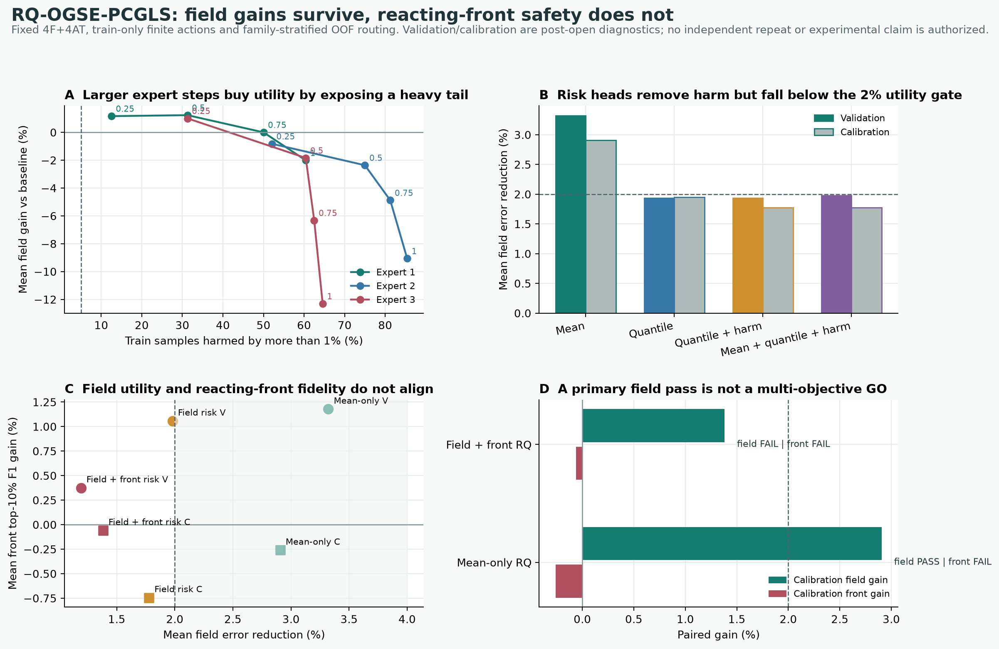

# Risk-Routed Spectral Experts for Budget-Matched BOST Reconstruction

**Working manuscript draft, 2026-07-17**
**Status:** not submission-ready; post-open synthetic development only
**Claim state:** closed pending independent repeat and experimental transfer

## Abstract

Background-oriented schlieren tomography (BOST) recovers a volumetric
refractive-index or density field from sparse gradient-sensitive optical
measurements. Strong static Sobolev preconditioning improves short-budget
conjugate-gradient reconstruction, but one global spectrum cannot be optimal
for plume, thin-front and shock-like fields under changing camera subsets and
correlated noise. We study whether deployment-observable information can route
each measurement to one of a small number of fixed positive spectral
preconditioners while preserving an exact static fallback and a fixed
four-forward/four-adjoint budget.

The proposed development framework first selects a train-only bank of fixed SPD
experts, then caches a finite set of baseline-to-single-expert interpolation
actions. A shared first normal field provides 44 spectral and spatial features.
Linear mean, quantile and harm-probability heads are screened with
family-stratified out-of-fold predictions. On post-open synthetic development
data using real PSU support geometry, a mean-only route reduces field error by
3.321% on validation and 2.907% on calibration relative to static
Sobolev-PCGLS-4. However, calibration contains one 1.897% field degradation,
and the mean top-10% front-F1 change is negative with a 30.876% worst-case
drop. Quantile and harm heads eliminate observed field harms but reduce mean
field gains below the predeclared 2% utility threshold. A multi-objective
field-and-front gate further lowers field gains to 1.192% and 1.382% and still
does not preserve calibration front fidelity.

These results do not establish algorithm superiority. They identify a concrete
failure of globally pooled first-adjoint features: field-L2 utility and
reacting-front fidelity are not jointly predictable from the current
representation. The next testable hypothesis is a permutation-invariant
per-view residual and adjoint-contribution encoder, evaluated on a newly frozen
independent repeat and held-out experimental cameras.

## 1. Introduction

### 1.1 Physical problem

BOST measurements respond primarily to transverse gradients of refractive
index. Sparse camera geometry therefore leaves a large, morphology-dependent
null space. Reducing the measurement residual is insufficient evidence that a
three-dimensional density field, thin front or shock surface has improved.

### 1.2 Numerical problem

Under a small fixed iteration budget, Sobolev-PCGLS-4 is a stronger baseline
than the previously tested learned steepest-direction model. A 105-member
family of fixed positive Sobolev spectra contains substantial per-sample oracle
headroom, but view-count and noise-only routing do not transfer. The research
question is therefore not whether a network can output a preconditioner. It is:

> Can measurement-observable morphology and risk route a fixed-budget PCGLS
> solver to a safer spectral expert without sacrificing reacting-front
> fidelity?

### 1.3 Intended contributions

Current evidence supports only contributions C1-C3 as implemented mechanisms.
C4-C5 remain hypotheses.

1. **C1, implemented:** a finite, interpretable bank of SPD spectral actions
   with exact baseline fallback and a fixed `4F+4AT` budget.
2. **C2, implemented:** train-only action caching that separates expensive
   reconstruction from cheap risk-route screening.
3. **C3, implemented:** separate empirical mean, lower-quantile, field-harm and
   front-harm heads with explicit coverage reporting.
4. **C4, unproven:** a per-view camera-set representation that transfers across
   morphology, noise and view masks.
5. **C5, unproven:** improvement over strong classical and neural baselines on
   an independent repeat and OERF held-out cameras.

## 2. Related Work

### 2.1 BOST and neural refractive-index fields

This section must be completed with verified descriptions of PSU BOST, NeRIF,
TDBOST and group-specific forward models. No comparison claim is currently
open.

### 2.2 Learned preconditioners

Neural preconditioner generation is not itself novel. The eventual distinction
must come from gradient-sensitive BOST physics, variable camera sets, exact
fallback, fixed operator-call accounting and experimental held-out-camera
evidence.

### 2.3 Quantile and selective prediction

Classical regression quantiles replace squared-error mean estimation with an
asymmetric pinball objective. Conformalized quantile regression can calibrate
prediction intervals under exchangeability. Selective prediction explicitly
trades coverage for conditional risk. The current method uses empirical OOF
quantile heads only; it does not claim conformal or selection-conditional
coverage.

## 3. Methods

### 3.1 Forward problem

Let the whitened BOST operator be `A`, the displacement observation be `y`, and
the unknown scalar field be `x`. The first shared normal field is

\[
g_0=A^\top Wy.
\]

All candidate routes reuse this adjoint call.

### 3.2 Static baseline

The baseline is four-stage Sobolev-preconditioned CGLS with

\[
M_0(k)=(0.05+\|k\|^2)^{-4}.
\]

The last unused adjoint is not computed, so the exact logical budget is
`4F+4AT`.

### 3.3 Train-only expert bank

Four fixed positive spectra are inherited from a train-only greedy oracle-cover
selection over 105 candidates. The synthetic morphology label is used only to
stratify OOF folds, never as a deployment input.

### 3.4 Finite single-expert actions

For each non-baseline expert `Me` and interpolation fraction `tau`,

\[
\log M_{\tau,e}
=(1-\tau)\log M_0+\tau\log M_e
-\operatorname{mean}_k[\cdot].
\]

The resulting multiplier is strictly positive and has unit geometric mean.
`tau=0` and every rejected route are exactly the baseline.

### 3.5 Observable representation

The current representation contains 44 pooled features of `g0`: radial and
axis-wise spectral energy, spectral entropy, directional moments, spatial
energy center/covariance, gradient-energy fractions and signed moments.

### 3.6 Risk heads

For each finite action, models estimate:

\[
\mu_e(z)=E[\Delta_{\mathrm{field},e}|z],
\]

\[
q_{\alpha,e}(z)
=Q_\alpha[\Delta_{\mathrm{field},e}|z],
\]

\[
p_{\mathrm{field},e}(z)
=P(\Delta_{\mathrm{field},e}<-1\%|z).
\]

The multi-objective extension adds a lower quantile and a harm classifier for
absolute top-10% front-F1 delta. Quantile heads solve a linear pinball-loss
program with L1 slope regularization. Harm heads use logistic ridge.

### 3.7 Selection and evidence firewall

- `risk_train`: action targets, model fitting and family-stratified OOF screen;
- `risk_validation`: post-open transfer diagnostic;
- `risk_calibration`: post-open transfer diagnostic;
- previously opened fresh: never loaded;
- future independent repeat: not authorized by current results.

No finite-sample conformal guarantee is claimed.

## 4. Experimental Protocol

### 4.1 Data

The current data combine real PSU support geometry with analytic reacting-flow
morphologies and synthetic camera noise. They contain no experimental
three-dimensional truth and are not CFD.

### 4.2 Primary metrics

- field relative L2;
- gradient relative L2;
- top-10% front F1;
- measurement relative L2;
- per-sample paired field gain;
- `>1%` field-harm rate;
- bootstrap mean interval;
- coverage and accepted risk.

### 4.3 Development gates

The primary field gate requires both validation and calibration mean gain
`>=2%`, positive bootstrap lower bounds, p10 approximately nonnegative and
field-harm rate `<=5%`.

The front safety audit requires nonnegative mean front gain and no material
p10 degradation. Its numeric thresholds were formalized after observing the
first mean-only result and therefore remain post-selection diagnostics.

## 5. Results

### 5.1 Finite-action headroom and risk

Global application of every non-baseline expert has a heavy negative tail.
Increasing `tau` initially raises utility for one expert, then rapidly increases
harm. This supports selective routing rather than a new global spectrum.

### 5.2 RQ ablation

| Route | Validation field | Calibration field | Field harm V/C |
|---|---:|---:|---:|
| mean-only | `+3.321%` | `+2.907%` | `0% / 3.33%` |
| quantile-only | `+1.933%` | `+1.946%` | `4.17% / 0%` |
| quantile + harm | `+1.933%` | `+1.777%` | `4.17% / 0%` |
| mean + quantile + harm | `+1.979%` | `+1.777%` | `0% / 0%` |

The quantile/harm heads improve empirical safety but reduce utility below the
field gate.

### 5.3 Front-fidelity conflict

The mean-only route passes the field gate but fails the secondary front audit.
The worst front losses occur for correlated-noise oblique shocks, even when
field-L2 improves. This demonstrates metric conflict rather than a simple
catastrophic field failure.

### 5.4 Multi-objective route

| Split | Field gain | 95% CI | Field harm | Front mean |
|---|---:|---:|---:|---:|
| validation | `+1.192%` | `[+0.294%, +2.204%]` | `0%` | `+0.375%` |
| calibration | `+1.382%` | `[+0.493%, +2.478%]` | `0%` | `-0.060%` |

The front veto is too conservative to retain field utility and still fails to
make calibration front gain nonnegative.

## 6. Discussion

### 6.1 What worked

- The action-cache design reduced 648-route RQ screening to about 12 seconds.
- Exact fallback and fixed SPD/call ledgers passed.
- A single-expert path is more effective than the prior all-expert softmax
  mixture for field-L2.
- Explicit risk heads reveal a measurable utility-safety frontier.

### 6.2 What failed

- Quantile and harm heads do not preserve the mean-only utility signal.
- Pooled `g0` features cannot reliably identify front damage.
- Field-L2, measurement fit and front-F1 are not interchangeable objectives.
- Current data are too small and post-open for a publication-level positive
  claim.

### 6.3 Mechanistic interpretation

Summing adjoint contributions over cameras removes view disagreement. A
correlated-noise shock can produce a plausible global first normal field while
individual cameras disagree in orientation or high-frequency content. The
current representation cannot distinguish this case from a genuinely
beneficial anisotropic expert action.

## 7. Next Method: View-Decomposed Risk Routing

The next preregistered candidate should expose per-view information:

\[
g_{0,v}=A_v^\top W_v y_v,
\qquad
g_0=\sum_v g_{0,v}.
\]

A permutation-invariant set encoder should aggregate:

- per-view whitened spectra;
- `||g0,v||` shares;
- pairwise cosine/angle dispersion;
- camera-correlated covariance eigenvalues;
- image-plane ridge/front coherence;
- camera geometry and active-mask metadata.

The output remains one baseline-or-single-expert action. Field and front risk
heads remain separate. A newly generated independent repeat must be frozen
before viewing any result.

## 8. Required Experiments Before Submission

1. Implement and test per-view adjoint contribution extraction.
2. Verify whether it adds logical `AT` calls or only exposes existing internal
   contributions.
3. Run leave-one-family-out and leave-one-noise-profile-out screens.
4. Freeze a new independent morphology/noise/view-mask repeat.
5. Compare TV-superiorized PCGLS, learned stopping, NeuralIF/learned-PCG and a
   feasible UNO-CG implementation under matched calls.
6. Obtain flow-off covariance and held-out-camera displacement from OERF.
7. Report three-dimensional field metrics and experimental reprojection
   metrics separately.
8. Repeat across at least three seeds and higher resolution only after the
   low-resolution gate passes.

## 9. Limitations

- analytic morphologies are not CFD or experimental flows;
- PSU support geometry is not OERF calibration;
- validation/calibration are already opened;
- front thresholds are post-selection formalizations;
- no independent repeat, real covariance or experimental held-out camera;
- no fair DeepONet/FNO/UNO-CG/NeuralIF comparison yet;
- no claim of generalization across resolution or camera systems.

## 10. Current Conclusion

The current evidence supports a methods-development conclusion, not a positive
algorithm claim:

> Finite single-expert spectral routing exposes real BOST field-L2 headroom,
> but pooled first-adjoint features cannot jointly predict field utility and
> reacting-front safety. Per-view observable structure is the next necessary
> representation test.

Submission remains blocked by scientific evidence, not by code execution or
local compute.
