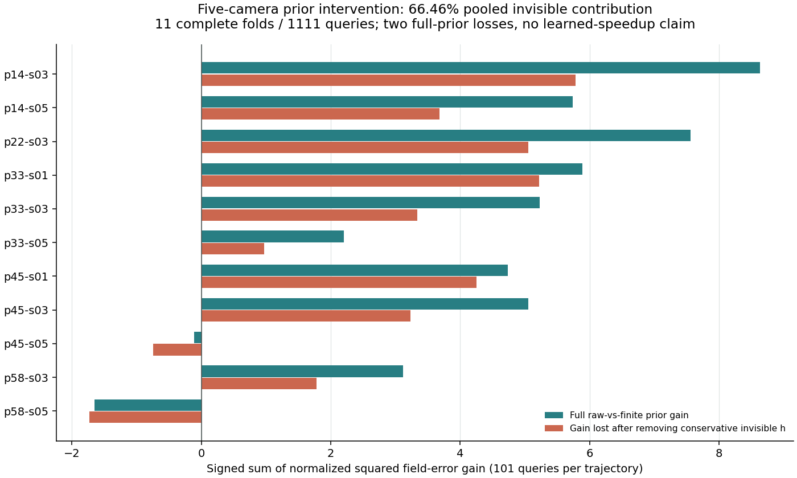
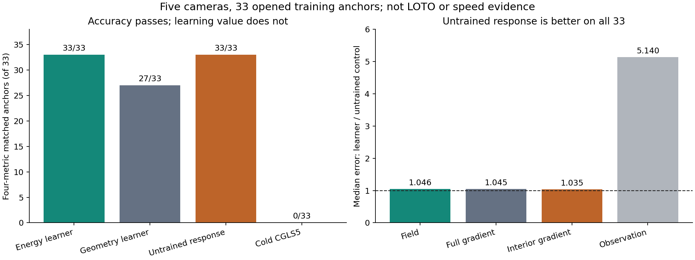
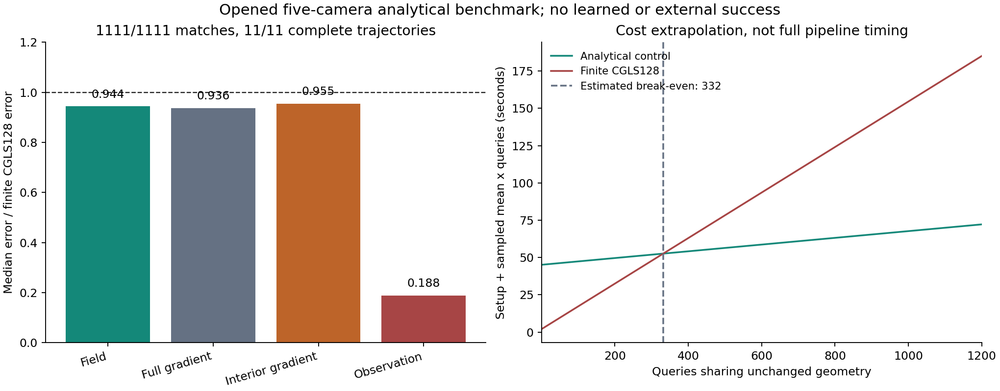
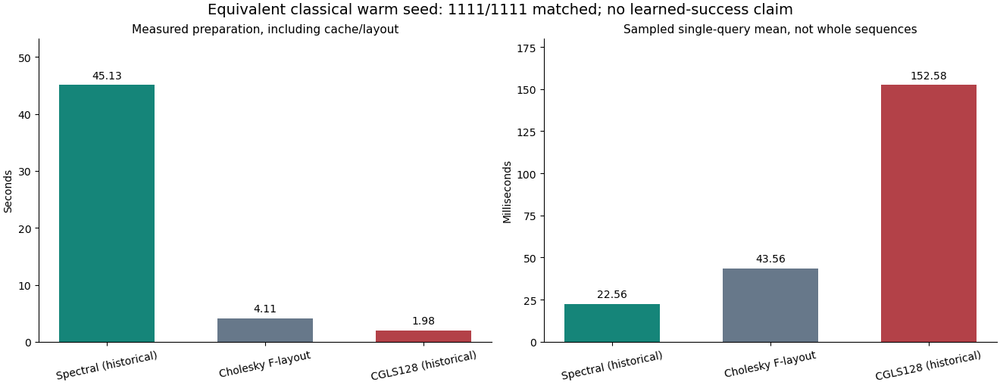
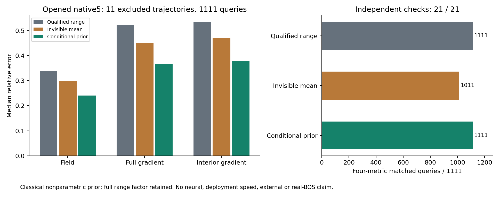

# 完整留轨迹学习：有小幅收益，尚无强参考加速

2026-10-10。这次不是训练内拟合或真值可见容量诊断。一个3,841参数的共享有符号跨相机射线图网络完成11个完整轨迹留出外折：每条101帧，5/7/9相机，共3,333个held查询、33个完整轨迹×相机层。

## 实际做了什么

### 全频响应的求解坐标控制

10月11日新增一个零参数经典终点门：当前分段物理的全频周期平均normal响应，作为每一步的右坐标预条件，而非旧配方的一次range-filter初值。以AC与CA^T执行原样零起点CGLS35；loading只在预条件器里，不改最小二乘目标。分别用SciPy/Torch从各自物理CSR构造频谱与作用，原样双递推、各自raw缓存和四指标重放，20/20独立检查一致。

五相机11条已打开train轨迹、0/50/100帧共33锚点。主控制匹配0/33、绝对采样门0/11、对冷35四项不差0/33；均匀响应控制保持冷35指标和11/11基本质量。33/33观测改善，同时33/33场、全梯度和内部梯度更差；配对比值中位数为1.404825/1.556658/1.397759/0.832581。没有证明核空间污染、边界效应或单一失败根因。

固定周期右预条件机制停止，不调响应、loading、padding或步数；7/9未展开，不是失败。每查询35A+35AT加71FFT/IFFT，两新臂均实际计费；setup、继承物理和teacher非免费。12.24秒、0.671GiB混合审计不是部署wall/RSS。该经典终态不能自动当作纯A^T学习teacher；没有学习、完整序列、外门或真实BOST成功。保留可靠强控制，继续要求新机制有实际三维终点价值，不仅低残差。[CGLS原始软件说明](https://web.stanford.edu/group/SOL/software/cgls/)是经典背景，不提供本BOS性能或新颖性结论。

### 当前物理下的先验分量干预

10月11日另行冻结一个机制归因，复用other-fold rawCFD与finiteCGLS128先验，不训练新模型。当前分段物理上，五相机11完整外折、每折101帧，共1111查询；两个干预仅分别保留先验差的Q部分或保守不可见h，归一化、精确校正和原样CGLS32不变。Q由[常数,A^T非零归一化行]的未pivot薄QR保留所有列，**Q可能大于纯range，h不是完整核空间**。两套全部预测封存后才评分。

预注册聚合净归一化平方场误差收益，移除h损失30.8354897557，完整raw相对finite收益46.3947490281，比值**66.4633%**。九条轨迹净收益正、两条负；159/1111查询完整先验收益非正。负分母的轨迹比例未定义，不裁剪负收益或挑选工况。实际终点差=beta*h至1.62e-14，配对物理投影差至2.81e-15，说明这部分统计先验能改变场而不改变观测拟合。

57/57独立比较一致，共享核验predictionCSR/观测，独立SciPy/Torch QR和场投影、另一原样递推、各自物理CSR/raw缓存/四指标/尾部，非独立重训或数据集。保留Q/保留h两干预均绝对门11/11、强参考0/1111和0/11；对冷35四项不差1100/1111和967/1111，伤害11和144。单干预35A+34AT，QR/继承setup/既有拟合非免费；90.21秒/2.64GiB混合离线审计不是部署wall/RSS。

**总体下一投入分开可观测求解效率与不可见统计重建。** 纯A^T不能直接表达本次h，但有限CGLS128也在range，所以这不证明pure-range加速不可能。不能把原始场先验收益全算成dual网络可学的逆动作。显式可迁移先验如要学习，须另冻接口、容量、成本和负收益风险；不自动授权训练，原均值/网络FAIL不变。[核空间学习](https://arxiv.org/abs/1806.06137)已有数据一致修正先例，不是本BOS有效性、first或收敛率证明。当前固定五相机几何和已开train家族，没有native7/9/12、扰动、未开外门、真实BOST或速度结论。

10月11日进一步实际完成一个**1091参数、rawCFD训练的互易残差能量模型**，不是扩宽旧图网络：几何条件的凸有符号边能量产生dual修正，exact伴随lift之后原样CGLS33。只有固定几何下的残差纠正Jacobian保证对称/半正定，不声称整个K1/精化映射凸或互易。凸神经能量有[ICNN原论文](https://proceedings.mlr.press/v70/amos17b.html)先例，不声称first或SOTA。

同一11完整留轨迹外折/3333查询/33层，raw标签只来自其他轨迹；另训481参数几何先验对照，运行未训练模型。22模型和两实现全部预测封存后才评分。38/38独立闭包一致，own图边/features/NumPy系数与dual/另一原样求解器/物理CSR与raw重采样/尾部与账；权重、canonical输入共享，不是独立重训或新数据集。

学习模型对几何先验和未训练模型3333/3333四项均不差，但对同价冷CGLS35只有2496/3333、837有伤害，场/全梯度/内部梯度/观测改善中位0.05643%/0.10826%/0.04538%/0.77273%。对Jacobi/dual-ridge四项不差216/3333和0/3333。三方法均基本质量33/33、强参考0/3333和0/33。**自身对照的学习信号不能替代强经典优势；固定配方FAIL并停止，不扩宽、不加轮次/loss/精化救援。** 这不是所有凸先验、原始场信息或C路线不可能。

每方法35A+35AT，三臂共享前缀审计103A+103AT/查询；setup、raw标签、7260更新与缓存非免费。741.52秒/3.96GiB是混合离线运行，不是fresh部署资源优势。验证最大场相对差7.93e-14、指标绝对差1.17e-14；无外门、真实BOST或论文突破。总体收益优先于不断生成配方：保留可靠物理/控制，下一不同信息作用先证明有效纠错，再扩大拟合。

上一项信息定位直接重放33组已封存的other-fold训练均值：中心化d=CFD均值-有限teacher均值，R(v)=||Av||²/||v||²。33/33的R(d)/R(CFD均值)<1，中位**1.7981e-4**；三维差异范数/原均值范数中位**17.897%**，对应投影差异/原投影范数中位**0.2401%**。差异有明显场幅度却相对弱可观测。这不是单帧重建误差、所有teacher误差根因、精确核空间或真实噪声阈值，不证明不可识别或伴随接口不可能。

两路径各自均值、物理CSR与NumPy/Torch算术，43/43比较通过；数组/统计最大差1.49e-15/4.44e-16。每路径新增99A+0AT，无新fit、网络更新、solver步数或held真值读取。继承setup/teacher/均值拟合与验证非免费，8.52秒/790MiB是混合诊断，不是部署速度。原均值和网络的强参考FAIL不变；下一学习机制应先解释原始场弱信息的合法稳定作用，不继续扩旧网络，也不以有限teacher或投影拟合好代替三维学习。

10月11日新增一个不同的信息源对照：每个完整留轨迹外折只用其他十条全部帧，分别拟合原始CFD和有限CGLS128的三维场均值。相同观测范数归一化、当前观测精确K1校正与原样CGLS32，共3333查询/33完整层；无held标签、统计或选择。两种先验均基本质量33/33，强参考匹配0/3333、0/33。

原始CFD先验相对冷CGLS35的场/全梯度/内部梯度/观测误差改善中位数14.3834%/13.6394%/12.2175%/18.3361%；四项同时不差3105/3333，伤害228。相对有限teacher先验，场改善9.1331%，四项不差2742/3333，并非处处更好。对Jacobi/dual-ridge四项不差2411/3333和2736/3333。这些是封存后的描述性配对，不替代预注册失败。简单先验的信息来源值得继续辨清，但不是同容量神经网络比较。

两路径独立构造先验、求解与CFD物理评分，114/114比较通过；先验/场/物理图像相对差8.23e-16/6.96e-15/2.48e-14，指标/汇总绝对差1.09e-14/2.93e-14。**显式训练场先验加exact A^T校正不是pure A^T-dual初值，不改变既有严格range-only合同，也没有分離原生精确核空间。** 三个已知相机集合缓存不是可变基数神经算子，22先验拟合/实现，每个先验每折35547系数。两路径共享canonical输入、编排和数值库；不是独立数据或神经重训。

每查询35A+34AT，与BP-Warm33等账；冷/Jacobi/dual35多一个AT，不能误称逐项更便宜。每审计路径含双臂预测/物理评分/lift共243309A+233310AT，继承35547几何setup等价投影与2旧factory A、先验拟合、CFD和teacher构造均非免费。230.85秒/1.23GiB混合审计不是fresh部署测量。关闭字面均值/归一化/K1/Warm32配方，不调权重、深度或门救援；优先研究原始场信息如何通过合法物理接口产生稳定纠错，而非扩旧网络。主目标仍未完成。[核空间学习原论文](https://arxiv.org/abs/1806.06137)在自己的形式中使用数据一致修正，并不证明本对照的原生核空间、BOS或速度结论。

最新总体机制复核固定原11个外折权重，在全部3,333查询中仅把网络增量替换成零信号处几何门控的一阶JVP，保留原数据依赖K1、归一化、基项及原样CGLS33。它不是整个映射关于原始观测的线性化；门还依赖以前训练的权重，不是无学习几何逆。

事先冻结的90%改善保留门覆盖33完整层的四指标均值/p90/最坏值，共396比较；176项和2/33完整层通过。四指标逐层均值改善保留率中位数为86.46%/88.14%/89.12%/91.90%。大部分平均小收益可保留，但高阶观测作用对一致尾部仍有贡献；不能把2/33写成全部收益主要来自非线性，更不证明非线性不可替代。相对冷35/原非线性网络四项均不差3,296/3,333和192/3,333；强参考仍0/3,333匹配，绝对质量33/33。

两实现独立重建图/JVP/精化/物理评分，165比较一致；共享原权重与canonical输入，不是独立重训。场/图像相对差1.85e-14/6.63e-14、指标/汇总绝对差1.13e-14/5.93e-13。单查询仍35A+35AT，每审计路径含评分/lift共123321A+119988AT，继承几何与旧训练另计。199.26秒、2.78GiB混合审计与减少图作用次数均不是部署加速。这项归因到此为止，不调展开点、Taylor阶数或重训救援；下一投入仍是不同有效纠错信息与强控制，而非扩大已关闭模型。

先对同一离散梯度的三线性插值表示做分段射线积分，另行独立核验新的观测与有限CGLS128参考。随后结果前固定唯一图网络：由已知射线之间的有符号物理耦合传递消息，输入只含当前观测、精确K1残差和reported geometry；按相机等权池化，参数共享，不把相机序号、时间或轨迹标签作为特征。预测dual修正，fresh exact A^T lift后接未修改CGLS33。在线字面账35A+35A^T，几何/图缓存和网络工作另计。

每个外折只用其他十条轨迹的有限CGLS128场作teacher，330次固定CPU更新，每个训练轨迹×相机约11帧，不是全数据epoch；held轨迹teacher不进入输入、标准化、参数选择、停止或回退。全部模型先封存，再预测全部held查询，最后才读取CFD真值评分。不是独立数据集或未打开的外部门。

## 两个不能混淆的结果

**预注册主门失败：0/3,333查询、0/33完整层匹配强参考的全部四指标。** 匹配是每项误差不超过同查询有限CGLS128误差的1.01倍加1e-10；不是“三维误差只有1%”。基本绝对p90门33/33通过，不能替代强参考匹配。CGLS128本身只是合格有限参考，不是收敛逆解。

封存之后的描述性配对读回显示：相对同35A+35A^T的冷CGLS35，**3,333/3,333查询的场、全梯度、内部梯度和观测误差均不差**，使用绝对比较容差1e-10。四项配对相对改善中位数为**0.3459% / 0.3928% / 0.2604% / 3.5481%**。这支持小而一致的留轨迹学习信号，但不是新预注册成功门，也不改变主门FAIL。

更强同动作控制没有被稳定排除：相对Jacobi-PCGLS35四项不差为684/3,333；相对dual-ridge-CG35为0/3,333。网络比更便宜的BP初值+CGLS33及自身未训练结构在全部查询均不差，仍不能据此只选弱控制包装加速。

## 复算与成本边界

独立路径重新构造图、特征、NumPy网络、exact lift、求解器精化和物理评分，23/23检查通过。最大逐项指标差1.90e-14；事后配对中位数最大差2.69e-15。两条路径共享封存权重、canonical CSR、观测与有限teacher；不是独立重训或独立实验。

共3,630次训练更新，训练账14,520A+10,890A^T，另有梯度审计264A+198A^T。每条独立实现路径的全部方法共享预测账693,264A+689,931A^T，物理评分29,997A；不是单模型部署账。teacher、图构建与缓存亦不免费；1,403.18秒是完成运行的混合离线审计，不含更早启动失效的几何开销，更不是部署计时。没有fresh部署wall/RSS、native12相机、扰动门、未开封外部泛化、曲线光线或真实实验BOST结论。观测仍是线性弱偏折直线射线代理，不是标定像素位移。

## 受控噪声下的小信号是否保留

另行结果前冻结一次有限鲁棒性检查，不改变旧模型：原11个完整留轨迹外折权重在99个0/50/100帧锚点、5/7/9相机上，各接受两份相对L2半径1%的观测扰动，共198查询、66三帧层。无重训、参数选择或回退。固定半径球面扰动不是实验噪声或已知方差的独立高斯模型。

相对同动作冷CGLS35，198/198查询四项均不差且至少一项严格更好，场/全梯度/内部梯度/含噪观测误差的配对相对改善中位数为**0.3332%/0.3745%/0.2655%/3.0475%**，比较容差1e-10。相对同动作Jacobi/dual-ridge四项不差仅**39/198和0/198**；强参考匹配仍**0/198**。学习与含噪有限参考均守住66/66采样绝对门，不能替代严格匹配。

独立图、网络、原样求解、exact lift、物理投影及CFD评分42/42检查通过；最大场/投影相对差1.94e-14/6.99e-14，指标差1.59e-14。两路径共享旧权重、canonical CSR与新扰动输入，不是独立重训。每路径实际68508A+66726AT包括九个方法、新含噪参考和评分，单模型仍35A+35AT；几何、图及旧训练非免费。99.25秒、约2.542GiB为混合审计，不是部署计时。

这保留了一个有限正信号，不改变原干净FAIL、授权旧模型扩展或证明完整噪声序列、任意扰动、同精度加速及真实BOST。[统计CG研究](https://arxiv.org/abs/2406.15001)已有预测/重建与噪声相关分析；本次不移植其统计风险界或停止规则。

## 剩余误差方向：为什么小收益还不够

随后对已封存的全部3,333个最终场和物理投影，做了结果前冻结的零训练归因。令E为有限CGLS128场减冷CGLS35场，D为学习最终场减冷CGLS35场，比较R(v)=||Av||²/||v-mean(v)||²。两条路径分别读取自身已封存场/投影，独立重建梯度、内积与统计；数组/汇总最大差3.30e-12/1.88e-12。新增0A+0A^T，不重训、不重新求解，继承数据与投影成本仍非免费。

学习修正的R(D)/R(E)中位数为**34.70**；5/7/9相机分别**19.62/33.94/43.15**，3,333/3,333查询和33/33完整层中位数均大于1。场方向对齐cosine中位数**0.3483**，修正幅度约为剩余场差的**5.00%**，实际有限teacher场差范数减少中位数**1.73%**。即便teacher可见地沿这个固定最终方向自由缩放，可解释场差能量的中位数也只有**12.13%**；这不是任意初值加精化的容量上界。

这支持“修正主要作用于相对更强可观测方向，剩余有限参考差更弱可观测”的限定解释，**不是完整特征谱分析、CFD真实误差判决或全部失败根因证明**。控制R比值为Jacobi1.39、dual-ridge57.15、BP-warm55.86；较大比值本身不决定算法优劣。有限teacher更接近也不自动等于CFD更准确。

下一投入先检查新机制是否能提供强控制尚未有效提供的剩余方向，而不是直接扩大网络。[Graph Neural Preconditioners](https://arxiv.org/html/2406.00809v3)讨论弱谱方向的训练覆盖，但它的非线性预条件器使用FGMRES；不能直接塞进本项目原样CGLS/PCGLS，也不是BOS有效性的证据。这项诊断不重开原配方或授权新训练。

## 总体决定

补充一项限定数值归因：99个原生规模采样查询、33个三帧层中，沿每档相机一个固定范围方向，对封存学习初值作正/负1e-12相对微扰，CGLS33的四映射相对终点变化最多2.66e-13；一个固定行序打乱最多1.90e-13。独立递推与物理响应18/18检查通过，最大响应差1.66e-13。两条路径共享原初值/终点与canonical观测，不是独立重训。不读CFD或teacher、不测新准确率、不证明任意扰动、噪声或完整序列稳定。不能把不利制造算例直接归因到原生求解器；此前未过资格的几何构造不因此重开。

每路径新增13,860A+13,071A^T，继承准备和原训练成本非免费；55.28秒约633MiB为混合诊断开销，不是部署资源证据。停止这轮数值细节深挖，回到有效剩余方向与强控制比较，不把资格审计当成算法成果。

保留小幅完整留轨迹信号和可靠物理/经典基准；关闭当前字面图网络配方，不加宽、加轮次、换loss、阈值或精化深度救援。下一投入必须解释它能修复什么强经典控制未便宜提供的剩余误差，再另行结果前冻结。不是整个C路线关闭，也不是算法突破或论文就绪。

图消息算子已有[Graph Kernel Network](https://arxiv.org/abs/2003.03485)先例。此处不是该论文的BOS复现，不作first或SOTA声明。

## 10月11日：精度小门可达，但零参数对照阻断学习贡献

从当前合格物理重新构造完整观测几何信息，结果前冻结一个17参数、共享的观测能量谱响应；fresh exact adjoint lift后接原样短CGLS精化。只评估已打开十一条轨迹各三个帧、原生五相机，共33个训练内锚点。没有完整留轨迹外折、101帧全序列或其他相机基数证据。

主模型达到**33/33四指标严格参考匹配、11/11采样绝对层**。13参数仅几何学习为27/33；同动作冷CGLS5为0/33。但是**零参数未训练谱响应也达到33/33，而且在全部33个锚点的四项误差均更低**。主模型/零参数误差比中位数为场1.045712、全梯度1.045386、内部梯度1.035129、观测5.140236。科学判决为学习贡献失败，而不是准确率小门失败；不事后把对照换成learned primary，不扩大本模型救援。

独立路径分别重建几何、观测、有限teacher、拟合和物理评分，**22/22检查通过，含独立重训**；最大最终场/指标差1.48e-12/7.36e-14。两路径共享数据来源和部分物理基础设施，不是独立数据集。

每查询逻辑5A+5AT，**另有两次稠密谱乘法与非免费的完整法矩阵准备、分解和大缓存**。每套准备的信息等价量为8446A+8446AT，不是实际逐查询在线回调次数；调用减少不能自动等同速度。下一投入先核算强解析对照的完整成本及摊销条件，作为公平benchmark资格，不是学习或资源成功。未开封validation/test没有读取，不声称外部泛化、曲线光线或真实BOST。

## 10月11日：解析强基准全序列资格与成本诊断

不改变前述零参数对照的公式、正则或短精化深度，扩展到已打开十一条轨迹全部101帧、原生五相机。两路径分别封存全部预测后才进行自身物理重放和CFD评分：**1111/1111严格匹配，11/11完整轨迹匹配及绝对p90通过，75/75独立检查通过**。最大场/图像相对差2.03e-12/5.91e-12、指标/汇总差1.72e-13/1.07e-12。相对冷35、Jacobi35、dual35和有限CGLS128，均1111/1111四指标不差。相对有限参考的四项误差比中位数为0.943766/0.936439/0.954885/0.188398。

这资格只属于**已打开五相机的解析benchmark**，不是learned primary、完整学习外折、其他相机基数或未开封外部证据。上一17参数学习配方仍关闭，不能把解析方法事后替换成学习成功。

独立全精度验证通过后，两个新进程分别从reported geometry重建相同分段射线矩阵，计量准备与单查询应用。固定33锚点各重复三次、顺序单查询、同8线程、不丢首调用，OS页缓存未清空。解析准备**45.129秒**，其中分解42.610秒；有限CGLS128准备**1.984秒**。单查询均值为**22.556/152.576毫秒**，p90为23.971/155.757毫秒。解析缓存约544MiB；新进程峰值RSS2.696/0.713GiB包含库、准备及资格检查、不含轻量supervisor，不是全系统同步峰值或内存改善。

每解析查询5A+5AT之外有两次稠密谱乘法；完整法矩阵包含8446A+8446AT信息等价量，准备与缓存非免费。按本次均值估计，同一几何需约**332查询**才摊销：101查询总计47.407/17.394秒，1111查询总计70.189/171.496秒。**这些总计是准备加采样均值的外推，不是对应全序列fresh端到端实测。** 新几何不能直接复用旧因子。单机单时段两方法计时不能证明稳定部署加速。

原五方法成本链在冷35的归档字段查验处退出，失败保留；该未封存计时不具权威性。没有重跑已消费的方法或改冻结源码，只在另冻窄接力中完成尚未打开的有限参考比较。Jacobi/dual计时未执行，五方法合同仍不完整。**这些成本只代表当前特征分解实现，不是逆作用成本下界；先核验同公式的更便宜经典分解，再判断学习能否减少新几何准备/存储。** 历史normal-factor对照的物理/求解配置不同，不能直接移植成本；不在完整分解已付费后继续拟合能量参数，也不据此宣称学习、资源、外部或真实BOST成功。

## 等价Cholesky实现与布局成本补测

固定正则、精确伴随提升和CGLS4不变，直接解同一ridge方程而非完整特征分解。独立SciPy稀疏Gram/Torch稠密Gram两路径在1111查询和11完整轨迹均守住原四指标门，75项全序列与11项因子检查通过；终点与谱实现最大差1.41e-12，两实现最大场/指标差1.79e-13/1.30e-14。不是学习、其他基数或外部数据验证。

分解准备从历史42.61s降到约1.2s。首次C布局缓存计时查询165.96ms原样保留；调用级诊断确认每次约570MB临时因子复制。另冻布局补测只在加载时一次转为列主序，因子逐元素/探针逐位一致，不重复1111科学评分或调公式。准备含写入/加载/转换总计4.110s，33锚点各三次的查询均值43.557ms，缓存约544MiB，子进程峰值约1.69GiB。与旧有限参考1.984s/152.576ms的比较为历史诊断，估计20次同几何摊销；不是同时配对或完整序列fresh wall。

这排除了“完整谱准备必需”的解释，但没有学习价值结论。稳态三角求解比谱乘法22.556ms慢，准备/查询是取舍；完整法矩阵、每查询两次三角求解与5A+5AT均非免费。下一先核验其他相机/几何中的强经典对照，再判断轻量学习能否绕开大因子；不扩已关闭模型、不把经典对照换成learned primary。

## 原生相机数量的强经典资格

保持同一解析初值、正则规则和CGLS4，在已打开十一条轨迹的完整101帧上新增七/九相机2222个查询。两路径分别封存全部预测后才评分；继承五相机封存证据而非重跑，共**3333/3333严格匹配、33/33完整轨迹-相机分层匹配和绝对门通过，212/212独立检查全真**。有限CGLS128参考自身33/33充分。最大场/物理图像相对差3.16e-13/5.07e-13、指标/汇总差5.08e-14/2.57e-13。

每档相机相对冷35、Jacobi35、dual35和有限CGLS128均1111/1111四指标不差。七/九相机相对有限参考的场/全梯度/内部梯度/观测误差比中位数为0.796997/0.779195/0.806835/0.214066和0.545612/0.517959/0.532612/0.190280。该零参数对照的资格不再局限五相机，但不是学习贡献、LOTO或未开封泛化。

每查询5A+5AT外有两次三角求解，七/九相机完整因子约1.065/1.778GiB，完整法矩阵信息、准备和缓存非免费。新两档每实现预测11110A+11110AT、评分4444A、离线探针12A+12AT等价量另列。113.92秒/约7.974GiB为单个混合审计子进程，不是部署wall/RSS或端到端资源改善。十二相机、变几何、噪声/标定扰动、学习完整外折、外部与真实BOST仍未通过。下一优先最小学习终点/强对照门，检验是否能绕开大因子且保持最终精度，通过后才完整外折和资源测量；不扩已关闭学习配方。

## English

The unchanged ridge rule, exact adjoint lift and CGLS4 qualify native seven/nine cameras on all101 frames of the same eleven opened trajectories. Both2222-query prediction sets seal before own scoring. Inheriting, not rerunning, five-camera evidence yields **3333/3333 strict matches and33/33 complete matched/absolute trajectory-camera strata; all212 independent checks pass**. Finite CGLS128 is itself33/33 adequate. Field/image differences are3.16e-13/5.07e-13 and metric/summary differences5.08e-14/2.57e-13. Every count is1111/1111 jointly nonworse against cold35, Jacobi35, dual35 and finite128. This is a zero-parameter classical control, not learned LOTO or unopened generalization.

Seven/nine full factors occupyabout1.065/1.778GiB;5A+5AT and two triangular solves per query do not make setup/storage free. New prediction calls per path11110A+11110AT, scoring4444A and offline probe equivalents12A+12AT are separate. The113.92s/7.974GiB mixed audit is not deployment timing or whole-system memory improvement. Native12, new geometry, perturbations, learned complete folds, external and real BOS remain unqualified. First prove small learned endpoint/control value without full factors, then authorize expensive outer-fold and resource evidence; do not expand closed recipes.

Equivalent Cholesky evaluation keeps the ridge, exact lift and CGLS4 unchanged. All1111 opened five-camera queries and11 trajectories pass, with75 full and11 factor checks; shared data/infrastructure are disclosed. Factor preparation isabout1.2s, not the historical42.61s spectral cost. Initial C-layout query timing165.96ms is preserved. A separately frozen layout-only correction removes per-call570MB factor copies, keeps values/probe results identical and does not repeat scientific scoring. New preparation4.110s includes conversion, query mean43.557ms comes from33 anchors repeated3 times, cacheabout544MiB, child peakabout1.69GiB. Historical reference comparison yields an estimated20-query break-even, not simultaneous pairing, stable deployment or whole-sequence wall. Triangular queries remain slower than spectral products. Qualify actual cardinality/geometry and factor-storage economics before learned compression; no learned, external or real-BOS success.

The fixed zero-parameter analytical warm control now qualifies **1111/1111 opened five-camera queries and 11/11 complete 101-frame trajectories**, with all **75 independent checks** passing. Each path seals predictions before own physical replay and CFD scoring; shared data sources and infrastructure are disclosed. Maximum state/image relative differences are 2.03e-12/5.91e-12, and metric/summary differences 1.72e-13/1.07e-12. All queries are jointly nonworse than cold35, Jacobi35, dual35 and finite CGLS128; median ratios versus the finite reference are 0.943766/0.936439/0.954885/0.188398. This is an analytical benchmark, not a replacement learned primary, LOTO, other cardinalities or external evidence.

Fresh-process warm-filesystem diagnostics rebuild the segmented geometry, then measure setup and 33 sequential anchors repeated three times without discarding first calls. Analytical setup is **45.129s** including 42.610s factor preparation, versus **1.984s** for CGLS128. Mean query times are **22.556/152.576ms**; the analytical cache is about544MiB, and child peaks2.696/0.713GiB include preparation/qualification but not the lightweight parent. Two dense products and full-normal information are nonfree. Estimated same-geometry break-even is **332 queries**. The101/1111 totals47.407/17.394s and70.189/171.496s are **extrapolated**, not complete-pipeline wall measurements. This is not a stable deployment or memory gain.

Preserve the original five-arm archive-check failure; only the unopened finite-reference timing was completed under a separate frozen continuation. No consumed arm was repeated or original source changed. Jacobi/dual timing remains unmeasured. Costs are specific to this eigendecomposition, not an inverse-action lower bound: first qualify cheaper mathematically equivalent classical factorization, then assess learned preparation/storage compression. The older normal-factor comparator has a different physical/solver configuration. Do not expand the closed energy learner. Learned, resource, external and real-BOS success remain unproved.

The Oct 11 spectral screen reaches strict four-metric reference matching on **33/33 opened five-camera training anchors**, with 11/11 sampled absolute strata. The 17-parameter observation-energy learner passes this accuracy screen; geometry-only learning matches 27/33 and equal-action cold CGLS5 matches 0/33. However, the **untrained zero-parameter response also matches 33/33 and has lower errors on every metric of every anchor**. Median learner/control error ratios are 1.045712, 1.045386, 1.035129 and 5.140236. Learned-value eligibility fails, not the accuracy screen. Close the literal learner without expansion or posthoc primary substitution.

Separate reconstruction and refitting pass all 22 independent checks; maximum final-state and metric differences are 1.48e-12 and 7.36e-14. Data sources and some physical infrastructure are shared, so this is not an independent dataset. Each query requires 5A+5AT plus two dense spectral products, full-normal preparation, factorization and a large cache. The setup information equivalent is 8446A+8446AT per implementation, not counted online callbacks. Prioritize whole-cost qualification and amortization of this analytical benchmark. Three-frame in-sample evidence is not complete-trajectory LOTO, full sequences, other cardinalities, unseen transfer, deployment speed or real BOS evidence. No new validation/test was opened.

An Oct 11 classical endpoint screen right-whitens every unchanged CGLS35 action with a full cyclic-normal response, rather than reviving the old one-time range-filter seed. Loading only preconditions the coordinates. Separate SciPy/Torch spectra/actions, original recurrences and own physical CSR/raw-cache metrics agree on 20 checks. On 33 opened five-camera anchors the primary matches 0/33, passes 0/11 sampled absolute strata and is jointly nonworse than cold35 on 0/33. The uniform control preserves cold35 and 11/11 basic quality. Every observation error improves while every field/full-gradient/interior error worsens; median ratios are 1.404825/1.556658/1.397759/0.832581. No single failure cause is proved. Close the fixed mechanism without tuning; native 7/9 remain untested. Each 35A+35AT query pays 71 FFT/IFFT pairs plus nonfree setup. The 12.24-second, 0.671-GiB mixed audit is not deployment timing. No learned initializer, full sequence, external or real BOST success; preconditioned endpoints are not automatically valid pure-adjoint teachers.

A prefrozen current-physics prior intervention uses1111 five-camera queries and11 whole-trajectory folds, with sealed other-fold rawCFD/finiteCGLS128 means and no fitting. Unpivoted all-columnQR of[constant,normalized nonzero A^T rows] gives a possibly enlarged retained space, not guaranteed pure range; its complementh is conservative, not the full kernel. Two unchangedCGLS32 arms keep retained delta orh; all own predictions seal before score. Signed pooled normalized-square field-gain fraction is30.8354897557/46.3947490281=66.4633%. Nine trajectories gain, two lose;159 nonpositive-gain queries and undefined negative-denominator fractions remain visible. Actual paired endpoint identities and image invariance hold to1.62e-14/2.81e-15.

All57 final checks agree under shared predictionCSR/observations, separateQR/projection/recurrence, own physicalCSR/rawcache metrics and tails, not independent data/training. Both arms pass11 absolute strata but match0/1111 strong references and0/11 complete strata; joint nonharm versuscold35 is1100/1111 and967/1111. Each35A+34AT plus nonfreeQR/setup/old fitting;90.21s/2.64GiB is mixed offline, not deployment. Separate observable solver efficiency from invisible statistical reconstruction, without claiming pure-range impossibility, changing original failures/contracts or authorizing training. FiniteCGLS128 is itself in range. No native7/9/12, perturbation, unopened external, realBOST, learned speed or paper success follows. Existing null-space learning precedent does not transfer its assumptions or rates to this BOS audit.

A separately frozen 1091-parameter raw-CFD learner uses a geometry-conditioned convex signed-edge energy gradient, exact adjoint initialization and unchanged CGLS33. Its fixed-geometry residual-correction Jacobian is reciprocal/PSD, not the entire deployed map. Eleven complete-trajectory folds cover3333 queries/33 strata with a481-parameter geometry-bias control and an untrained arm. Other-fold labels only; all22 models and both prediction paths seal before scoring. Shared weights/inputs/CSR, own edge plans, NumPy coefficients/VJP, separate original solver and physicalCSR/raw resampling/metrics are disclosed; not independent retraining. Convex-energy learning has [ICNN precedent](https://proceedings.mlr.press/v70/amos17b.html), not a first/SOTA claim.

All38 independent checks agree. The learner is jointly nonworse than bias and untrained arms on all3333 queries, but only2496/3333 versus equal-action coldCGLS35, harming837. Median field/gradient/interior/observation gains versus cold are0.05643%/0.10826%/0.04538%/0.77273%; joint counts versusJacobi/dual-ridge are216/3333 and0/3333. All arms retain33/33 basic absolute strata but match0/3333 strong references and0/33 complete strata. Close the literal recipe without width/update/loss/refinement rescue; this is not universal impossibility of convex priors, raw information or the C route. Each arm35A+35AT, shared three-arm audit103pairs; setup/training/cache nonfree. The741.52s/3.96GiB mixed offline run is not deployment speed, external transfer, realBOST or paper success. Prioritize different effective correction information over more fitting.

The latest physical information-location audit replays33 immutable other-fold training-mean pairs. For centered d=CFDmean-finiteTeacherMean andR(v)=||Av||²/||v||², all33 ratiosR(d)/R(CFDmean)<1, median1.7981e-4. Median relative field/image differences are17.897%/0.2401%. This is relatively weak training-mean information, not single-frame errors, all teacher-error causes, exact kernels or calibrated noise bounds. It does not prove nonidentifiability or impossibility of an adjoint initializer.

Own means/physicalCSR/NumPy versusTorch arithmetic pass43 checks with array/statistic differences1.49e-15/4.44e-16. Each path99A+0AT, no newfit/network/solve/held-truth input. Setup, earlier teacher/mean fitting andvalidation remain nonfree. The8.52-second/790-MiB mixed audit is not deployment timing. Preserve the raw-field clue but keep old mean/learnerFAIL unchanged; require a genuinely new lawful stable information mechanism before fitting, not expansion of the old network.

AnOct11 comparator fits raw-CFD and finiteCGLS128 field means from exactly other trajectories under11 complete folds, with identical normalization, observation correction and unchangedCGLS32. Both pass33 absolute strata but match0/3333 strong references. Raw-CFD has median field/observation gains14.38%/18.34% versus cold35 and field9.13% versus finite-teacher mean, but harms228 versus cold and is not uniformly better. These are post-seal descriptive effects, not new success gates. All114 independent checks pass, including own priors/recurrence/physics/CFD scoring and fold exclusion.

This explicit trained field prior plus exact adjoint correction is NOT a pure-range initializer or native exact-kernel identification, and does not change the strict initializer contract. Three known-cardinality caches,22 fits per implementation and35547 coefficients per prior/fold are not a shared neural operator. Per-query35A+34AT equalsBP-Warm33; cold/Jacobi/dual35 cost one extraAT. Each two-arm audit243309A+233310AT, inherited setup35547 forward equivalents and2 old factoryA, fitting/data/teacher/cache costs remain nonfree. The230.85-second/1.23-GiB mixed audit is not deployment timing. Close this literal mean recipe; prioritize a lawful stable raw-field information path rather than expansion of the old network. No neural, resource, external, real-BOST or paper success.

The latest global mechanism review keeps all11 models unchanged and replaces only the neural increment by its exact zero-signal geometry-gated JVP on all3333 queries. Data-dependentK1 normalization/base/residual and unchangedCGLS33 remain; gates depend on learned weights, so this is neither whole-map linearization nor an untrained geometry inverse. The prefrozen90%-effect-retention gate passes176/396 mean/p90/worst comparisons and2/33 complete strata. Median per-stratum mean gain retention is86.46%/88.14%/89.12%/91.90%. Much of the modest average signal survives; higher-order observation dependence affects uniform tails. This does not prove nonlinear necessity or that all gains are nonlinear. Joint nonharm againstcold35/nonlinear is3296/3333 and192/3333, while strong-reference matches remain0/3333 and absolute strata33/33.

Independent graph/JVP/refinement/physical scoring agrees on165 comparisons under shared weights/canonical inputs, not independent retraining. Field/image relative differences1.85e-14/6.63e-14 and metric/summary absolute differences1.13e-14/5.93e-13. Per-query35A+35AT is unchanged; each audit path uses123321A+119988AT including scoring/lift, plus nonfree inherited setup/fitting. The199.26-second,2.78-GiB mixed audit and smaller graph-action count are not deployment speed evidence. End this attribution without Taylor-order, expansion-point or training rescue; prioritize different effective repair and strong controls before model expansion.

A separately frozen robustness check keeps all11 terminal held-trajectory models unchanged. Each of99 opened anchors receives two1%-relative-L2 spherical observation perturbations:198 queries and66 three-frame strata. No fitting or selection. The learned endpoint retains joint nonworse performance against equal-action coldCGLS35 on198/198 queries, with median paired gains0.3332%/0.3745%/0.2655%/3.0475% for field/full-gradient/interior/noisy-observation errors. AgainstJacobi/dual-ridge the counts are39/198 and0/198; strong finite-reference matches remain0/198. Both learner and noisy reference retain66 absolute strata. Independent reconstruction passes42 checks, with field/image relative differences1.94e-14/6.99e-14 and metric difference1.59e-14. Weights, canonicalCSR and perturbed inputs are shared, not independently refitted. Each path's68508A+66726AT covers nine methods/reference/scoring; the learner remains35 pairs plus nonfree graph/setup/oldtraining. The99.25-second,2.542-GiB mixed audit is not deployment timing. Fixed-radius perturbations are not calibrated experimental noise, full noisy sequences or statistical guarantees; originalFAIL stays closed and no training expansion, resource or real-BOST claim follows.

A shared3,841-parameter signed cross-camera ray graph completed11 whole-trajectory LOTO folds,101 frames and5/7/9 cameras:3,333 held queries and33 complete strata. It reads current observations, exact-K1 residuals and reported geometry only. Camera IDs route grouping but are not learned features. Known signed ray couplings provide nonlinear messages; a fresh exact adjoint lift is followed by unchangedCGLS33, costing35A+35AT per standalone query plus nonfree geometry/graph/network work.

Each fold uses only the other ten trajectories' finite CGLS128 fields as teachers, with 330 fixed updates and about 11 frames per training trajectory-camera pair, not full-data epochs. Held teachers do not affect features, normalization, selection, stopping or fallback. All models seal before held predictions, which seal before CFD scoring. This is opened-family evidence, not an untouched external test.

**The preregistered primary fails:0/3,333 four-metric reference matches and0/33 complete matched strata.** Each match requires every error to be at most1.01 times the same-query finiteCGLS128 error plus1e-10. Basic absolute-p90 quality passes33/33 but does not substitute for the strong matched gate. The new segmented reference is a qualified finite comparator, not a converged exact inverse.

**A separate post-seal descriptive readback finds all3,333 queries jointly no worse than equal-action coldCGLS35**, with absolute comparison tolerance1e-10. Median paired relative improvements are0.3459% field,0.3928% full gradient,0.2604% interior gradient and3.5481% observation. This is a modest consistent whole-trajectory learning signal, not a new success gate. Against equal-action Jacobi-PCGLS35 the joint nonworse count is684/3,333; against dual-ridge-CG35 it is0/3,333. Beating the cheaper BP warm control or the untrained structure cannot establish superiority over strong controls.

Independent graph/features/NumPy prediction/lift/refinement/physical scoring passes 23/23 checks; maximum metric difference is 1.90e-14 and paired-median readback difference 2.69e-15. The paths share sealed weights, canonical CSR, observations and finite teachers; this is not independent retraining. The 3,630 training updates cost 14,520A+10,890AT, with another 264A+198AT for gradient audits. Each implementation's shared all-method inference uses 693,264A+689,931AT, plus 29,997A for physical scoring; these are not one model's standalone deployment counts. Teachers, graphs and caches are nonfree. The completed-run 1,403.18-second mixed audit excludes earlier aborted startup setup and is not fresh deployment wall/RSS. Native 12 cameras, perturbations, unopened transfer, curved rays and paired real BOS are untested.

A separately frozen post-open attribution reads each path's own sealed endpoints and physical replay images for all3,333 queries. E is the finiteCGLS128-minus-cold35 gap and D the learned-minus-cold35 endpoint correction. R(v)=||Av||²/||center(v)||². Median R(D)/R(E) is34.70, with5/7/9-camera medians19.62/33.94/43.15; all queries and33 complete-stratum medians exceed1. Median field cosine is0.3483, step/gap norm is5.00%, and realized finite-teacher gap-norm reduction is1.73%. Teacher-visible scaling along this fixed final direction explains a median12.13% of field-gap energy, not arbitrary warm-seed capacity. Independent derivative/arithmetic/statistic reconstruction differs by at most3.30e-12 per array and1.88e-12 per summary, with0 additionalA/AT. Original state/replay costs remain nonfree.

This supports a limited relative-observability hypothesis, not a full spectral decomposition, CFD true-error result or proof of every failure cause. Control median ratios are1.39 forJacobi,57.15 fordual-ridge and55.86 forBP-warm; a larger ratio alone is not a quality ranking. Closeness to a finite teacher is not automatically closeness toCFD. GNP motivates weak-spectrum coverage but uses nonlinearFGMRES, not unchangedCGLS/PCGLS; it is not BOS evidence. No new training or reopening follows.

Close this literal recipe without more width, epochs, changed loss, graph thresholds or refinement depth. Retain the small held-trajectory signal and qualified physics/classical comparison. Prioritize genuinely different residual-repair action that strong cheap controls do not explain. No algorithmic breakthrough, resource speedup or paper-ready claim follows. Graph message operators have existing GKN precedent; nofirst/SOTA claim is made.

A separate99-anchor/33-sampled-stratum native diagnostic finds at most2.66e-13 four-map endpoint response to a fixed plus/minus1e-12 relative range perturbation of sealed learned seeds. One row-order shuffle gives1.90e-13. Independent recurrence/physical responses pass18 checks, with maximum disagreement1.66e-13. Common seed/endpoint bytes and canonical observations are disclosed; this is not retraining, new accuracy or universal/full-sequence/noise stability. NoCFD/teacher scoring occurred. Manufacturing eligibility failures cannot be generalized into native solver failure; failed geometry recipes remain unqualified. Each path costs13,860A+13,071AT plus inherited preparation. The55.28-second,633-MiB mixed diagnostic is not deployment timing. End this numerical digression and return to effective residual repair and strong controls.

## 学习Galerkin两层网格必要小门 / Learned Galerkin Two-Grid Screen

10月11日：纯算子监督的17共享参数小模型只使用8个人工右端，不读CFD、原生观测或轨迹标签训练；每套实现独立64次固定更新。在五相机11条已打开轨迹的33个锚点上，两实现分别封存预测后物理重放，31/31核验通过。场/图像最大相对差4.80e-15/2.28e-15，指标最大差1.27e-14。科学判决FAIL_NECESSARY_NATIVE5_LEARNED_GALERKIN_TWO_GRID：强匹配0/33、采样绝对尾部0/11；相对未训练两层网格33/33四指标改善，但相对便宜双扫描、同价冷7及强经典控制均没有四指标联合不差单元。只关闭这份具体配方，不关闭AMG或C路线，不调粗层、强连接、宽度、损失、轮次或深度挽救。

每查询7A+7AT与一次粗解，双扫描6A+6AT，冷7为7A+7AT；完整法矩阵、监督用经典因子、几何/粗层构建与训练均非免费。在线不存完整细层因子不等于资源成功。83.71秒、3.93GiB为混合审计，不是fresh部署wall/RSS。这里只覆盖已知固定几何与三锚点，不是严格LOTO、完整序列、七/九/十二相机准确率、新几何、外部或真实BOST。原未排序CSR造成离散粗层不一致的失效保持未定；只另冻索引存储排序修正，物理系数、模型、训练预算和科学门不变。

The 17-parameter operator-only model uses eight manufactured RHS and 64 fixed updates per independently fitted implementation, without CFD/native observations or trajectory labels. All31 independent checks pass on33 opened native5 anchors; maximum field/image differences are4.80e-15/2.28e-15 and metric difference1.27e-14. Strong matches remain0/33 and sampled absolute tails0/11. Learning improves the initial two-grid on33/33 four-metric pairs, but joint nonharm against cheaper/same-cost and strong controls is0/33. Close only this exact recipe, not AMG or the C route. Do not rescue it by changing coarse size, strength, width, loss, epochs or depth.

Each learned query pays7A+7AT plus a coarse solve; the cheaper two-sweep pays6A+6AT and cold7 pays7A+7AT. Fine Gram/teacher factor/setup/training are nonfree. The83.71s/3.93GiB audit is not deployment timing or a resource win. Known geometry and three anchors are not strictLOTO, full sequences, other native camera counts, external or real BOS. Preserve the original inconclusive unsorted-CSR attempt; only index storage ordering was corrected in a separately frozen successor, leaving physics/model/budget/scientific gates unchanged.

[Luz et al., ICML2020](https://proceedings.mlr.press/v119/luz20a.html) provides prior work on learning AMG interpolation. This is a small necessary screen for this inverse problem, not a full replication orfirst/SOTA claim. Qualified native5/7/9 zero-parameter control remains3333/3333 and33/33; it is not replaced by a learned-success claim.

## 条件保守不可见场先验 / Conditional Conservative-Invisible Field Prior

10月11日，保持结果前冻结配方，从33锚点小门继续到同一11条已打开公开轨迹的全部1111帧。每个核模型只使用其余10条轨迹的1010个源样本；整条101帧留出轨迹的输入和场标签不参与其训练、带宽或归一化。轨迹/时间标签仅用于隔离折，不进入数值预测。每套实现分别拟合的小门模型原样复用，两套完整预测先封存，再分别物理重放与评分，不是重新独立训练或新独立数据集。

唯一primary为经典非参数RBF回归：当前带符号观测按自身范数归一化，预测其他轨迹提供的保守不可见场分量，再与精确经典range初值相加，接原样CGLS4。核带宽只由fold-train距离的固定低中位数得到，ridge固定1e-6；没有held-out阈值、回退、选择或超参调节。保守投影不是完整零空间识别。它是显式场统计先验，不能冒充纯A^T神经初值；不可见结构和数据一致性学习有已有文献，例如[Schwab等的Deep Null Space Learning](https://arxiv.org/abs/1806.06137)，核回归可参考[Rasmussen与Williams的教材](https://gaussianprocess.org/gpml/chapters/RW2.pdf)。这里不宣称first/SOTA或继承其定理。

权威判决PASS_FULL_NATIVE5_CONDITIONAL_NULL_PRIOR_HEADROOM，独立21/21项全真。唯一候选1111/1111四指标匹配、11/11完整轨迹绝对与匹配门通过；对均值先验、无先验合格经典控制及CGLS35/Jacobi35/dual35，全部1111查询四指标联合不差。配对场误差比中位数为0.829366与0.726425，分别下降17.0634%与27.3575%；这不是两个总体中位数之比。候选场/全梯度/内部梯度/观测误差中位数为0.240421/0.367075/0.376808/0.000575338。均值控制只有1011/1111匹配、8/11完整匹配，因此全局均值不能解释全部收益。状态/先验/权重/图像最大相对差1.37e-12/7.01e-12/5.40e-11/1.38e-12，指标最大绝对差3.86e-13。

每次非零查询仍需5A+5AT、完整经典双三角求解；条件先验另需1010个源距离、核双三角及场混合。几何QR、源场、训练缓存和完整经典因子均非免费。无先验控制自身已1111/1111匹配且同为5对精确动作，因此这里的精度提升不是学习导致的exact-call reduction。76.48秒/2.403GiB只是混合离线审计，不是fresh部署wall/RSS。当前0神经参数；仅一套已知五相机rig、已打开数据，原生七/九/十二、增删/新位姿/扰动、未打开外门和真实BOST尚未验证。只读审计确认原生七/九不满足当前shape-forced QR的构造条件，不能盲目扩同一配方；这不是物理零空间不存在的证明。下一先做可构造五相机的窄扰动/新几何门，然后再决定小模型压缩，不能直接宣布论文成功。

The unchanged pre-frozen recipe advances from33 anchors to all1111 frames of11 opened public trajectories. Each model excludes the entire101-frame held trajectory and uses1010 samples from the other ten; held inputs/field labels do not fit its bandwidth, normalization or predictor. Fold labels only enforce separation. Each implementation reuses its own independently fitted parent model unchanged, seals all fresh predictions before scoring, then performs its own physical replay. This is not new independent retraining or an independent dataset.

Classical nonlinear RBF regression maps current signed normalized observations to a conservative invisible field component, then adds the exact classical range seed and unchanged CGLS4. The train-only lower-median bandwidth and1e-6 ridge remain fixed. All21 independent checks pass. The primary matches1111/1111 queries and11/11 complete trajectories, with joint four-metric nonharm on allqueries against mean/zero-prior and strong35-step controls. Paired median field-error reductions are17.0634%/27.3575% versus mean/zero prior. The mean control matches1011/1111 and8/11 complete trajectories. This isolates conditional-prior value beyond a global mean; it does not establish universal identifiability.

Allqueries retain5A+5AT and full classical triangular solves; the source bank, kernel solves and geometry setup are nonfree. The zero-prior control already matchesall1111 with the same exact-action count, so no call reduction is attributed to learning. The76.48s/2.403GiB audit is not deployment timing. There are zero neural parameters, one known native5 rig, and no native-cardinality/perturbation, unopened external, real-BOS, resource or paper success. A read-only shape audit shows this QR complement is ineligible for native7/9, not that their physical nullspaces are absent. Prioritize a narrow eligible-native5 perturbation/new-geometry gate before a minimal neural compression decision.

[去隐私结构化摘要 / Privacy-safe structured summary](segmented_cross_ray_learning_2026-10-10_public_summary.json)
