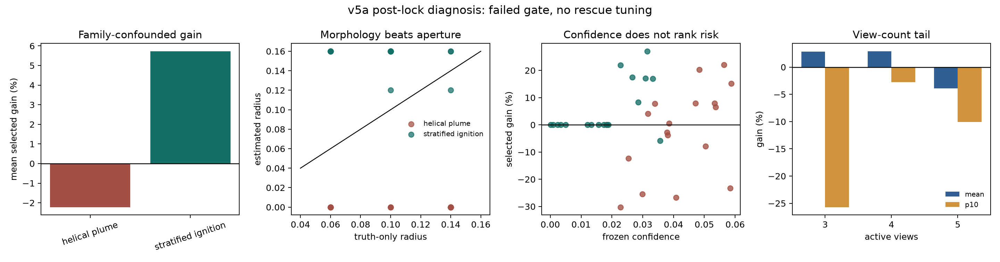

# v5a 有限孔径盲标定首开复盘

> 结论先说：`FAILED_OR_INCOMPLETE`。这是一次有用的失败，不是待包装的成功。
> v5a 首次把“生成观测的真实算子”和“重建可见的近似算子”明确分开，但简单的
> 最小残差孔径选择把反应场形态误当成光学孔径，未通过预注册门槛。

## 1. 为什么这轮比前四轮更接近真实问题

前四轮主要在准确已知的线性弱偏折算子上研究数值更新与 learned correction；它们能
检查优化和门控，却不能回答“相机有限孔径、景深或标定误差使 forward model 错了怎么办”。

v5a 改成：

\[
y = A_{\mathrm{truth}}(r_*)x + \epsilon,
\qquad
\hat x_r = \operatorname{Recon}(y;A_{\mathrm{recon}}(r)),
\qquad
A_{\mathrm{truth}} \ne A_{\mathrm{recon}}.
\]

- `A_truth` 使用更密的有限孔径子光线和路径采样生成观测；
- 重建端只拿到 5 个近似孔径算子，半径为 `0, 0.04, 0.08, 0.12, 0.16`；
- 一条 audit camera 完全不进入重建、交叉视角选择或噪声尺度估计；
- 开发选择集与锁定集使用不同反应场家族、真实孔径、机架角度、锥束参数和噪声水平；
- 5 个候选算子的诊断共 30 次 forward/adjoint，最终重建 30 次，总计 60 次；
  针孔 PBB/FISTA 基线同为 60 次。

有限孔径会把理想针孔的单条光线变成一束锥光线，这个物理困难由 Molnar 等人的
[finite-aperture BOS 工作](https://arxiv.org/abs/2402.15954)直接支持。当前实现只是
规定的线性弱偏折小模型，不是该论文的完整 cone-ray、非线性光线追迹或实验复现。

## 2. 首开前做过什么冻结

- 预注册提交：`90ff9614f474e724864748e0953cfed125b3fcf5`，已先推送到 GitHub。
- 锁定集首开前，runner、有限孔径生成器和 config 的 SHA-256 已写入
  `demo_t16_operator/v5a_blind_aperture_prelock_protocol.md`。
- 第一个开发版因候选只得到 4 步而基线得到 60 步，预算不公平，作废。
- 第二个开发版的噪声尺度间接看到了 audit camera 的 clean signal，作废。
- 修复后增加“任意篡改 audit camera 都不能改变噪声尺度”的测试，再冻结第三版。
- 锁定集只在 selection commit 落盘后构造；首开后没有修改 v5a 方法、阈值或门槛。

## 3. 冻结的选择规则

开发选择集用真值选择了最强等预算基线 `pinhole_fista_equal_calls`，以及候选
`full_residual_hard`。后者用每个孔径算子的两步 probe 全视角残差选孔径，并用最优与
次优残差的 margin 作为置信度。

- 阈值：`0.02182040736079216`；
- 开发集覆盖：`10/30 = 33.33%`；
- 开发集平均 L2 增益：`+5.343%`；
- 开发集 p10：`0%`；
- 开发集 `>1%` 伤害率：`3.33%`。

注意：这些数字参与了方法选择，因此不是最终泛化证据。

## 4. 锁定集首开结果

锁定集共有 36 个样本，只含未见的 `helical_plume` 和 `stratified_ignition`，真实孔径
为 `0.06 / 0.10 / 0.14`，相机机架和 audit camera 也与选择集不同。

| 预注册门槛 | 要求 | 首开结果 | 判决 |
| --- | ---: | ---: | --- |
| 失配非平凡 | pinhole penalty ≥ 2% | **3.144%** | 通过 |
| 平均 L2 增益 | ≥ 2% | **+1.753%** | 失败 |
| p10 增益 | ≥ 0% | **-17.784%** | 失败 |
| `>1%` 伤害率 | ≤ 5% | **25.0%** | 失败 |
| audit-camera 重投影 | 不上升 | **-0.439%** | 通过 |

候选平均 relative L2 为 `0.43522`，等预算针孔 FISTA 为 `0.45170`。平均值看起来稍好，
但尾部有明显灾难样本，所以不能只摘取 `+1.75%` 写进摘要。五项只通过两项，v5a 失败。

还有一个锁后红队修正：预注册的 harm rate 以全部样本作分母，拒绝样本按零增益进入。
所以开发集的 `3.33%` 是 `1/30`，接受条件风险其实为 `1/10 = 10%`；锁集总体是
`9/36 = 25%`，接受条件风险则是 **`9/24 = 37.5%`**，accepted-only p10 为
**-24.779%**。原 v5a 判决仍按预注册口径且已经失败；v5b 必须把
`P(gain < -1% | accept)` 作为门槛，不能用回退样本稀释风险。

## 5. 失败到底发生在哪里

锁后诊断只描述失败，不允许回头挽救 v5a。

| 分组 | 覆盖 | 平均增益 | p10 | `>1%` 伤害率 | 平均估计孔径 |
| --- | ---: | ---: | ---: | ---: | ---: |
| helical plume | 94.44% | **-2.222%** | **-25.834%** | **44.44%** | **0.000** |
| stratified ignition | 38.89% | **+5.727%** | 0% | 5.56% | **0.156** |

- `34/36` 个样本被选到候选库的两个端点 `0` 或 `0.16`；
- `24` 个接受样本中，`23` 个估计孔径与真实孔径相差至少 `0.06`；
- 接受样本的 confidence 与真实 gain 的 Spearman 相关为 **-0.0026**；
- 最坏样本把真实孔径 `0.14` 的 helical plume 估为 `0`，gain 为 **-30.24%**。

audit 指标也有口径敏感性：预注册的“逐样本百分比再平均”为 `-0.439%`，所以按原门槛
通过；但先平均 RMS 再算百分比是 `+0.308%`，且接受样本中 `37.5%` 的 audit residual
上升，最大约 `+35.59%`。因此 v5b 要同时报告 mean-of-ratios、ratio-of-means 和
accepted-only audit harm，不能让一个平均方式代替完整风险分布。

因此，“margin 大”没有表示“更安全”。残差主要在区分反应场的空间频谱/形态，而非
有限孔径。当前 evidence 更符合 **morphology/operator confounding**：未知体场 `x` 的变化
可以吸收或模仿一部分算子参数 `r` 的变化。

## 6. 为什么这不是简单换个阈值能修好

开发集阈值在新 family 上把覆盖率从 `33%` 推到 `67%`，但风险排序近乎失效；更严格的
阈值未必能区分好坏，因为最坏样本也可能有高 margin。现在用锁集重新挑阈值，会造成
标准的 test-set overfitting。v5a 必须保持失败；任何新规则都要叫 v5b，并换新开发/锁定证据。

这也呼应了通用研究：operator mismatch 可能显著破坏 inverse model，而 blind
calibration 是否有效取决于模型是否真正使用 operator 信息。可读作背景的
[InverseNet 预印本](https://arxiv.org/abs/2603.04538)不是 BOST 论文，也不能替代本项目自己的
实验。学习 forward/adjoint correction 的已有理论应看
[On Learned Operator Correction](https://arxiv.org/abs/2005.07069)与
[Inverse Problems with Learned Forward Operators](https://arxiv.org/abs/2311.12528)。

## 7. v5b 最值得先验证的研究假设

### 机架共享、元数据锚定的 Profile-Fisher selective calibration

孔径、焦平面是相机机架或采集块的属性，不应让每幅未知流场各猜一次。v5b 先用
f-number、焦距、reference/flow-off PSF 锚定物理可行区，并让多个未知场共享低维光学参数；
然后不是问“哪个孔径残差最小”，而是问“在允许三维体场一起变化后，孔径还可辨识吗”。
令 `J_x = A(r)`，`J_r = (∂A/∂r)x`。把体场看成 nuisance parameter 后，一个局部的
条件信息量可写成 Schur-complement / profile-Fisher 形式：

\[
I_{r\mid x}
= J_r^\top W
\left[I-J_x(J_x^\top WJ_x+\lambda R)^{-1}J_x^\top W\right]
J_r.
\]

括号内尝试去掉“仅靠改变体场也能解释”的测量方向。若 `I_{r|x}` 很小，孔径变化落在
体场 nuisance tangent 中，就应回退针孔/稳健基线，而不是给出高置信度极端孔径。

这不是宣称发明 profile likelihood、Fisher information、Schur complement 或 variable
projection；它们都是已有数学工具。可能的研究贡献只在于：

1. 为 BOST 有限孔径/景深失配建立可复算的可辨识性指标；
2. 用 held-out camera 与相邻算子扰动构造无体真值的 risk/abstention 规则；
3. 证明它能在反应场形态变化下减少 catastrophic tail，而不只改善平均 L2；
4. 在 NeRIF 或组内 differentiable ray model 中迁移，而不是停留在线性 toy。

### v5b 最小证伪实验

1. 把当前 v5a lock 降级为 v5b 的开发诊断，绝不再当最终证据；
2. 新建至少 4 个未见 family、2 套新机架、连续而非离散的真实孔径与新噪声种子；
   同一个 latent field / mask / paired noise 必须完整扫过所有孔径，形成
   `field × family × radius × K` 的配对析因设计，避免 v5a 的边际平衡仍留下组合混杂；
3. 对照 pinhole FISTA、raw full-residual grid search、cross-view grid search、soft
   marginalization、oracle-nearest 和 oracle-true；
4. 先检查 `I_{r|x}` 是否真的能排序 gain/harm，再冻结 risk threshold；
5. 全新 lock 同时报告 mean、p10、harm、coverage、audit reprojection、孔径误差和总成本；
   harm 与 p10 必须同时给出全体和 accepted-only 口径；
6. 若 p10 或 harm 不过门，停止把 blind aperture calibration 当主算法。

完整的 Stage A-C、配对析因数据、统计样本量和 Go/No-Go 已单列在
`demo_t16_operator/v5b_rig_shared_profile_calibration_protocol.md`。其中明确要求 v5b 使用
accepted conditional risk；若 0 个 accepted harm 也要让单侧 95% 上界低于 5%，至少需要
59 个接受样本，60 场 pilot 只能证伪、不能证明安全。

选择性预测/拒绝本身也不是空白；[SelectiveNet](https://proceedings.mlr.press/v97/geifman19a.html)
等工作已经系统讨论 risk-coverage。这里需要证明的是 BOST 专属的可观测性证据，而不是
“加一个 reject option”。

## 8. 与何远哲方向如何接上

[NeRIF 正式论文](https://doi.org/10.1063/5.0250899)解决连续折射率场表示、体素离散误差、
噪声和计算成本；它依赖 calibrated projection/differential model。v5a/v5b 研究的是另一个
互补问题：**当这份 forward model 因有限孔径、景深或标定漂移而错了，重建器应怎样识别
不可辨识区并拒绝过度自信**。后续可把 profile-Fisher 量通过 NeRIF 的 JVP/VJP 计算，而不
显式形成大矩阵。

对 4D TDBOST，算子参数还可能随时间缓慢漂移；但在单帧可辨识性没过门前，不应直接扩成
4D 网络。先证明单帧的光学 nuisance 能被识别，再考虑时间平滑或低秩先验。

## 9. 现在要问师兄的四个决定性问题

1. 组内 forward model 是否显式包含 aperture、depth-of-field 或多子光线？目前默认的
   ray model 是 thin ray、cone ray 还是经验 distortion correction？
2. 原始 reference / flow-off 图像能否提供点图案的 PSF/blur 信息，以及相机 f-number、
   焦距、对焦平面和物距？若能，孔径不必完全从未知流场中盲估。
3. NeRIF/TDBOST 代码能否计算关于体场和光学参数的 JVP/VJP，或至少能重复调用 forward？
4. 能否封存一条完全不参与重建的真实相机，以及一套不参与调参的 case，作为 held-out
   optical audit？

## 10. 证据入口

- 预注册：`demo_t16_operator/v5a_blind_aperture_prelock_protocol.md`
- runner：`demo_t16_operator/run_v5a_blind_aperture_calibration.py`
- 有限孔径算子：`demo_t16_operator/finite_aperture_bost.py`
- 原始首开报告：`demo_t16_operator/results/v5a_blind_aperture_calibration/report.json`
- 样本级证据：`demo_t16_operator/results/v5a_blind_aperture_calibration/sample_metrics.csv`
- 锁后诊断：`demo_t16_operator/results/v5a_blind_aperture_calibration/failure_diagnosis.json`
- 锁后诊断校验和：`demo_t16_operator/results/v5a_blind_aperture_calibration/failure_diagnosis_checksums.sha256`
- 校验和：`demo_t16_operator/results/v5a_blind_aperture_calibration/checksums.sha256`

当前证据允许写：“我们发现简单残差式盲孔径选择在未见反应场形态下发生严重混淆，并
建立了可复现的失配、首开和尾部风险协议。”当前证据不允许写：“我们提出的方法优于现有
三维重建算法”或“已经解决真实 BOST 有限孔径问题”。
